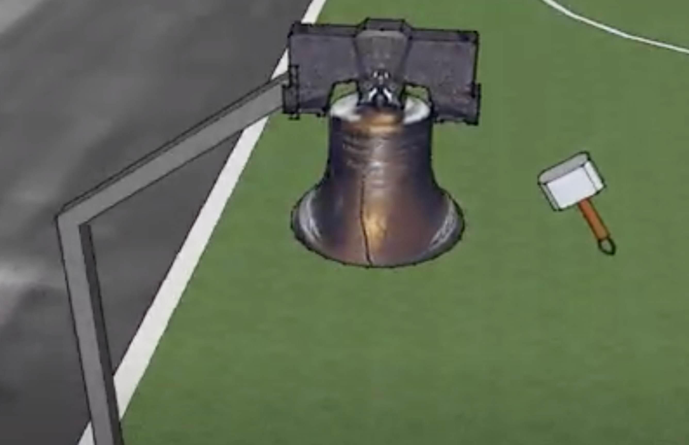

## Hammerfield
Hammerfield is a sport that was first made in 2012 by Dave Simson, a huge Marvel fan. Initially, he watched the Marvel movie Thor, and, from there, he was inspired to create this new game called Hammerfield. The hammer shown in the picture below is based on Mjolnir, Thor’s hammer.

The rules in this game are quite simple. The field is about 100 meters long and 68 meters wide. It has two bells at the opposite ends of the court. The players just have to run to hit the bell. Before the game begins, the hammer is usually in the middle of the court. When the game starts, players run to get the hammer. After they have it in their hands, they can pass, throw, or just hold and run with the hammer. There are two main ways to score in the game. The first way is by throwing the hammer at the bell, but players can only earn one point by hitting the bell this way. Another way is by actually striking the bell with the hammer on hand, which gives double points. In each team, there are about seven to eight players. 

At this point, some people might wonder: “How can a player steal the hammer from the opponent?” For easier understanding, it is similar to stealing in rugby. We should tackle opponents under their legs. The key in this rule is that the player can only tackle under the body, not the torso.  

## Bossaball
Bossaball is not known to many Koreans, but it is a legitimate sport. To introduce what it is, Bossaball is a new sport made in 2004 in Brazil. The founder of this brilliant sport is Filip Eyckmans, a Belgian man who was in love with Brazilian music. The only purpose of his invention was to make a new genre of sport that could combine Brazilian samba music and the spirit of sport into one. Thanks to him, Bossaball is getting popular, although at a slow speed. Bossaball, to simply explain in a sentence, is basically a combination of trampoline and volleyball. 

Bossaball is very similar to volleyball in many aspects. In volleyball games, we spike, receive, and hit the ball over the court. Bossaball is almost identical. However, the only difference is that Bossaball has a trampoline on the court. 

As you can see in the photo, they have a ball that looks similar to a volleyball. The person on the trampoline is the one who makes an attack to the other side of the court, and the other players are the defenders. Furthermore, in each team, there are about five players, and they take turns for an attack. Similar to volleyball, they can use any parts of their body for the game. Currently, the Brazil Bossball Cup exists, but it is not part of the official World Cup. Since Bossaball is an exciting sport, its popularity is growing day by day.

## Personal Tips 
This section is for those who need some tips to play these new sports. For the first tip, while playing the sports “Hammerfield,” if you want to strike the bell with the hammer on hand, jump before the hit. Some people new to hammerfield don't know how important jumping is in this game. Jumping can keep you safe from tackling. Since opponents can only tackle below the hips, when you jump, you would be much safer compared to running.

For the second tip, try to use your feet while playing Bossaball. You might be confused about this because the court looks lower as you jump using a trampoline. Actually, even if we fully jump as high as possible, we can barely put our hands over the net. This is why Bossaball is hard. We can’t strike a full-powered spike. So rather than using hands, use feet to attack.

So far, I have introduced two new sports: Hammerfield and Bossaball. However, there are many more new games of sports that are yet unknown to many people. It is one of my dreams that these new sports will become more famous in the future, and we could easily practice them. Don’t wait. Just try a new sport!

*Listen to the article as read by the author:*

`audio: https://www.dropbox.com/scl/fi/e1m8353ci346owtowow5f/aiden_0124.mp3?rlkey=0sd6nwco6ljmzubh2qifb2lm5&raw=1`