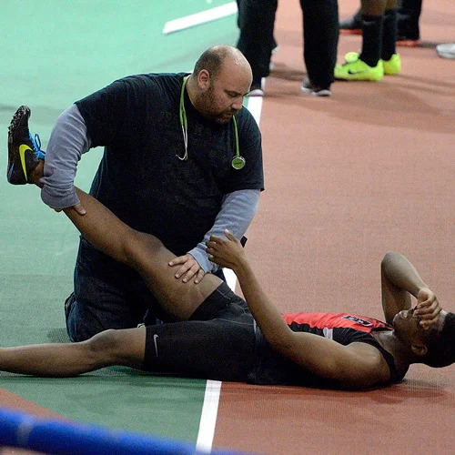

There are many types of athletes, from basketball players and soccer players to swimmers and runners. However, in all sports, athletes have one thing in common that they all have to deal with, injuries. Injuries that athletes deal with vary from small to large.

When injuries are small, athletes are likely to recover quickly and come back. Examples of small injuries would be small scratches, scrapes, aches, and more. But when athletes deal with injuries that are huge, they might have to stop their athlete life and retire. In this article, I’ll go over some serious injuries that athletes may have and their examples.

## Sprains and Strains
Sprains and strains may sound like weak, small injuries, but they are not. Sprains happen when muscles or tendons are damaged. Strains happen when ligaments are damaged. Those are one of the most dangerous injuries that athletes can have. First reason for it is because they can’t move or practice for a long time. Obviously, depending on how much they are damaged, the speed of recovery may vary, but still, they shouldn’t use their body so roughly even after they are fully recovered. Examples of serious sprains and strains include hamstring injury, torn ligaments, and tendon tear. As these injuries may end careers in worse cases, we can consider them “deadly” to athletes.

## Bone Fractures
When we think about injuries, we usually think about bone fractures. Fractures usually happen in the collarbones, ankles, wrists, hands, and feet. Fractures on those places may hurt a lot, but usually athletes heal quickly and come back as fast as they can. The sport with the highest rate of fractures is American football. I mentioned that athletes heal fast after bone fractures. However, an unusual example would be the “Marcelo incident.” Marcelo is a very famous soccer player in Real Madrid. What happened is that he accidently stepped on another player’s leg and ended up twisting the player’s leg. We can say that the other player’s career ended. This was a rare case, and bone fractures usually don't affect players’ lives unless the player is old or bone fractures happen to a critical spot.

## Concussion
Concussion is also one common injury that athletes get. Concussion is a brain injury that happens from a blow to the head. It happens when the brain suddenly jolts. The symptoms for concussion are headache, balancing problem, and memory problems. For the common grade 1 concussion, it takes only a few weeks to recover. But when it gets to grade 3, the highest stage, it is fatal to athletes because it affects brain function. Ryan Miller, a famous American football player, retired due to a concussion. After he got the concussion, he had memory loss, seizures, and other serious problems that directly affected his career. Concussion happens commonly to football, figure skating, and hockey players. Concussion is sometimes not considered as a strong injury, but a serious one can actually end players’ careers.

## Conclusion
In this article, I discussed a few common injuries that happen to athletes. We started off with sprains and strains. Even though they are the most common injury that athletes get, there are a bunch of cases where athletes should’ve stopped their career. Next, for bone fractures, athletes may recover quickly, but if it gets more serious to the point of bone dislocation, it will definitely end their athletic lives. Finally, concussion, an injury over the neck, is also very common but serious depending on the severity. Again, how serious an injury is depends on what sport it is, but there are no sports without injuries. After reading through these injuries that athletes may face, can you feel the bravery that athletes have for every game they play? Why don’t we give them actual worries and respect rather than jeers?