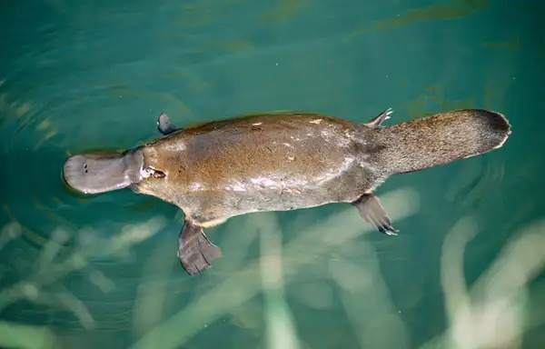

## Introduction
Mammals are fascinating creatures among kingdoms of animals. Famous animals such as lions, tigers, dogs, and cats are all classified as mammals. While most people think that all mammals directly give birth to the babies instead of laying eggs, few mammals do lay eggs: echidnas and platypuses. Out of these two species, I’d like to introduce you to the platypus, the most controversial mammal on this planet.

## Background
The word “platypus” (scientific name: Ornithorhynchus anatinus) originally means a “flat-foot duck.” In addition, the mammal is well known for its cute and unique appearance. The creature was found in 1797 by John Hunter. Their main habitat is Australia: east and west water streams of Queensland, tropical forest of Australia, alpine areas, near dams, etc. Although they are endemic to Australia, they are not classified as endangered. However, they are categorized as vulnerable. Platypuses grow to a size of up to 60 centimeters and weigh up to 2.4 kilograms. They have a beaver-like tail alongside a flat shaped, duck-like bill, feet adapted to swimming and brown, dense fur adapted for waterlife. They usually eat yabbies, small insects, insect larvaes, small fishes, and rarely, swimming frogs. As shown in their diet, they are creatures that are highly adapted for swimming and burrowing. Because they have unique and rare characteristics, they were often made as characters in stories: for example, in a cartoon called Phineas and Ferb, there is a famous detective platypus named Perry the Platypus. These creatures have the beak of a duck and body of a beaver, which made people confused about whether they should be classified as birds or as mammals. Platypuses are considered mammals because they produce milk, have no feathers, and are warm-blooded creatures. 

## Special Abilities of the Platypus
Even though they are classified as mammals, they have diverse bizarre characteristics that most mammals don't have. Special abilities they have are the ability to lay eggs, mammary glands, electrolocation, and venomous spur. Let me introduce all these abilities one by one.

How can a mammal be able to lay eggs when they are supposed to give birth on their own? This question is invalid to echidnas and platypuses. First, to classify them, they are considered as monotremes, which means that they are mammals that do lay eggs. Echidnas are also known as “spiny anteaters.” While echidnas’ only special ability is laying eggs, platypuses are considered more unique because they have a bunch of special abilities. Platypuses usually are pregnant only for about 12 days to 2 weeks. Because they can mate easily and have a relatively faster gestation period, experts say that this is the reason why they are not easily categorized as endangered.

Moving onto their mammary glands, they don’t have nipples to feed their offspring's milk. However, their maternal milk comes out through their skin and is absorbed into their fur. Because of this unique way of providing milk, babies should always rub their mouth to their mother’s skin and gnaw their mother’s fur every time they want to drink. 

Since platypuses don't have a good sense of odor and sight, they evolved to have electroreceptors in their bill, their beak-like mouth. Through this unique structure, they can sense their prey’s muscle contractions and slowly detect where their prey is located. Moving on to the venomous spur, their venoms are produced inside their spur. An interesting fact here is that only male platypuses have adapted to have these venomous spurs: biologists say it's because they had to protect their children and mate from others. They produce venoms from their crural glands and have many compounds of proteins and peptides that reduce blood pressure and cause pain.

## Conclusion
In this article, we identified everything about one of the most bizarre creatures on Earth: platypus. These creatures have unique ap..pearances along with unique adaptations and special abilities, and are declining in population due to enormous habitat destruction. I hope for more protection for these endemic species.