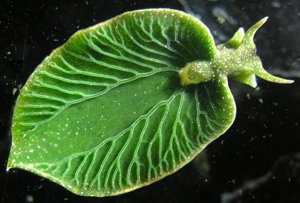

If we think about living creatures such as reptiles and mammals, they are creatures that don’t do photosynthesis. The reason why animals don’t do photosynthesis is that they don’t have chlorophylls and photosynthesis is too inefficient to produce energy compared to converting food to energy. On the other hand, plants, since they can’t eat food except few, have evolved to do photosynthesis using chlorophylls and several different pigments. However, would you believe that there are few animals that do photosynthesis? Let me introduce a few animals that can photosynthesize with the mechanisms they use and the reason for them.

## Spotted Salamander
Salamanders are creatures which belong to amphibians. Out of various species, spotted salamander is the only amphibian that uses photosynthesis. In fact, this creature is the first vertebrate found that uses photosynthesis to live.

How they use photosynthesis for themselves is quite interesting. Rather than photosynthesizing themselves when they are adults or tadpoles, the stage they photosynthesize is when they are embryos inside their egg shells. How can they photosynthesize themselves even when they are not grown? This is because when spotted salamanders lay eggs, green algae goes into egg cells and sticks into its mitochondria. Mitochondria are organelles responsible for creating energy. What green algae does here is that they provide oxygen and carbohydrates to embryos. We call their relationship endosymbiotic, a relationship where one organism lives inside another for a certain life span. If embryos don't have this symbiotic relationship with the algae, they are likely to die due to lack of oxygen. 

## Pea Aphid
Insects eat anything. Some are carnivorous, while some are herbivorous and omnivorous. Insects are creatures that don’t photosynthesize but are able to conserve a lot of energy using lipids and amino acids they have. Even though how insects metabolize is well-known, there is one type of insect that actually does photosynthesis in a unique way: aphids. 

Aphids are very small insects that mainly eat the sap of plants. Saps of plants are liquid in the central vacuole of a plant cell. The way that they do photosynthesis is also unique. They do photosynthesis using carotenoids they create from their body. Carotenoids are accessory pigments to do photosynthesis. Not only that, carotenoids are responsible for capturing light and transferring energy. Pea aphids also gain energy in the form of adenosine triphosphate (ATP) by trapping the light inside their body and converting. The reason why pea aphids are so special is that they are the only creature that can create carotenoids by themselves. The reason why they evolved like this is because saps weren’t enough to support them to have full energy.

## Eastern Emerald Elysia (Elysia Chlorotica)
Slugs are creatures well-known for their shell-less look unlike snails. Slugs are herbivorous creatures that eat fruits, vegetables, and seedlings. If we think about slugs, we usually think about slugs crawling on grass looking for their food. However, eastern emerald elysia is a different type of slug that lives in the ocean. Slugs that live in the ocean are various but out of all slugs and actually out of all sea creatures, eastern emerald elysia is the only species that does photosynthesis. 

They perform photosynthesis using their whole body. First, they gain chloroplast in a unique way. By using their “radula,” the sharp curved teeth, they bite filamentous algaes like Vaucheria littorea and only sucks the chloroplasts out of it. As the chloroplasts move into their wide and flat body, they become an actual part of the body. The process of photosynthesis happens in their body which helps them to move around without food for about a year.

## Conclusion 
We differentiate plants and animals by whether they can photosynthesize or not. However, like the animals that I’ve introduced today, some animals do photosynthesis despite the fact that they can move around to eat food. Conducting experiments on photosynthetic animals might be a key for new developments.