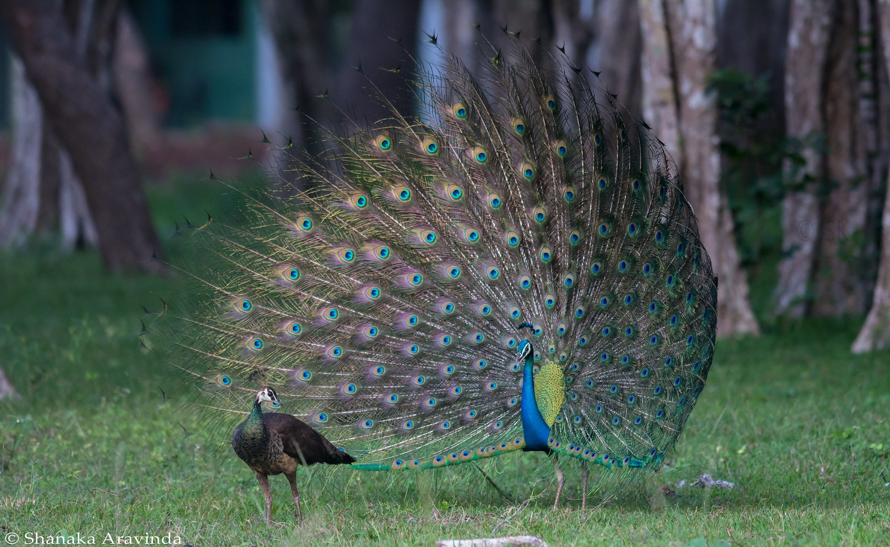

All animals reproduce for new individuals in their community and to maintain their genetics. These reproductions are done either sexually, with both female and male species, or asexually, with only one individual copying themselves.During the process of sexual reproduction, they do a courtship display which is a species-specific behavior to appeal their attractiveness to other sex; usually, male species appear to show more courtship displays throughout most species. In this journal, I would like to explain two unique courtship displays that animals display.

## Peacock birds
The representative courtship display that most people tend to think about would be peacocks. Peacocks are native to India, Sri Lanka, Myanmar, and Java, usually found in tropical forests. They usually eat small nuts, fruits, and insects that are found in their habitat. Because they have diverse diets, they tend to survive and reproduce easily. These benefits protected them from getting endangered by many factors such as hunting, predatory, and habitat destruction. Peacocks were hunted a long time ago because of their beautiful feathers and unique color of body. Their beauty did not only kill them but they also protected themselves by boosting their sexual reproduction rate through courtship displays.

Male peacocks have a tail feather called “train,” and have shiny golden feathers that attract females during their courtship displays. These feathers are usually not open because they block peacocks’ path, and are inefficient when they leave it open. Most male birds fold down their trains to move easily and only open them during the appeal. There are eye-like markings on trains which are called “ocelli.” These ocelli’s only function is to attract female peacocks during their display. The reason why peacock birds’ displays are unique is because they shake their trains in a constant soundwave, about 25.6 hertz; we call this behavior or display  “train-rattling.” A fun fact about this train-rattling is that their ocelli don’t even move while they shake their whole trains. All these factors of beauty and uniqueness make male peacock birds’ courtship displays to be special.

## Blue-footed Booby
Blue-footed boobies are birds that are native to Galapagos Island. These birds have unique characteristics: yellow eyes, blue feet, brown tail feathers, and white body. Irregularly, for these species, females are larger than males because they evolved to protect their eggs safer. They also have a unique way of hunting too; they dive until 100 feet below water to catch one fresh fish. They usually love to eat fishes such as anchovies, sardines, mackerel, flying fish, and squids. Even though they were hunted until the 1960s, they still weren’t extinct because they survived as a pack together. Even though they have strength in surviving as a pack, they are currently endangered with only 6400 species left in the wild. The reason why their courtship displays are special is not only because they are rare to see or because they have blue feet, but is because they show an adorable dance.

Blue-footed boobies are also known as tap dancers because they show a tap dance when they are during courtship displays. Having 3 steps, the ritual is done. The first step is that they slowly stomp the ground foot by foot and appeal how dominant they are through their movement; this “tap dance-like behavior” frames them as a tap dancing bird. The second step is that they slowly move their beak up and down while making their own mating noises. The last step goes through them opening their wings, and showing their strength and size through it. All these steps are unique particularly to them because they are the only birds that go through these adorable or unique rituals.

## Conclusion
Rather than peacocks or boobies, there are diverse species with so many unique courtship displays: pufferfishes make a shape; mice sing “ultrasonic” songs; flamingos dance tangoes. Not only birds, but fishes, mammals, insects, and reptiles all tend to show particular courtship displays which are unique and species-specific. Although all types of animals show courtship rituals, the reason why birds show more frequently is because they evolved to show the aesthetic feather. Figuring out what courtship displays are and how special they are for each species, we again can feel how all animals have evolved individually and iconically.