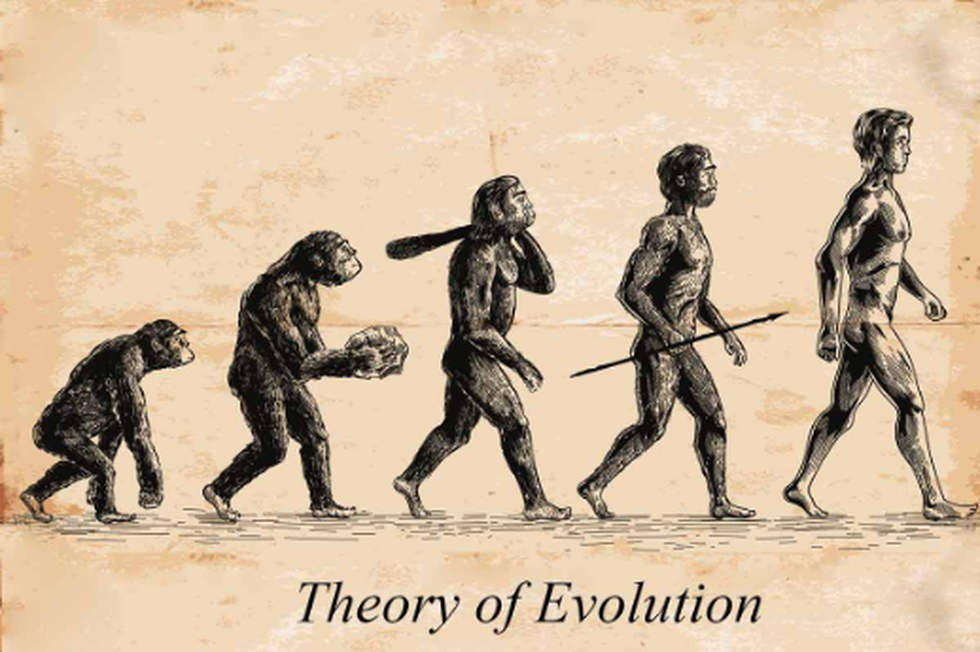

## Introduction
Would you believe if every life on Earth originated from a single microorganism from 3.7 billion years ago? Humans are well-known for their high intelligence. Not only that, every animal has their own unique strategies to survive. We never looked like this, and animals that we know never looked that way too. All species have adapted to the change in their environments and evolved as time passed. Today, I would like to introduce you to what evolution is, how it was theorized, and some examples.

## Evolution
The dictionary definition of the word “evolution” is “the gradual development of something, especially from a simple to a more complex form.” Until the 18th century, people couldn’t study evolution because they did not have enough biological knowledge developed. But in 1859, a naturalist named Charles Darwin theorized evolution by observing how different animals adapt to their environment. To give more description about Darwin’s theory, he observed what we call “natural selection,” which is a phenomenon where organisms more fit to their habitat have higher possibility to survive therefore passing their genes to their descendants. As an example, the features of giraffes we see today are the result of natural selection. If we see giraffes, they have long necks and tongues. The giraffes with longer necks compared to shorter necks survived more as it is easier to reach the trees resulting in more giraffes with longer necks over generations. Slowly, the short-necked giraffes were gone and the giraffes that we are familiar with were left. To give another example, a bird's beak perfectly exemplifies natural selection.


This beak example is what Charles Darwin actually observed. The photo above shows three different birds with three different beak shapes. All of the birds live on the Galapagos Islands, but there are four main areas that have small differences. One area has more insects, and another has more berries and seeds. Even though they were in very close distances and shared a similar environment, based on what the birds in each area could've eaten better which affects their survival, the beak shapes varied.

Before moving onto the next question, I’d like to explain mutation. Mutation is change in DNA sequence in an organism. Every evolution basically starts with mutation because if one mutation occurs and it seems like it's surviving better in a certain environment, that mutated gene or trait will be more common. Mutations are generally harmful for an individual, but they naturally disappear and are not passed down over multiple generations.

After fully understanding what natural selection is, there might be a question: “Could the evolution of a species affect the evolution of others?” This is indeed possible, and we call this coevolution. If one species evolves, it is likely for another species that is significantly affected by or dependent on the other to evolve together. To give an example with birds, when one species of bird preys on a specific animal constantly, they will evolve together. To give another example, garter snakes and newts have also shown coevolution. Garter snakes prey on newts. Consequently, newts, which had no protection, evolved to contain a powerful toxin. However, the garter snake evolved together and developed resistance.

## Conclusion
Evolution is still studied today to identify how animals have changed and what they changed from. By knowing more about the ancestor species of animals, we can also learn more knowledge. While I was writing this article, there were a lot of questions that I asked myself: “Why are human beings so intelligent compared to other species?” That question may be unsolvable based on how we interpret it. While biological technology is constantly and rapidly developing, I would like to see more news about evolution and different animal species’ ancestors.