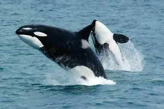

Human beings have investigated space more than the ocean. In that grand ocean, there are countless species living: until now, 242,000 species have been discovered. While there are varieties of species with their unique abilities, some ocean species evolved with a smart brain. The most representative example of smart ocean animals would be dolphins; dolphins have high intelligence and long life spans, which makes them popular for training in aquariums. Although dolphins may seem to be flawless, they have one weakness: their strength. Even though they don’t necessarily have a predator, dolphins are not as strong as sharks or whales. While dolphins have vulnerabilities of strength and sharks have vulnerabilities of intelligence, there is one species with all characteristics: orca whales. Throughout this journal, I would like to further explain all about orca whales and the controversies of them.

## Background Information 
Orca whales are the largest oceanic dolphin family within a single species in their genus (Orcinus Orca). Thanks to their large body and wide range of diet, they tend to live all around the oceans: tropical to arctic. They are mainly found near the North Pacific and North Atlantic sides of the oceans. They weigh up to 4000 kilograms, which helps them to easily sustain their temperature and travel for long distances. They gain all these weights from diverse diets such as herrings and any kind of fish smaller than them. Not only are they the largest, but they have one of the most unique characteristics: they are only black and white. These colors lead people to think of them as stronger and dominant species. Relating to their characteristics, orca whales are also known as killer whales; they got this name because they kill baby whales as their main food, sometimes, it is not because they are whales that kill animals. Due to all these intelligent and unique characteristics of orca whales, humans use them as circus animals nowadays. These circus orcas are very controversial, in fact unethical, because they don't provide the full environment that orcas require, and they don’t care about the psychological harm that orca whales suffer from.

## Controversy Over Performance
Killer whale circuses are widely found among North America, Europe, and Asia. Distributed widely throughout the world, it is considered controversial among diverse cultures and countries. Ethical controversies are arguing that these circuses are unnatural and so captive that they make them stressed and vulnerable to death. In fact, according to the research, the death rate went up by 150% for killer whales that were kept in a small aquarium. Some people may ask the reason it is more unethical to keep orca whales than normal fish: the biggest matter is that killer whales are social animals that require active hunting, a wide range of breeding, roaming, and communication. I would like to explain some real-life examples of distressed orca whales showing extreme disorders.

Orca whales have a huge association area which allows them to feel diverse feelings. While many orca whales in captivity may not feel lonely because they have a following pack together, this one orca whale named Kiska showed how their emotions are as complex as human beings. Kiska, also known as the world's loneliest orca, is living in Marineland Park, Canada. As she reached the age of 45, all of her pack went dead or moved to different areas, which left her alone in one main tank. As she became alone, she showed many stress-induced behaviors such as circling around the tank, bumping herself to the glass, and refusing to eat the food. Sad fact about Kiska is that she is still not freed to the wild because of their zoo’s system. While there are many donations toward freeing Kiska, she still remains lonely and aggressive.

When Kiska showed her stress by hurting herself and tearing herself down, many other orca whales who are actively trained tend to kill their trainers when they are distressed. There are many cases related to orca whales killing their trainer. However, this one killer whale killed 3 trainers in a row: his name is Tilikum. As he became one of the longest trained orca whales,he became more distressed gradually, which led him to kill 3 trainers in 3 different places. All these examples support orca whales as highly intelligent and social animals.

## Conclusion
Many animals living in the ocean are kept in aquariums and are actively trained for human entertainment. As we’ve seen in this article, orca whales are highly sociable and active creatures that require a grand ocean within their life, not a small tank with treats given. In the frame of “protecting them,” people train them and abuse them cruelly. Not only orca whales, but I also believe we shouldn’t keep these species as a toy for the circus.