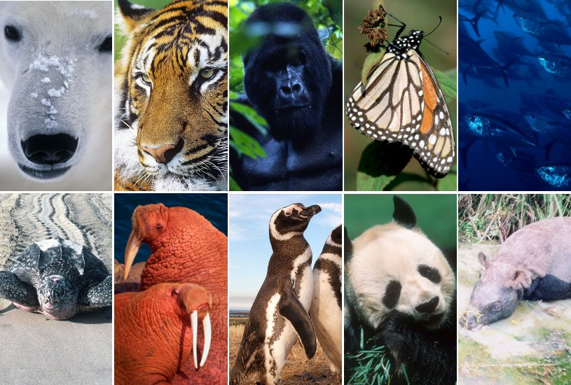

## Intro
Nowadays, a lot of animals are endangered due to a variety of factors: climate change, habitat loss, pollution, etc. In every place on Earth, more and more animals are being endangered. I would like to explain not only about the factors that cause animals to be endangered but also the effects on the ecosystems.

## Factors
Climate change is a problem in many ways. It not only causes damage to human beings but also animals. For land animals, climate change decreases their food sources and causes their habitats to have droughts. The problem with this is that those damages cause animals to forcefully migrate into different habitats. When animals migrate from their original habitats into new ones, this causes unbalance in the ecosystem. One ecosystem would lose their animal and another ecosystem would gain. When a new species is introduced to an ecosystem, they compete harshly with existing species for food. These animals that migrate and cause huge damage to a habitat are called invasive species. Unfortunately, humans are often the ones who cause these invasive species to migrate.

The situation for sea animals is pretty similar to land animals but much worse. Rising sea levels and increasing temperature forces sea animals to migrate into different areas and causes habitat loss. The rise of sea levels also damages land animals and even human beings.

Climate changes may be something that we can slow down but not stop. Even though we say that we are trying our best to slow down climate change, global warming won’t easily slow down its rate. Nowadays, people are doing campaigns to save the Earth and recycle more actively to harm the Earth less. Those efforts may sound like an effective solution to climate change, but actually it only helps a tiny bit.

Next factor is pollution. Pollution is very closely related to climate change because the cause for pollution is also humans. Pollution to air happens because we generate electricity, drive cars, run factories, create wildfires, and etc. Pollution that happens in water is due to the release of chemical products, use of plastic, etc. If climate change was causing habitats to get damaged at a slow speed pollution gives fast and easily detectable damage to habitat. Compared to climate change, the pollution may sound better but, actually, it is as serious as climate change. Humans release so many things into water: radioactive products, plastics, coals, and more. Pollution gets serious because of the massive amount of waste. Some people say that we can stop pollution simply by not releasing it but that would cause huge economical damage. It is also nearly impossible to help animals avoid pollution.

Turtles are a good example of pollution affecting animals directly. Turtles are directly affected by pollution because of their diet: jellyfish. Since jellyfish and plastic bags look very similar, turtles often accidentally eat plastic bags. Obviously, turtles die when they eat too much of those plastics. When turtles turn extinct it will end up breaking the whole chain of the sea's ecosystem. Nowadays in social media, there is lots of content where people catch animals with plastic bags on their necks. Those efforts may help some animals to live and reproduce better, but there are simply too many animals affected that there is very little impact on the ecosystem.

## Conclusion
If problems such as climate change and pollution get worse at a quick rate like today, the average temperature is predicted to go up by 5 degrees which will cause massive destruction to the whole world. To not meet a tragedy like that, I think we should do all the things we can including the use of biotechnologies to at least slow the process down. I hope one day, there will be a scientific breakthrough that can actually make the situation better.