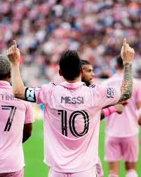
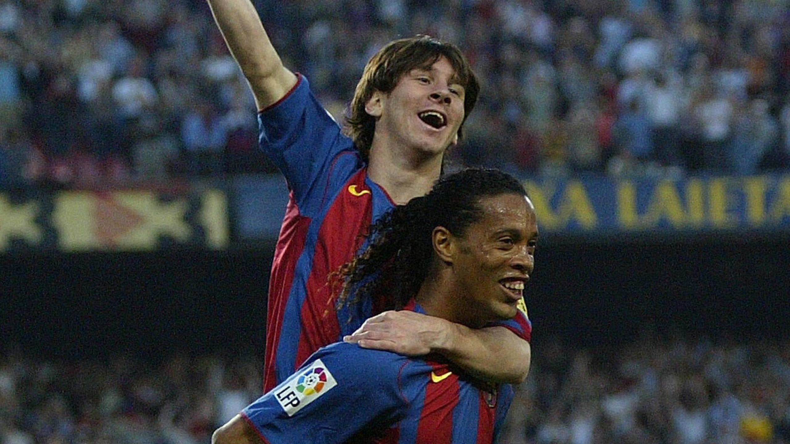
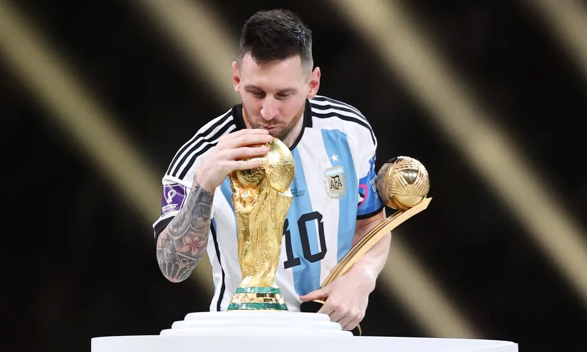

# Childhood
Lionel Andress Messi was born on the 24th of June in 1987 in Rosario, Argentina. After playing soccer as a hobby until the age of 6, he entered his first soccer club, the Newell’s Old Boys club. After a few years, he had concerns that his height and body size wasn’t increasing much compared to his friends. Even with these disadvantages, he was always the ace in his soccer games which caught the eye of Carles Rexach, the director of the soccer team FC Barcelona. That is how he joined FC Barcelona’s youth team.

At the age of 13, Messi joined FC Barcelona, which made him move to Spain for his team practice. Even though Messi had a small body, his skills and legs were helping him to be one of the best youth players on his team. From the age of 13 to 17, he was in the “C club” of FC Barcelona which is a team for new athletes. He repeatedly practiced running and playing soccer, sometimes playing small soccer games for the C club.

# Flaming Debut
Lionel Messi made his first debut in October 2004. He was a boy with short height but magical legs. His first goal was in 2005. The goal was supported by one of the world's best soccer players at the time - Ronaldinho, a Brazilian legend. Ronaldinho’s wonderful flying pass directly landed on Messi's foot and led Messi to shoot into the goal. For Messi, his first goal was a long dream. He always respected Ronaldinho as the best soccer player and wanted to play in the same ground. So, for him, it was a great honor to get a pass directly from Ronaldinho ended up scoring a goal.

# First Olympic
In the summer of 2008, he participated in his first Olympics in Beijing, China as a member of Argentina. Messi during this time was in his heyday. His team moved easily to the final, but they met team Nigeria, one of the strongest soccer teams during the time. The match was very dynamic, with the attacking and defending team changing constantly. Even though Argentina were known as a strong team within Ángel Di María, the well known soccer player, they were having challenges against Nigeria. Starting the second half, Messi gave a perfect through pass to Di Maria and won the match with the score count of 1:0.

# Ballon d’Or
Ballon d’Or is an award given by the FIFA(International Federation of Association Football) to the best soccer player of the year. After he won the Champions league, soccer league where several teams fight in form of competition, in 2009, in 2010, Messi also won the first Ballon d’Or. After he started to get his first Ballon d’Or, he won his second Ballon d’Or in 2011, 3rd in 2012, 4th in 2013,  5th Ballon d’Or in 2016 and 6th Ballon d’Or in 2019.

# The Final World Cup
Starting from 20th of November in 2022, Argentina fought with Australia as their first opposition in the world cup. As expected, they won Australia with the score of 2:1. Going up to quarterfinals, they met Netherlands, a team known for their defense. Even though Dutch players’ heights and body sizes were much larger than Messi, his powerful goal led Argentina to win them after their penalty shootout(method for a football match if teams are tied after extra time) by 3:4. Going into the semifinal round, they met team Croatia. With Modrich, Ivan, Brozovic, their team was full of world class players. Thankfully, without making mistakes, Messi made goals for Croatia and won with a score of 2:0. Moving onto the final round, the hardest and strongest team was their opponents. It was France. France had a team full of world class players. Not only were their attacks fast, their defense had no mistakes. Even though Kylian Mbappe, a rising star, made a hat-trick which means putting more than 3 goals in a game, Argentina looked like they weren't losing. Messi scored twice and assisted perfectly for another goal which made the score count 3:3. Later, they got into a penalty shootout. Starting from Messi, who scored the first goal, his team won the penalty shootout by 3:4 and became the champions. This world cup was very meaningful for Messi because it was his final world cup due to his age (36 as of 2023).'

2023
Messi on July 21st, transferred to Intermiami, which is owned by David Beckham, and he is still showing his wonderful soccer skills every match. He has 3 sons, and all of them seem to have great talents in soccer thanks to their father. His goals and assists will be forever a iconic history.