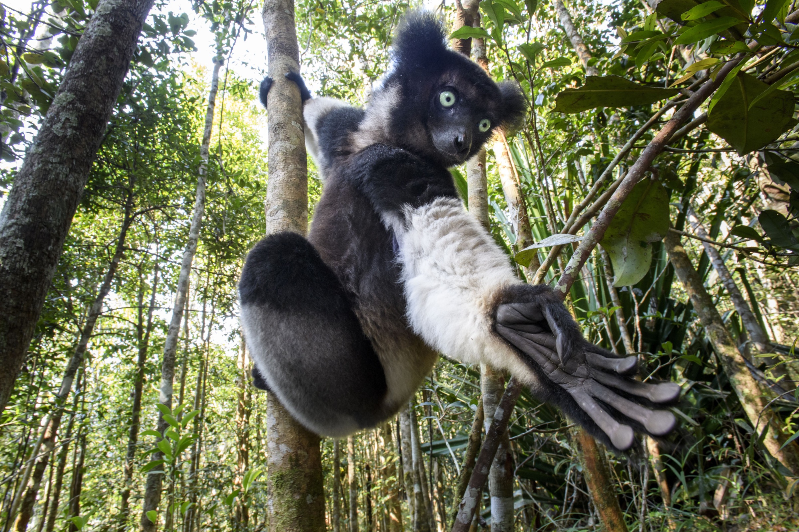

# Introduction
Nowadays, many people are using drugs for different kinds of reasons: to excite, self-medicate emotions, enhance bodies, etc. Like the following examples, humans are using drugs not only for medical purposes, but also to get “high.” Shockingly, not only us, but animals also use drug-like substances in a variety of ways and purposes. So in this journal, I would like to introduce animals that get high.

# Black Lemurs
Black lemur, a species which is part of the Lemuridae family, is one of the most endangered primate in the world. Similarly to ring-tailed lemurs, black lemurs live in Madagascar.

Black lemurs consume drugs using arthropods called millipedes. More specifically, these lemurs eat Madagascan fire millipedes, which are considered to be toxic. These millipedes release toxins such as cyanides, benzoquinones, hydroquinones and hydrochloric acids. Out of those toxins, two main toxins that lemurs consume are cyanides and benzoquinones. To briefly talk about symptoms of those toxins, cyanides can cause rapid heart beat, vomiting and dizziness and benzoquinones can cause sore throat, short breath and more.

They bite off  the millipedes to get toxins released from them, and start to drool extremely due to cyanides. After they drool a lot, they start to rub their saliva and millipede on their fur. This is because saliva and millipedes’ toxins are like insecticides which can keep them safe from mosquitoes that have malaria. But not only using it as an insecticide, lemurs use this to be in a trance-like state which is a state where they get dizziness, shock, haze and more. This means that, like human beings, they use millipedes to get thrill and to get high.

# Jaguars
Jaguars, one of the largest cat species that are native to America, also consume drugs. Jaguars living in the Amazon rainforest are caught on camera getting high through yage vine.

Yage vines produce ayahuasca leaves which contain toxins that  cause extreme hallucinations and excitement. Especially harmaline and other beta carbolines are the main toxins that those yage vines produce. For their symptoms, harmalines are hallucinogenic and beta carbolines are associated with anxiety. Originally, those ayahuasca leaves were used from indigenous Amazon tribes for them to meet with spirits and for religious ceremonies, but people caught jaguars using it.

Jaguars bite and eat some of the fallen ayahuasca leaves primarily to cleanse their digestive systems. Not only digestive systems are cleansed, but after they eat leaves and lick their body, it activates as an insecticide which keeps jaguars safe from a variety of parasites. But the problem is that after they cleanse their body, they start to bite off the leaves to get high. After they consume those leaves, they turn from apex predator to cute little kitten.

# Wallabies
Wallabies, small macropods which are native to Australia and New Guinea, are considered one of the cutest animals in the world. Unlike their cute and small appearance, they are also heavy drug addictors. 

Wallabies were caught in Tasmania continuously going into poppy fields and consuming plants from the field. Poppy plants are a flowering plant well known for producing opiums. Opiums are highly addictive drugs which are considered as depressant. These opiums slow the message between brain and body like morphines and heroins. 

Unlike different animals, there was no specific reason for the wallabies to show this behavior. However, it was found that hungry wallabies around the poppy field went in and started to consume opiums just as a snack.

# Fruit Flies
Fruit flies are a species which is part of the  Drosophilidae family, and are most commonly found around the world. Would you guys believe that fruit flies sometimes also depend on drugs to run from sadness? 

First, alcohols are well known as depressants and makes our brain activity slower, ending us showing riskier behaviors. While it is very funny how these fruit flies sometimes look for alcohol, there are mainly two reasons: parasites and sexual deprivation. Fruit flies can kill parasites inside their body using alcohol. Furthermore, they can also consume sweetness, a flavor they like the most, by drinking alcohol such as wine. For sexual rejection, they drink alcohol when they are rejected by their mating partner. According to Jason Bardi from University of California San Francisco (UCSF), fruit flies which are rejected by their partner started to look for alcohol rather than non-alcoholic things.

# Conclusion
Throughout this article, we’ve discussed various species that consume drugs. There are other animals not introduced in this article: dolphins with puffer fish, parrots with opiums, velvet monkeys with drinks, and even reindeers with poisonous mushrooms. While I was researching animals that use drugs, I felt again that humans are no different from animals.
Like fruit flies, human beings also look for alcohol when they get rejected by their lover. Why not have a fruit fly pet to talk together while drinking!