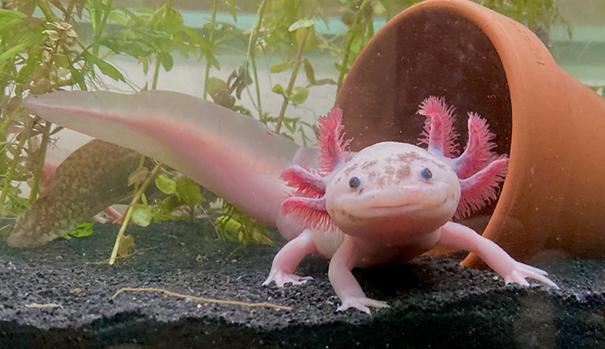

## Introduction
From Charles Darwin, an English biologist and geologist who had a significant impact on evolutionary biology, a well-known evolutionary perspective has been theorized: natural selection. Natural selection states that living creatures tend to evolve or adapt to compete easily and survive through changes in the environment over generations. Nowadays, the rapid development of industries and an unstoppable rate of pollution cause the animals to change constantly according to natural selection. Thus, this article will introduce a species that shows the basis of creatures’ tendencies: the axolotl. 

## Axolotl
One of the rarest and most unique amphibians is an axolotl. These cute little amphibians are carnivorous, eating worms and insects. They live among Lake Xochimilco and Lake Chalco in the Valley of Mexico, which makes them an endemic species of Mexico. Their population, which is already small since they are endemic to Mexico City, is now classified as “critically endangered” due to serious drainage and pollution of lakes. ” Despite their rarity, axolotls are, in fact, very popular pets; they are easy to care for, live long lives, don't require much money, and most importantly, are very cute. Cutting the background information about them until here, they are furthermore very bizarre creatures. 

## Evidence of Adaptations
Axolotls are neotenic; they live forever in their larval form, as if frogs have ceased in their tadpole form. Then, what made them evolve this way? There are many reasons behind axolotls’ neoteny. The first reason was simply that they had no reason to move to ground life. One of the biggest reasons why amphibians undergo metamorphosis is that land provides more food and a safe habitat for them. However, the area where axolotls lived was already rich in their diet, which made them stay in the water for their entire lives. The second reason is that water provides more efficiency and safety in their lives. Undergoing metamorphosis requires a lot of energy, hormonal stress, and time, and is dangerous. However, they have more time and energy for reproducing by saving energy that could have been used for metamorphosis. That means the habitat inside the water was comparatively safer than the outside. Their unique characteristics are not limited to the neoteny: regeneration is the most special skill that axolotls have.
All organisms can regenerate. However, axolotls’ regeneration is beyond expectations: axolotls not only regenerate their limbs, but can also regenerate their lungs, hearts, nerves, and even parts of their brain. These astonishing abilities of regeneration evolved due to several factors: their predators and reproduction method. Axolotls have very fragile skin; they are easily ripped and scarred. Their main predators, such as herons and egrets, are very nimble and strong. Once the axolotls are poked by them, their organs and tissues are directly damaged and pose a severe danger to their life if not cured. Because of this, they adapted to regenerate at super speed in any part of their organs. Moreover, their reproduction method also had an effect. Axolotls are very slow breeders, where they require enough safety and time to reproduce; to compensate for this weakness, they have chosen to regenerate their tissues quickly to maintain their life.

## Conclusion
As you can see, axolotls evolved and underwent the most fundamental law explained in the first paragraph: natural selection. For the perfect form of themselves, many dangers challenged them: predators, diets, etc. Nowadays, although the Mexican government is constantly working for their conservation, their population in the wild is decreasing, ironically. Then, why do human beings get forgiven just by hiding below the frame of “conserving” while they have already devastated everything? Although the question has been raised, a solution can not even be imagined. Moreover, not only axolotls, but all animals underwent adaptation, following the law of nature. However, humans are destroying this fundamental law, just like destroying a huge tower of evolution for each species. While this article may sound like simple information about axolotl, more attention to this unstoppable collapse must be given. Without a clear solution, the future of humanity will block the natural path of evolution.
