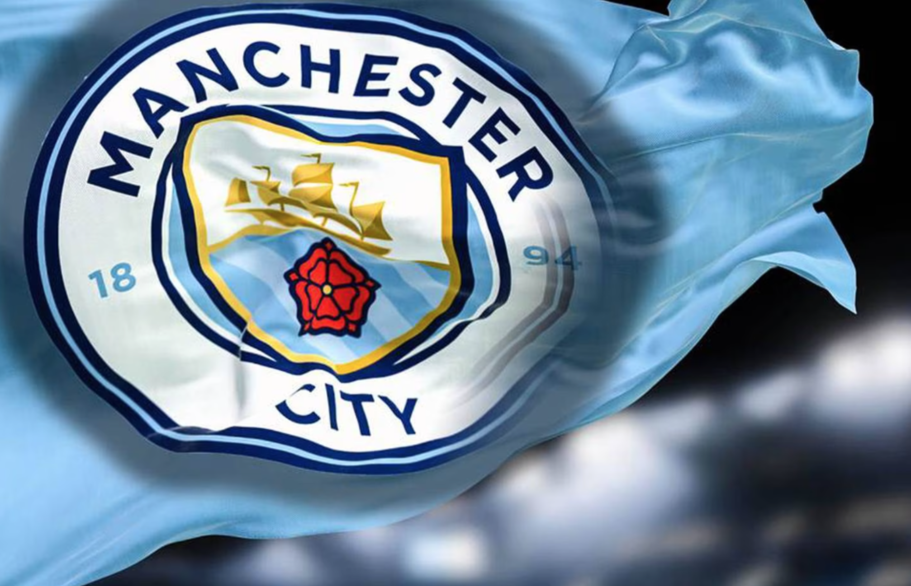

Have you ever wondered what team and player is currently dominating all football games? Today, let's figure out who is currently the best team and the players with their accomplishments.

## Manchester City F.C
Manchester City (“Man City” in short) F.C is a football club that officially started in 1894. It is one of the English football clubs and was the strongest even though it was new to the FA Cup Leagues. After Man City won their first trophy in 1904, they started to increase their size and strength by letting in strong players in the club. The current coach/manager is Pep Guadiorla, who is rated as one of the greatest coaches. Currently, Man City is still the strongest. The proof for their strength is how they won the treble. Man City is well known for their treble. Treble is an achievement recognized when a team wins 3 trophies in a single season. For most of the teams, this is extremely hard to achieve. But, thanks to the players in Man City, they could’ve made the treble. 

## Players
Man City is famous for their clever players. As a core of the team, Kevin De Bruyne, and Erling Haaland are the two best players of the team. They are the most well known players for their skills and also have monstrous body structure.

## Kevin De Bruyne
De Bruyne is a Belgian footballer born on June 28th, 1991. Even though he doesn’t have extremely good body strength, he is well known for his smart plays. His position is attacking midfielder which isn't a popular position from the audience compared to striker or center back. He is a legendary player out of all. His dribbling skills are top class too. His passes directly run to strikers or wingers. Even though Kevin is an attacking midfielder, he also has very good critical thinking skills when he has the chance to score a goal or pass. Additionally, his defending skills are also rated very high.

## Erling Haaland
Erling Haaland is a Norwegian footballer born on July 21st, 2000. Haaland is the son of soccer player Alfie Haaland. Thanks to his father, he was blessed with a great physique. He is 194 cm tall and weighs 88 kg. Not only that, he has extremely developed muscles all over his body. He is well known for his scary characteristics during his play. He is considered one of the fastest and strongest players in this century. His strikes are so fast that most of them score a goal including his heading using his physical strength. Right now, Haaland is a rising star with statistics already over most of the legendary players. People are expecting huge accomplishments from him with his team.

## Man City’s Treble
Man City won the treble by winning the Premier League, Champions League, and FA Cup. The moment where the final trophy of treble was puzzled, all of Man City’s fans and players had a huge party and was the most historical sports news of 2022/2023. The last round was with AC Milan, which is also a very strong team having Rafael Leao and Olivier Giroud. By the wonderful mid-halfline goal from Rodri, a midfielder, they beat AC Milan with a score of 1:0. People call this season “the start of legend” not only because of Man City’s treble but also because of their goals.

## Man City Currently
Right now, Kevin De Bruyne is seriously injured; his hamstrings are strained. He is slowly healing but he will be going to take a long time to play well again. Because of his injury, Man City isn’t like before - they are constantly losing games. Because of this, Pep Guardiola is in extreme stress and makes a lot of placement mistakes. Through this, we can see how important De Bruyne and his passes are for his team. Fortunately, many of the defenders and attackers including Erling Haaland are showing huge improvements in their skills due to the absence of Kevin De Druyne. Currently, Man City fans including myself are waiting for Kevin De Druyne’s recovery and improvement of Guardiola’s strategies and players’ skills.