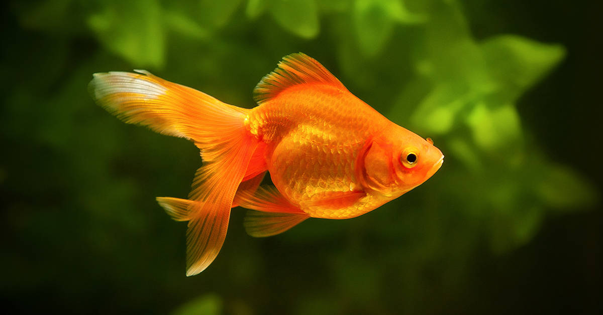

Human beings, living a long time together with animals, discovered a lot of animals and have found various information about them. Even though research is ongoing, there are many myths regarding some animals. This article is a mythbuster talking about the myths of certain animals with explanations of the reasons why they are wrong.

## Goldfish's Memory
Out of many animals, goldfishes have the most famous myth that their memory lasts 3 seconds. This is used as a meme or to make fun of somebody. However, goldfishes are smarter than you might think.

Goldfishes, known by many to have a three-second memory, can remember things even up to a few years. According to the Discover Magazine, goldfishes have spatial awareness, object perception, and social thinking like humans do. One experiment, conducted by the University of Michigan, tested the memory of the goldfish through shock-avoidance experiment. After many trials and attempts, it proved how the goldfish can remember dangerous and safe parts of the tank. Additionally, to figure out their memory skills more thoroughly, they conducted experiments related to human-face recognition and fish-operated vehicles: experiments all succeeded and proved that goldfishes have, in contrast to popular belief, strong memory.

But vvwhy do goldfishes have this myth? The answer to this question is based on the brain systems of fishes. In the early 1900s, scientists figured out that fishes don’t have hippocampus in their brain. Hippocampus, which is responsible for memory, is one of the most important factors that creatures need for memorizing and remembering things. Because most scientists assumed that fishes can’t memorize due to their brain system, for many years, they did not attempt to conduct an experiment to prove that the myth was wrong. 

## Chameleon’s Camouflage
Chameleons are charming creatures that have a fun myth: they change their color based on their surroundings. However, this is completely wrong. In many movies, chameleons are animated so that they change their colors easily, but in reality, they can’t.

Chameleons are not changing their colors based on their surroundings but everything except their surroundings. This might sound funny, but emotions, temperature, humidity, and light determine the change of color. There are few ways that chameleons change their color: nanocrystals, melanophores, and chromatophores in their skin. When chameleons go through conditions that affect their nervous system, it gives a sign to the skin to change their color by stretching out their skin. While chameleons are well known for their unique eyes that can turn 360 degrees, they also have unique skin too. Nanocrystals primarily help them to change color. By stretching their skin, the crystals’ reflection changes, which makes them change color into yellow or red by manipulating the wavelength’s amplitude.

Because chameleons are sensitive creatures, especially to temperature, light, emotion and humidity, they easily change their colors. People, misinterpreting the reason for the change, just randomly guessed that chameleons change their color based on their surroundings. The change of color is not so deeply related to camouflage but only for mating and to express stress.

## Snake’s Musical Soul
Did you ever see snakes being controlled by hypnotic music in the movies? In fact, this is half-right and half-wrong. It is true that they move because of specific sounds, but not because they hear the specific notes of the music.

Funny thing about this myth is that snakes don’t actually have the ear to hear the music. In fact, they feel the vibration of the sound. They have a bone inside their head called “columella” which lets them feel the vibration of a certain sound. The mechanism of how this works is that the bone called columella is connected to their jawbones and they get raged when the jawbones are stimulated. When they feel the vibration, they prepare to shoot their venom. Because of this, people don’t usually recommend whistling to the snakes because it actually elevates their stress.

Despite how dangerous the ritual is, in several areas, hypnotizing snakes are considered to e part of their traditions.

## Conclusion
This article went over many myths about animals. There are many other myths about animals: bats are blind, giraffes don’t sleep, bears hibernate, and more. While all these myths are clearly wrong, it is funny how people seem to believe the myths very strongly. All we can do is to hope all the myths are displaced by the truth.