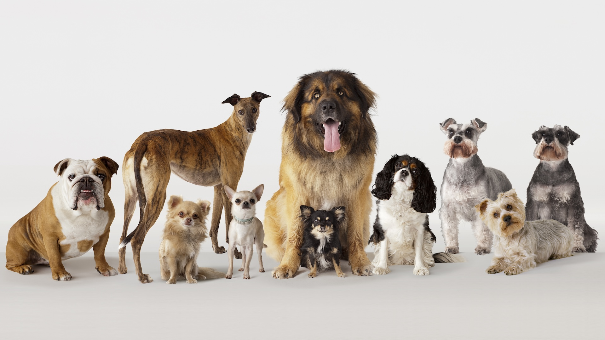

## Introduction
Many households, approximately 45 percent of modern-day people, have dogs in their homes. Not only dogs, but nowadays, people own diverse types of pets: reptiles, fish, birds, and more. While there are many pets owned by people, none of them has a longer history than the most popular pet: dogs. These animals, called dogs, can not only be our emotional supporter and one and only friend, but can also protect and save us from any physical harm if well-trained. Acknowledging that they have these amazing abilities of sympathy and loyalty, this journal introduces some dogs that have the longest history as pets.

## Saluki
As dogs gained popularity, many jobs and activities related to dogs also emerged. One of the most praised activities with dogs is dog racing. While many dog breeds display high speed, dog racing is usually run by the dog breed called “greyhounds”. There are many species in the group of greyhounds. But this section would introduce the relative of the greyhounds: the oldest and the most elegant Salukis. 

Salukis display their gorgeous appearance through long and slim bodies with long hair near their legs, necks, and ears. This amazing appearance was from ancient Egypt. Going back to 2100 BCE, 5000 years ago, these beautiful dogs were mainly used to hunt gazelles through their amazing speed. Their speed went up to 60 km/h, which means they were in fact faster than a few types of gazelles. Furthermore, they were often owned by the nobility of ancient Egypt and were buried together when their owners passed away; they were also often mummified. Salukis are not only treated as cute dogs and a perfect tool to hunt gazelles, but they were also treated or symbolized as a religious figure. In fact, there are lots of dog gods in ancient Egypt’s wall paintings that represent a similar appearance to Salukis. 

How are Salukis in modern days? Salukis are still represented as a fast but gorgeous dog with strong loyalty and blood of royalty. Because they have this royal and elegant personality within appearance, they fall into the more expensive breed of dog; they are also very hard to raise.

## Akita Inu
When we talk about any culture and history, Japan displays one of the most unique and distinct histories. Related to their old and long history, they also have a traditional dog breed that they have owned for several centuries. Even though it is not as long as the Salukis’, they were with Japan for 500 years. I would like to introduce this amazing big protector of Japan, the Akita Inu. 

These Akita Inu have a big body weighing up to 35 kilograms. They have a brownish shadow on their top and white fur on the rest of their body, representing one of the most famous dog breeds in Japan: Shiba Inu. While they look like an ordinary Shiba Inu, their size and aggressiveness are on the next level. Shiba Inu grows only up to 10 kilograms; this means Akita Inu is at least three times of a Shiba Inu. Then, people would have the following questions: why were they this big? What were their roles? They were, in fact, strong guardian dogs of samurai. Samurai and most households with middle or high status had Akita Inus to protect themselves and to show their power. These dogs are not only strong, big guardians, but they were also hunters. Because they had amazing loyalty and aggressiveness towards other animals, they used to kill down boars, deer, and even small-sized bears as well.

How are Akita Inus now? Nowadays, Akita Inus are losing their popularity due to their strong personalities, aggressive nature and size. While some Akita Inus are still conserving their breed, Shiba Inus are gaining popularity due to their chubby face and comparatively small size. To conclude, I think Akita Inus also remain as asymbol of protection and gain their popularity back.

## Conclusion
Dogs were once praised, defended, and supported by humans throughout many countries and cultures. While I only covered about Salukis and Akita Inus, there are still diverse species with centuries of history and significance. These amazing histories not only show how loyal they were throughout all generations, and how these animals called “dogs” are smart and amiable. Regarding the fact that dog-owning households are increasing, it means the generations will still repeat with new forms of dogs’ function to humans.
