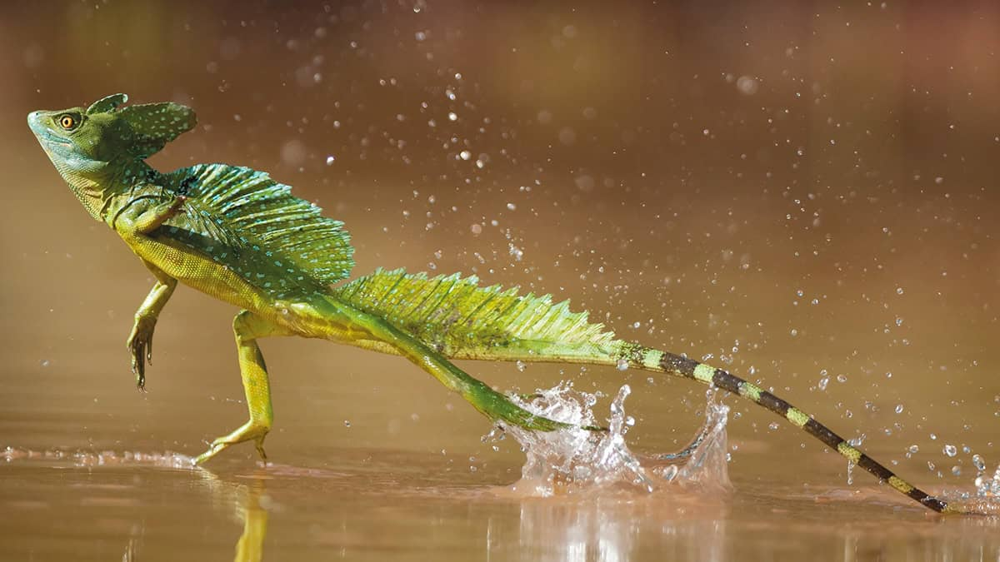

Out of many species on this planet, reptiles are well known for their exotic appearances and diverse species. While reptiles like chameleons are iconic examples of exotic and mysterious creatures, this article will highlight a few lesser-known species with stunning abilities.

## Tuatara
Tuatara, best known for how ancestral they are, first appeared on Earth about 200 million years ago. They are considered the oldest lasting reptile because they are the only species that survived from Rhynchocephalia, an era before the Jurassic age when reptiles emerged. Living in specific regions in New Zealand, they are critically endangered due to their slow reproductive rate, struggle against invasive species, and habitat loss. Not too large in size, tuataras eat small insects and mammals, maintaining their population up to only 50,000. The reason why tuatara is highlighted is not only because of their old history but also their “third eye.”

Tuatara has a third eye on their forehead. The “eye” is not for seeing something but to regulate their body. Even though it just looks like a small spot on their forehead, it is called “parietal eyes” because they have lenses and retina just like eyes do. The function of this eye is, again, not to see things but to regulate their hormones and detect time of the day. Because the eye has a light-sensing photoreceptor, tuataras can know the seasons and the time of the day. Fun fact here is that most reptiles have photoreceptors to detect time and regulate hormones. But the third eyes of tuataras are special because their lens and retina play similar roles with normal eyes.

## Basilisk Lizard
Basilisk lizards are species that originate from South and Central America. Not too big in size and easy to breed, they are also famous pets among reptile lovers. Currently, they are spread throughout most countries as a pet. They are also easily found in nature because of their amazing ability to escape predators. Eating insects and small birds, they have fast reproductive rates and adaptive skills, especially along bodies of water. Moving onto their exotic abilities, they are called “Jesus Christ Lizards” because they can walk on water while running away.

Running on the surface of water may sound impossible. But due to their adapted feet structure, rapid legs, and light weight, they can run on water. More specifically, their feet, which have a large surface area and specialized scale for running on the water, reduces friction on water. Fun fact here is that lots of reptiles can run on the water, but the basilisk lizards are special because of how long they can run. For most reptiles that can run on water, they can only run up to 6 feet; basilisks, however, can run up to 20 feet. It might sound dangerous as they can sink but they actually can be submerged inside water for up to 30 minutes.

## The Argentine Tegu
Argentine Tegu, being one of the most popular pets nowadays, is a type of reptile that grows up to 1.2 meters long. Even though they eat rats and require a big cage, they are considered one of the best pets because of their smart and kind personalities. Native to South America, they can be found in Argentina, Brazil, Uruguay and Paraguay. Even though they grow big and look ancient, they are omnivorous and are healthy enough without any meat. They usually consume wild vegetables such as mangoes, papayas, etc. Their exotic ability is high intelligence.

When we usually think of lizards and geckos, we think that they are less intelligent compared to dogs, parrots, or cats. However, tegus are the only reptiles intelligent enough for human beings to train, communicate through body language, and build emotional bonds. While most reptiles exhibit instinct-driven behavior, tegus are reptiles that think first through their knowledge and then decide whether to do or not do certain actions. To depict their intelligence, tegus that have strong emotional bond with their owner may actually stick to their owners by following and sleeping next to them. Tegus evolved to be human-friendly because they lived alongside humans for over a thousand years, although initially bred for human consumption. Because they have evolved alongside humans, they tend to follow humans better and have high emotion recognition abilities.

## Conclusion
Many reptiles are being constantly discovered and are studied not only because of their exotic appearances but also their amazing abilities. Other than reptiles that I mentioned, there are chameleons that camouflage, horned lizards that squirt blood out of their eyes, thorny devils that drink water through their skin and more. To conclude, I would like to say that even though many people dislike reptiles because of what they eat and how they look, reptiles are as cool as and sometimes even cooler than normal pets such as dogs and cats.