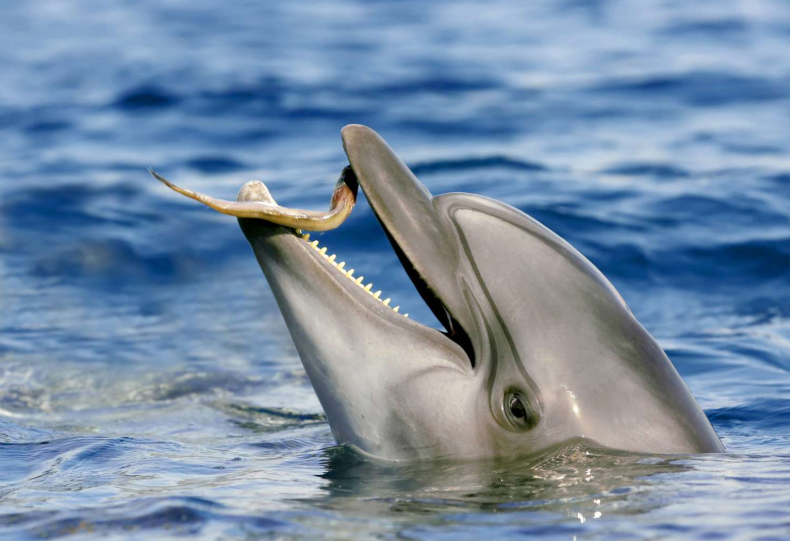

## Introduction
Many creatures have evolved to live together, run away from, chase, and play with others for their own benefit; they coexist with other organisms through diverse methods, including parasitism, mutualism, and symbiosis. However, very few animals that display incomparably high intelligence tend to play with other creatures as if they are toys, not different species. While some animals show this highly intelligent behavior, I would like to point out the most famous and, I believe, the most cruel creature that displays these behaviors: dolphins. In this article, I will discuss all about dolphins’ abnormal behavior that might sound funny, but in reality, is a violent and creepy behavior. 

## Dolphins
If you think of any smart animals that are playful and sometimes creepy, you can never neglect the mammals of the ocean, dolphins. Dolphins are not only famous for their high intelligence but also for their playfulness. Thus, sometimes they are caught by people and become one of the tourist attractions. However, even these poor dolphins are very cruel and are one of the apex predators in the marine ecosystem. While they eat most of the small fish, they sometimes even play with them. Specifically, they use pufferfish as a toy.

Pufferfish as a toy? How do we even use an animal as a toy? They purposely puff them and roll them through the water current just like humans playing with their balls. There are many reasons behind this creepy behavior. The primary reason is just to have fun. Dolphins are very sophisticated animals; aside from human beings, they are probably the smartest animals, along with dogs, octopuses, and primates. Because of this high intelligence and variation of emotions they can feel through a variety of activities, they are considered to be animals that can show the most emotional expressions. Even though they have such varied emotions, that doesn’t mean they can feel all emotions. Especially, pure enjoyment is definitely the hardest feeling that they can feel without socializing. That is why they play with pufferfish, just like we play soccer and basketball for our enjoyment. They can not only play solely by themselves, but they also seem to exhibit behaviors similar to people, teaming up and playing games to achieve the “ball” first. Hence, they can not only resolve their boredom on their own, but also form bonds with others: a societal act. If that was the first reason, what would be the second reason for it? The next reason for their unique behavior is related to the chemistry of pufferfish. Pufferfish’s toxin from their skin is well known for being one of the strongest neurotoxins, which causes paralysis and dizziness. While pufferfish’s tetrotoxins are toxic enough to kill a person when overdosed, dolphins bite them with a very delicate pressure, causing puffed pufferfish to release their toxin only a little bit. During this process, dolphins feel high and get addicted to these toxins, making them more joyful to play with these pufferfish: in other words, they are just like drug addicts of the ocean.

While dolphins show these weird but funny behaviors through the pufferfish, this type of play is the least violent one. Dolphins are surely cute and amiable, but sometimes they are very violent, even psychopathic. Moreover, when they get sick of pufferfish, they sometimes slap octopuses with their tails until their limbs are all separated;  their dopamine is released when they look at wiggling legs all separated. They also toss eels at each other for no reason but joy. These are why dolphins are cute, but one of the most antithetical creatures of the ocean.

## Conclusion
Dolphins were introduced as psychopaths in this journal; however, it is not right to just call them that way for these reasons. For example, we don’t call dogs psychopaths for them playing with sticks in the wilderness; we rather call them cute and kind angels. As such, packaging dolphins because of this sometimes unique behavior in the chaotic ocean is not fully true. For them, it is just an act of playing, a way of bonding, and a way of communication. Besides dolphins’ behavior, it is now a near future that we will not be able to see dolphins anymore: habitat destruction, pollution, etc. Rather than focusing on these behavioral perspectives, why not see a larger box of saving them?

	
