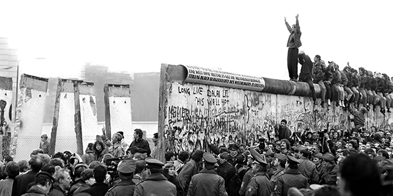

On November 9th, 1989, the wall in Berlin, which was protected like a jewel in a vault, collapsed. Dividing Germany into West Germany and East Germany, the Berlin Wall was initially constructed on August 13, 1961, after World War II. 	

After the conclusion of World War II, Germany faced division among four zones of occupation as the allied powers decided that Germany could not be governed alone, whereupon the allied powers, under Britain, the United States, France, and the Soviet Union, temporarily took charge. Berlin, located in the Soviet Zone, was dispersed among the four powers. This division was confirmed by the Allied leaders at the Potsdam Conference, held from 17 July to 2 August 1945. The United States, Britain, and France took control of West Germany under capitalism. Businesses were privately owned, the market could decide prices, and people could start new companies. On the other hand, East Germany was handled by the Soviet Union under communism. In this zone, the government took charge of industries, and the state decided the production and prices. Albeit being scattered amongst the Allied powers, Berlin remained the most sensitive and volatile representation of this division.

Germany was a focus of Cold War politics, and the division between East and West Germany became increasingly evident. Afterward, in 1949, Germany officially split into two different independent nations. West Germany was referred to as the Federal Republic of Germany (FRG), which was allied to Western Democracies. In contrast,  Eastern Germany, referred to as the German Democratic Republic (GDR), was allied to the Soviet Union. Soon after, in 1952, the government closed the border between East and West Germany; however, the border between Eastern and Western Berlin remained open. This resulted in the Eastern Germans fleeing through the city to escape the oppressive environment. 

On the night of 12-13 August, a wire barrier was built in West Berlin. As a result, neighbourhoods and families were separated overnight. The wire barriers were eventually fortified and were further reinforced to a concrete structure. The Berlin Wall was made up of two parallel walls that were 155 kilometers long and about four meters high. The "death strip," which was heavily guarded, separated the walls. From hundreds of towers, the East German guards, with the right to shoot anyone trying to cross the wall, kept an eye and high surveillance on the border. More than 100 people lost their lives attempting to cross the Wall during the existence of the Berlin Wall, and hundreds more faced fatality along other parts of the inner German border that separated East and West Germany.

Disturbance in East Germany and the political changes occurring in Eastern Europe in 1989 put pressure on the government to loosen restrictions. Large crowds gathered at border checkpoints on November 9 after spokesperson Günter Schabowski made an incorrect announcement that travel to West Germany would be permitted immediately. The Berlin Wall fell when guards stopped enforcing passport controls, and people were allowed to cross freely. The incident made the government of East Germany even weaker, which finally resulted in the reunification of Germany on October 3, 1990.

In the end, the construction of the Berlin Wall was not a significant decision or a spontaneous attempt but a culmination of existential political schisms that replayed themselves after the conclusion of World War II. Germany’s division into East and West, shaped by rival capitalist and communist ideas, made Berlin the most dominant symbol of the Cold War conflict. The Wall rose in 1961 to stop the mass flight of East Germans, physically separating families, neighborhoods, and a country for almost three decades. Its heavily fortified layer below the surface symbolized not just a dividing line between two states, but rather the wider ideological division in the Cold War-era - the struggle between the Soviet Union and Western democracies. Yet, disturbances in East Germany and political changes throughout Eastern Europe eventually brought the government down in 1989. The Fall of the Berlin Wall marked the end of communist rule in East Germany and symbolized the period of German reunification in 1990. The Berlin Wall stands today as a well-known historical symbol of the division of Germany and the conflict among the same Germans.

