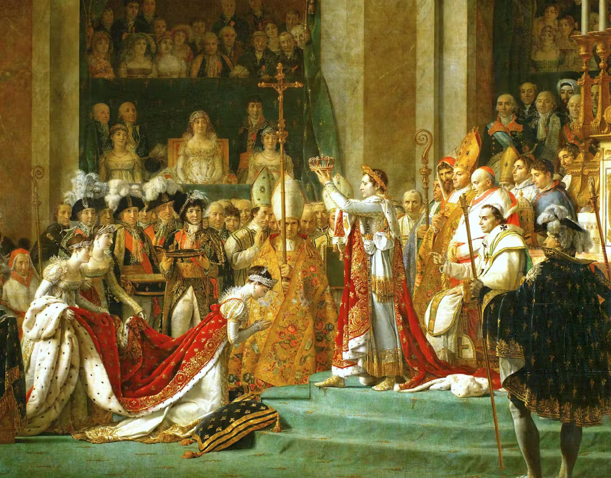

On December 2, 1804, Napoleon Bonaparte, a French military leader, crowned himself with a coronation crown with his own hands and his wife, Josephine. He was incomparable to other emperors of other nations and legends from ancient times. 
	
Napoleon Bonaparte was born on August 15, 1769, in Ajaccio, on the Mediterranean island of Corsica, France. He was the son of Carlo Buonaparte and Letizia Bonaparte, his mother. He was the eighth child of his family. Despite having a noble family, he was still known as an outsider in France; his goal was to prove himself to others, which could lead to high authority and power. His idea of holding power was derived from the French Revolution. During the period, the law system was a monarchy where the King held power; due to the French Revolution, the monarchic system immediately collapsed, and that is when Napoleon decided to rise as a leader. 

Napoleon viewed the chaos as an opportunity rather than a threat, as a revolution that shook France. After enlisting in the French army, he immediately stood out thanks to his strategic thinking and leadership. Due to his commitment and explicit choices in battles, he gained respect and promotions. He dedicated and developed himself to fighting wars. With every victory, he took a step toward gaining the high authority he had always desired. 

He turned from an ordinary soldier into a strong leader who crowned himself emperor, capturing the opportunity during the chaotic French Revolution. His beginning from Corsica to the highest point of French power also proves why  Napoleon was a great leader in history.