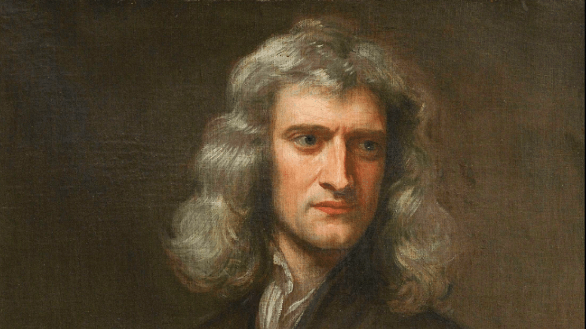

In 1666, Isaac Newton saw an apple falling from a tree. He asked himself; why did the apple fall straight down? Not upwards or sideways but straight down. After this, he started to formulate a theory for gravity. In 1687, Newton published a paper outlining his theory of gravity. It was widely popular amongst the scientific community and was recognized as a fundamental scientific law. We are going to talk about Isaac Newton’s background information, achievements, and impact.

Isaac Newton was born in Lincolnshire, England on January 4, 1643. He was a theologian, astronomer, and physicist. He is considered one of the most influential scientists of all time. When his mother remarried after a divorce, his grandmother took care of him. He attended University of Cambridge’s Trinity College in 1661. When he went to college, he began to study mathematics and physics along with optics. After all the achievements that he made, he died in March 1727 in London.

The main achievements of Isaac Newton and their impact were formulating the Laws of Motion, Law of Universal Gravitational, and calculus. Starting with the Laws of Motion, there are three laws. The first law is also called the Law of Inertia, which is about an object remaining at rest or moving in the straight path unless it is acted upon by an external force. The second law of motion states that the acceleration and mass of an object  is proportional to the net force acting on it. Lastly, the third law states that for every action there is an equal and opposite reaction. Newton’s law of motion helped the advancement of engineering and physics by understanding the behavior of objects under the influence of forces.
 
The Law of Universal Gravitation states that any particle of matter in the universe can attract other masses with a force that is proportional to the product of masses and inversely proportional to the square of the distance between them. The formula for that is F=G x m1x m2 x 1/r^2. The Law of Universal Gravitation explained the motion of celestial bodies such as planets, moons, and comets, also helping astronomers to predict and understand phenomena such as tides accurately.

Lastly, for calculus, Isaac Newton and Gottfried Leibniz were its founders. Using calculus, Newton explained his laws with a solid mathematical foundation. Calculus can help in calculating the acceleration, velocity, and position of objects, which is very important for designing vehicles such as cars, rockets, and airplanes. It is also used in the study of electromagnetism, where it can also help understand the behavior of electric and magnetic fields. 

Newton’s achievements are still helpful today. However I think the law of motion is the most useful contribution and achievement of Isaac Newton in modern days.