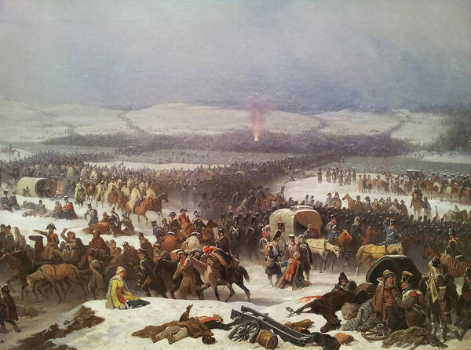

On December 16, 1812, thousands of troops were drowned and froze to death in the battle of Berezina, a place where French Officers witnessed the most horrifying death a soldier could ever experience. Berezina was devastatingly cold, and the battle was the most miserable and terrifying. Not only did they have to resist their opponents, but due to the extreme weather conditions, they had to fight against themselves mentally and physically.

The Battle of Berezina occurred in Russia, on the Berezina River, in present-day Belarus, one of Napoleon’s Russian Campaigns during the Napoleonic Wars. The struggle began after the French Army had to evacuate due to the problem they were struggling with, and needed to avoid the complete annihilation of the soldiers. The most intense problem took place in Russia, as we all know, Russia is extremely cold, and even during the French Invasion of Moscow, the French Grand Army was going through the problem of freezing to death, lacking utilities, scarce food sources, and also faced its coalition from all directions.

The Battle of Berezina involved the nations of the Sixth Coalition against France, which were Prussia, Austria, the United Kingdom, Sweden, Spain, Portugal, Russia, and various German states. Primarily, Russia, which was planning to explode and annihilate Napoleon’s Army by destroying the bridge of the Berezina River while they were retreating from Russia. Despite the impenetrable defense and schemes from different nations, Napoleon had a great plan to eradicate the enemy forces; he decided to fool the Russian troops by pretending to be ready to cross the river and withdrawing Russian forces from the bridge. While they were pressuring Chichagov’s river, French sappers were in action, making a pontoon bridge across the river near the village of Studienka. After the completion of the preparation for evacuation at a village near Studienka, Napoleon sent his troops rapidly across the North side, but tragically, some French troops were sacrificed for their emperor, and the rest of his army could safely cross the river. Some troops remained at the Berezina River, which resulted in casualties and war prisoners.	The significance of the Battle of Berzina remained as a title of disaster in French history. France lost about 25,000 to 30,000 soldiers who were killed, captured, or wounded. Due to this battle, Napoleon’s military power and his reputation were partially destroyed. His Grand Armée was nearly destroyed after these sieges against coalitions, which negatively affected French Military Power, as the Grand Armée was the most elite and experienced military group formed in France by Napoleon himself. 

The Battle of Berezina remains one of the most brutal and harrowing battles in Napoleonic War history and a symbolic experience of Napoleon’s downfall. Although the French Army barely evacuated back to France, they witnessed a lot of terrifying fatalities of their troops by facing coalition forces, but also against the harsh environment of Russia, which involved extreme cold, as a result, led to the major annihilation of Napoleon’s troops in Russia.