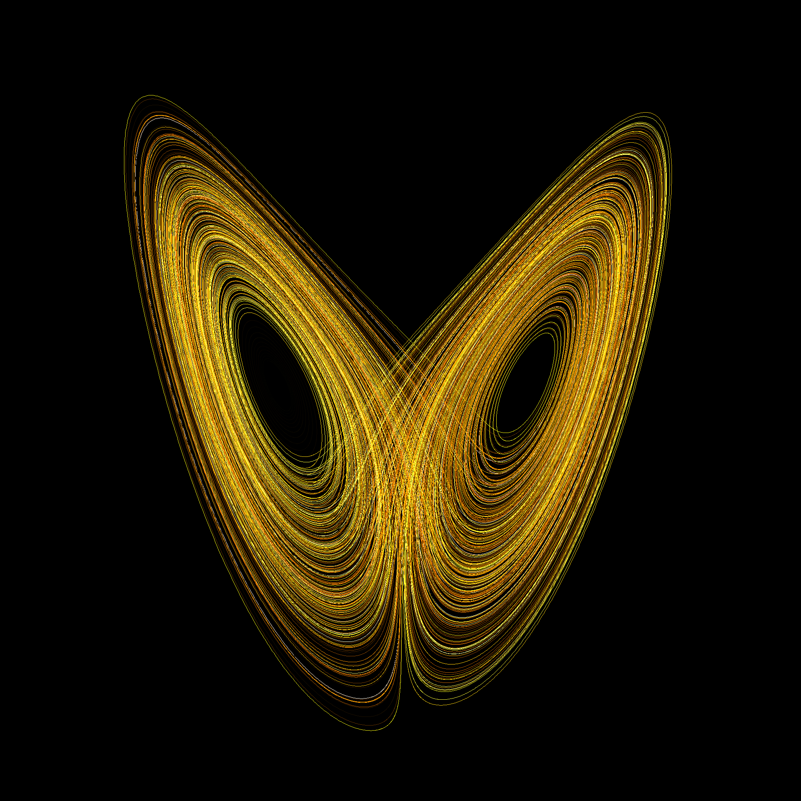

In 1960, a meteorologist named Edward Lorenz started his first experiment in chaos theory. The butterfly effect, which is well known, is considered one of the key concepts of chaos theory. Soon, Edward Lorenz pioneered the field of chaos theory. These days, chaos theory is used to calculate things that are limited in computational models, for example, by analyzing and predicting weather systems, fluid dynamics, and population cycles.

Chaos theory explains the point where stability changes to instability and order moves to disorder. The butterfly effect is a concept in chaos theory, which is the idea that small actions turn into big responses; small wings of a butterfly can greatly affect weather such as typhoons and tornadoes. 

The history of chaos theory began in the 60s from an experiment by Edward Lorenz. At the time, Lorenz was studying to predict the weather with equations. In 1961, he changed something in his experiment: rounding the decimals to 3 digits instead of full 6 digits. After he changed his value, his result in the experiment was very different from before. He realized that changing small things could lead to major changes in results. He described this occurrence as “the butterfly effect.”. The rise of chaos theory was in the 90s. It spread around the world and was recognized in various subjects such as physics, biology, and complexity science. In the 2000s, chaos theory advanced with mathematics and computer science breakthroughs. 

Chaos theory can even teach us important lessons in our lives. It can tell us that unpredictable things and uncertain things can happen. Also, it teaches us that small actions that we make can lead to great consequences that aren’t predictable. It also tells us that, in scientific experiments, small errors can ruin the whole experiment

Overall, chaos theory is instrumental not only in mathematics, physics, meteorology, computer science, and biology but also in real life such as by teaching us the consequences of our small actions that lead to big effects which is also known as “the butter effect.” So, I want to tell you guys that chaos theory is important not only as an academic field of study but also as a lesson for real life. 