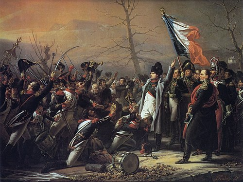

On March 1, 1815, former Emperor Napoleon Bonaparte escaped from exile on Elba and landed on the southern coast of France, near Golfe-Juan. There, he encountered the 5th regiment of line infantry soldiers that had been sent to arrest the escaped former emperor; they stopped in front of him. 

The 5th regiment of line infantry soldiers halted, blocking the route. Napoleon Bonaparte shouted toward the soldiers of the 5th regiment, “ Here I am. Kill your Emperor, if you wish.” Consequently, the soldiers were shocked; they then chanted, “Vive L’Empereur!” which became the turning point of the French Empire. Infantry soldiers deserted their positions to return to their former emperor, Napoleon Bonaparte. All soldiers were persuaded by him, including Colonel La Bédoyère, who was in charge of the soldiers. He brought every soldier back to Napoleon, marking a return of Napoleon’s power. 

After the defection, most of the soldiers and commanders had joined him; Colonel La Bédoyère, who brought the majority of soldiers back to Napoleon, was promoted to general as a reward for his commitment and loyalty. Soon before March 10, Napoleon marched toward the Alps, resulting in the collection of more troops within his realm. He intentionally avoided large areas such as major cities so people wouldn’t notice the advance of Napoleon and his forces.

On March 10, they decided to march toward Paris and regain their position. Although Louis XVIII attempted to stop Napoleon, the entire army switched allegiances and joined Napoleon. He completely won his army again, which was a huge advantage for him. After March 20, Napoleon and his troops entered Paris, and from that point, King Louis XVIII realized his plan had failed to stop Napoleon’s forces from entering Paris, and his troops weren't willing to fight. When they stepped into Paris, they were greeted by soldiers and other supporters.

Another event broke out after the entrance of Paris, known as the “Hundred Days.” This period is referred to as the Hundred Days because shortly after Napoleon regained power, he was defeated after 100 days at the Battle of Waterloo. Colonel La Bédoyère’s fate is also a significant and interesting aspect of the Napoleonic Wars. Soon after Napoleon’s army fell on June 18, 1815, after the defeat at the Battle of Waterloo, he was arrested by the British royalists and was court-martialed. As a result, in August 1815, La Bédoyère was executed by the firing squad for his treason against the Bourbon Monarchy. Meanwhile, Napoleon was abdicated after being defeated by the nations within the Sixth Coalition, the Prussian Empire, and the United Kingdom. Later, Napoleon was exiled to Saint Helena in the South Atlantic, where he spent the next six years of his life after abdication and died in 1821.

Everyone thought Napoleon’s plan would work out well and result in a lasting reign of the French Empire by Napoleon Bonaparte, but in the end, he lost all his troops and was abdicated by the United Kingdom and Prussia after decisively losing at the Battle of Waterloo on June 18, 1815. 