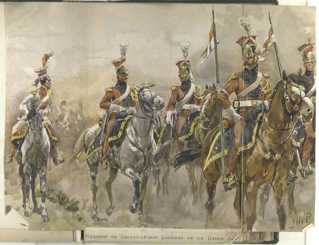

In 1808, during the Battle of Somosierra, 1er Régiment de Chevau-légers de la Garde, known as Polish Lancers, struck the Spanish artillery soldier’s neck with the iron-point on the tip of their lance. This gave a crucial path for Napoleon and his French Troops to triumph. The Cavalry Regiment of the French Empire was one of the greatest and most dire armies of the French.

1er Régiment de Chevau-légers de la Garde was the lancers within the French Army from Poland, who were exceptionally loyal to their Emperor. Why would people from other nations be loyal to Napoleon? Polish Lancers had a covenant with Napoleon where they promised to keep and promote their traditions and honor with their well-known weapon, the lance. Prior to the contract, there wasn’t a regiment referred to as Polish Lancer; after the covenant, the regiment was named 1er Régiment de Chevau-légers de la Garde, consisting of lancers from the Duchy of Warsaw.

What made them so unique and significant within the French Army? They were highly distinguished and committed to Napoleon, who was known for their courage and loyalty to their nation and emperor. Not only for their emperor, but they were also thirsty for liberty and re-establishment and craved independence for their own nation, which motivated them more on the battlefields as Napoleon promised them that the independence of Poland would be restored. Not only did their loyalty and patriotic aspect stand out, but their uniform was also unique; they had their own blue and red colored uniform, which makes them stand out since most of the cavalry had only one dominant color in their uniform. Looking back to their patriotic aspect, due to their huge craving for triumph, they also played pivotal roles in various military campaigns.
	
They have so many achievements that could be recalled. One of the significant and historical accomplishments of Polish Lancers was their outstanding cavalry charge in the Battle of Somosierra, in which they played a critical part in taking over a Spanish artillery formation for France, which contributed greatly to Napoleon claiming their triumph in the battle. During the retreat after the Battle of Borodino, or Moscova, when Napoleon was retreating along with his army, the Cossacks, the Russian Cavalry arrived to kill Napoleon,  but they didn’t know that lancers were protecting the Emperor as Horse Guard. Lieutenant J. Hempel led the 1st Squadron of the Polish Lancer for counter-attack against Cossacks, and during the charge, a lancer named Kozielulski was injured in the upper arm by a pike while he was saving the Emperor. Later, Kozielulski was promoted to Major for his heroic action; this shows the courage of the lancers who did not waste time or hesitate to take action against the Russians. They were so loyal and brave that they gave deaths to the enemies of their fatherland; this proves to people how they took immediate action against the opposing force against the emperor and how they performed a heroic action just to save and serve their emperor. This shows how strong their loyalty and courage were at the time, even if it was risky and heavily impactful on themselves. Alternatively, they were also included within Napoleon’s elite Imperial Guards due to their exceptional performances on battlefields, touring enemies apart alongside. Serving as elite Imperial Guards made them show the whole of Europe that they were the finest and the most dire light-cavalry force, proving who the owner of cavalry in Europe is, gaining their fame and pride for their regiment, but also for their nation, the Duchy of Warsaw.

1er Régiment de Chevau-légers de la Garde, the finest light-cavalry regiment that dedicated itself to Napoleon under the condition that their nation would regain their pride and liberty by re-establishment, was motivated greatly in craving enemies' blood on their steel lance. Not only their own patriotic aspect, but they also had their own dominant and unique uniform that they showed off on the battlefield. Alternatively, their achievements also stood out, such as forming a defense in the Battle of Siemorra and retrieving the Spanish artillery. Because they were so dedicated and committed to their regiment and to their nation, they were very notable for their aspects in Europe; Polish lancers took charge when they were moving out, along with Napoleon acting as a Horse Guard, rescuing him from the Cossacks when they tried piercing through Napoleon when they initiated their counterattacks toward the Russian cavalry.
