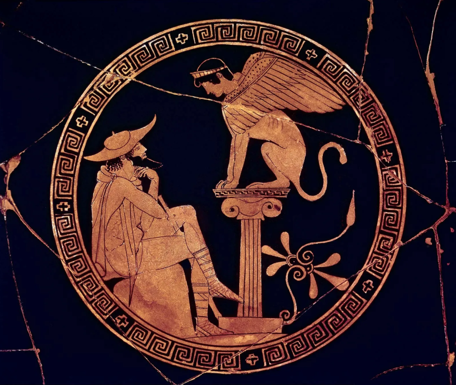

King Laius sprang into the hearse, unaware that he was boarding his own death, brought about by his son, Oedipus. This sequence captures the resentful irony of the relationship between father and son. 

This bizarre irony’s began with a descendant of the prophecy from Apollo’s oracle. After the Queen of Thebes, Jocasta, gave birth to Oedipus, King Laius received a prophecy from an oracle that he would be killed by his own son. Acknowledging this foretelling, his mother abandoned her son at the Mountain Cithaeron for him to waste away eventually. To make sure he would rot to death on top of the mountain, his parents pierced and pinned his ankles together with an iron spike; this is where his nickname, Swollen Foot, derived from. Eventually, the infant was found by a wandering shepherd on the mountain and was sent down to another shepherd from Corinth. The shepherd who received the abandoned newborn chose to present the baby to the childless Corinthian Queen and King, Merope and Polybus. They raised him for years, naming him Oedipus without revealing his true origin, keeping the truth sealed from him.

One night at a banquet in the city-state of Corinth, a drunk man burst in, mentioning that Oedipus was not the true son of the Corinthian royal family. After the allegation was proclaimed and arose, Oedipus’s emotion was like a salad bowl, a mixture of anxiety, anger, and intense denial. Because of his doubts and denial of reality, he went off for counsel from Apollo’s oracle at Delphi like a startled dove darting straight into a fowler’s net. Things did not go as he expected. After he arrived at Delphi, he faced an eldritch prophecy from the oracle: “Oedipus would murder his father and have a child with his own mother.” Scandalized, he ventured from Corinth to Thebes.  After being nauseated by such a disturbing prophecy, he fled from his parents, whom he assumed were his biological parents.

During his venture, he came across King Laius and his servants. They demanded that Oedipus make way for himself and his servants at the crossroads. However, Oedipus, unwilling to yield, started a vile confrontation and clashed with them ruthlessly. Amidst the clash, Oedipus alone slaughtered four of his servants, including King Laius, his birth father. He continued marching on his venture to Thebes. Soon after arriving in Thebes, he faced the lethal Sphinx. She would mercilessly engulf all who would answer her questions incorrectly. Unexpectedly, he answered the Sphinx’s question correctly. Thebes celebrated its victory against the Sphinx, as she was a ravaging creature. With the passing of time, no one figured out who killed Laius; he married the widowed Queen of Thebes, Jocasta. In time, they laid four babies, neither of them knowing they were biological sons and birth mothers. Until then, they did not know the plague was closing in as a consequence of the infants being laid by them and the murder of King Laius. 

As the murder of King Laius was never solved in Thebes, the miasma — terrible, polluting plague — was brought upon the advent of Jocasta and Oedipus’s descendants to the world. Creon, Oedipus’s brother-in-law, was sent to the Oracle at Delphi to discover why God was punishing the city. Later, he figured out that the plague began spreading due to the murder of King Laius and would not end until the murderer was found. The investigation was opened, but nobody suspected it was Oedipus who killed his own father. However, Teiresias, an old and blind prophet, pointed out that Oedipus was the murderer. He tried to deflect the accusations and continuously denied them. Jocasta explained that she heard it was probably some robbers that he clashed with at the crossroads. The odds were against Oedipus. Simply, the testimony of the servant who fled during the scene exactly matched the physical appearance of Oedipus. Subsequently, he was convicted of murder. Jocasta, shocked by the truth, rushed to her room and hanged herself. When Oedipus arrived to her bedroom, she was already dead. Her body was cold and lifeless. He was filled with anguish and denial. Shortly after, he realized that he had married his own mother and figured that he was the reason why his father had perished at the crossroads.

The perishing of King Laius represents that divine foretelling and fate in Greek mythology cannot be avoided. He tried to avoid his fate by abandoning his son to rot at Mount Cithaeron. However, he faced his cruel fate and its consequences at the crossroads, not knowing he was given death by the hand of his own biological son. Ultimately, Oedipus, too, could not escape the consequences of murdering his own birth father during the venture to Thebes. Later, when he arrived at Thebes, after being convicted, Jocasta—who had married his own son — was astonished beyond measure that she took her own life. This all represents the vile and heavy consequence of trying to cheat divine foretelling in Greek mythology and displays the extreme, cruel, and disturbing reality that they have to face as their punishments. 