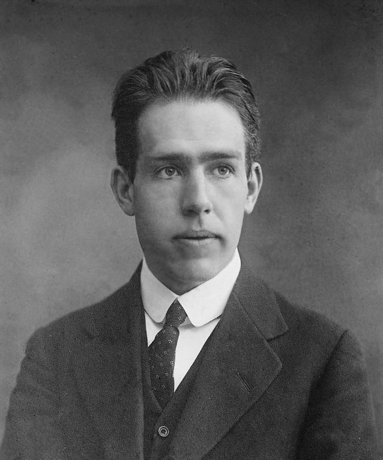

Modeling atoms while the behavior and concept of electrons are poorly understood might seem difficult. Well, a Danish scientist accomplished it. Niels Bohr, a physicist, pioneered the first model of the atom.

Niels Bohr was born into a family with a strong academic background in Copenhagen, Denmark on October 7, 1885. Christian Bohr, his father, was a physiologist and a professor at the University of Copenhagen. His family members were generally well-educated. His mother, Ellen Adle Bohr, was also a well-educated person from a Jewish family. 

Niels Bohr had a lot of notable achievements. Let’s talk about his development of quantum theory first. He made a great contribution to its development, such as the principle of complementarity. His next achievement is winning the 1922 Nobel Prize in Physics. This prize is not an easy award to earn; however, he managed to earn it, which also tells us that he was a great physicist and a clever man. Lastly, this achievement relates to one of the branches of physics, which is his contribution to nuclear physics. He constructed the idea of nuclear fission after the discovery of nuclear reactions. 

Following his achievements and legacy, he impacted physics’s branches, mainly at the atomic scale, which is a well-known achievement he made. His atomic theory enlightened us about the electron configuration and the different levels of energy. This laid the foundation for quantum theory. He played a key role in establishing the principles of quantum mechanics, especially in the idea of quantization, the probabilistic nature of particles, discrete levels of energy, and photon emissions. 

The death of Niels Bohr was after the conclusion of World War II on November 18, 1962. He always used to work on his research continuously even though the war was ongoing; this demonstrates his persistence despite harsh conditions.

Overall, Niels Bohr had a great impact on physics and its foundational theories today. Such achievements could have been possible since his parents were both well-educated mainly in science. Overall, his research and achievements had a great influence on physics, and when he died, he left a great legacy for later theories in physics and its research. 