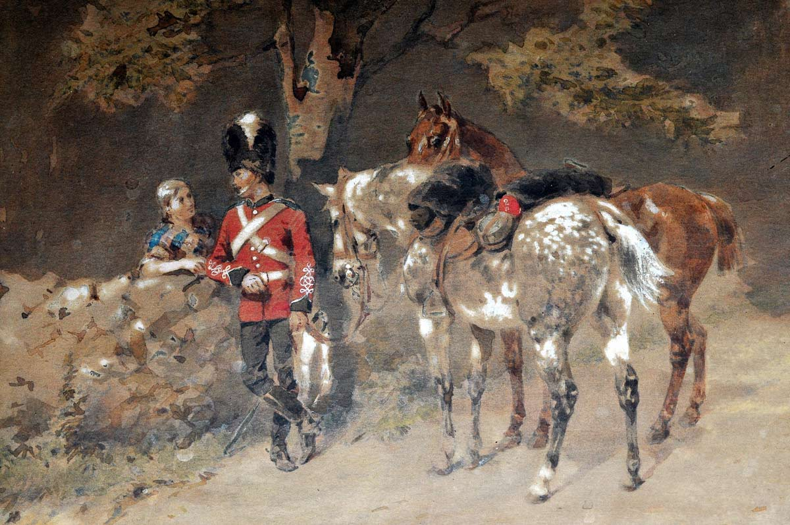

In 1815, Kingdom of the Netherlands, at the Battle of Waterloo, the Royal Scots Grey charged against the French infantry brigade. The Scots Greys gave the Frenchmen a taste of the heavy cavalry saber of the United Kingdom, capturing the soldiers of the 45th Regiment of Foot from France. The Royal Scots Greys had numerous notable achievements, and their unique style flourished.

The Royal Scots Grey was formed in 1678 in England. They had their original name of “3rd Dragoons,” later renamed to the Royal Regiments of Scots. They also have the word “Grey” in their name, as the horse riders in this regiment rode grey horses, making it easy to recognize each other. Until the Act of Union, which united both Scotland and England, they did not have the word “Royal” in their names. The Scots Greys were formed to ensure safety against rebellion and political unrest under Charles II. Their main purpose was not to gain victory on frontlines, but rather to guarantee safety for their monarchs. 

The War of the Spanish Succession from 1701 to 1714 was the first battle of the Royal Scots Grey. The focus of this campaign was to decide who would rule Spain when the Spanish Habsburg king, Charles the Second, died without an heir. During this time, three different nations wanted to conquer Spain: France under Louis XIV’s grandson, Austria, and Britain under Archduke Charles. The Coalition against France, Austria, and Britain stated that, if France took power in Spain, it would be too strong in Europe. In this period, the Royal Scots Grey were still a dragoon regiment, a unit where an individual could fight both on horse and on foot. The Royal Scots Grey’s first contribution to victory was the Battle of Blenheim, where they crushed the French and Bavarian army. In the Battle of Ramilies, they forced the French army to retreat with their sharp cavalry charge, destroying their infantry. Similar to this, both the Battle of Oudenrade and the Battle of Malplaquet forced the French to retreat again, weakening their army. This battle was so significant because the triumph of the French could have made it indestructible in Europe and might have led to total control of Europe for France. After this battle, France was weakened because of high casualties, and it marked the conclusion of the Treaty of Utrecht, balancing the power in Europe. Consequently, Royal Scots Grey gained a positive reputation for their bravery, courage, discipline, and power on the Frontline. 

The most significant battle in the Napoleonic War, and for all other nations, was the Battle of Waterloo, June 18, 1815.  The legendary achievement and fame of the Royal Scots Grey were built here. During this period, they were under the control of the Duke of Wellington’s Union Brigade, Inniskilling Dragoons, who were Irish, and Royal Dragoons, who were English. They wore bearskin caps and rode on magnificent grey horses. The most famous action for the Royal Scots Grey was at midday, when Napoleon launched an attack toward Britain’s infantry, sending his French I Corps, which ended up pushing back Wellington's infantry force. After retreating, the Union Brigade, along with Royal Scots Greys, prepared a countercharge. They went deep into the French infantry line, destroying and making them taste the heavy saber of the British Cavalry. The charge was so successful that Royal Scots Grey, under Sergeant Charles Eward, captured a French Eagle Standard which represented and symbolized the pride of Napoleon’s army. This charge and seizing the Eagle symbolized the courage and the victory for Britain. After the charge, they had enough time to hold the French forces until the arrival of the Prussian army, which was part of the Sixth Coalition along with Britain, to destroy France. After this battle, the Royal Scots Grey gained an increasing reputation for their honorable and heroic action in the cavalry charge during the Battle of Waterloo. At the end, the sixth coalition, including Prussia and Britain, ended up claiming the triumph in the Battle of Waterloo. 

Royal Scots Grey had a unique experience back then, changing their name from a third Dragoon Regiment to Royal Scots Grey after the Act of Union. They had numerous achievements that made them stand out in all of Europe. Especially in the Battle of Waterloo, they were known for their remarkable action in capturing the Eagle of the French army, which symbolized the pride, basically taking over the pride of France. They bought enough time for the Prussian army to arrive, later destroying the French Army. 

