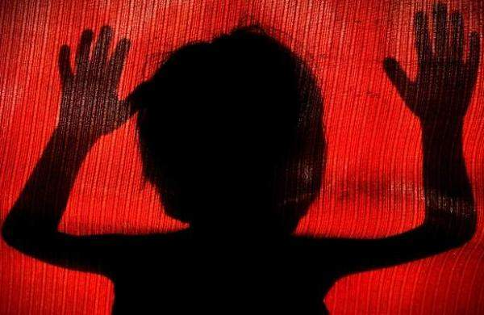

According to the United Nations Office on Drugs and Crime, most of the countries have over 60 percent of families punishing their children physically. Neglecting or abusing children can cause lasting impact on them such as trauma. I am going to explain about the impact of crimes against children.

Crime against children is doing something bad to them or abusing them. This not only includes physical assault, but it also includes emotional and mental abuse, sexual harassment, and neglect.

By damaging children's emotions and mental health, it can cause trauma at such a young age, and it will be hard to get rid of. This can lead to serious mental health conditions including anxiousness, depression, and post-traumatic stress disorder (PTSD). If these things get worse, some children might think of commiting crimes such as murder, drug use, and suicide. According to the American Psychological Association, 20 percent of children and teens are seriously attempting and considering suicide. That's why crimes against children should stop immediately.

By creating PTSD or trauma, it can give children's autism, a disability with difficulties in learning and having conversations with other people. Due to PTSD, it can make children easily frightened, difficult to control, have developmental problems, and become aggressive. Because of these problems, it will be hard to have friends, form good relationships, and interact with society. Also in the future when they have academic or social problems, companies might not choose you. This is also related to getting educated. If you have bad grades, you will get rejected from the universities or colleges that you applied to. As mentioned, trauma and PTSD are hard to get rid of, so it will be hard to maintain a good mental state.

Child neglect is when a child is not given the basic needs a caregiver should give. This can cause anxiousness, depression, and other emotional issues. This can give children an impact including developmental problems in the brain, such as thinking like a 3 year-old baby even when older. In school, it is very important to have good relationships and academic skills so that you can learn. But if children are neglected, it will be hard for them to communicate with others. If a child is having trouble learning they might not have developed enough skills when they begin to attend high school or even university. This might make them to have suicidal thoughts. 
Child neglect is the responsibility of the parents, and they should keep children safe so that they are not physically and emotionally hurt. If parents abuse their child, it will be hard to tell someone else, because other people might think that the child is just getting punished for something wrong that he did. Most people won't believe the children when they say they are getting abused. This is why crimes against children should be stopped now. 

*Listen to the article as read by the author:*
<iframe width="800" height="450" src="https://www.youtube.com/embed/55thSJ3ZMuQ" title="Akito Kim - November 2023 - TCA Journal" frameborder="0" allow="accelerometer; autoplay; clipboard-write; encrypted-media; gyroscope; picture-in-picture; web-share" allowfullscreen></iframe>