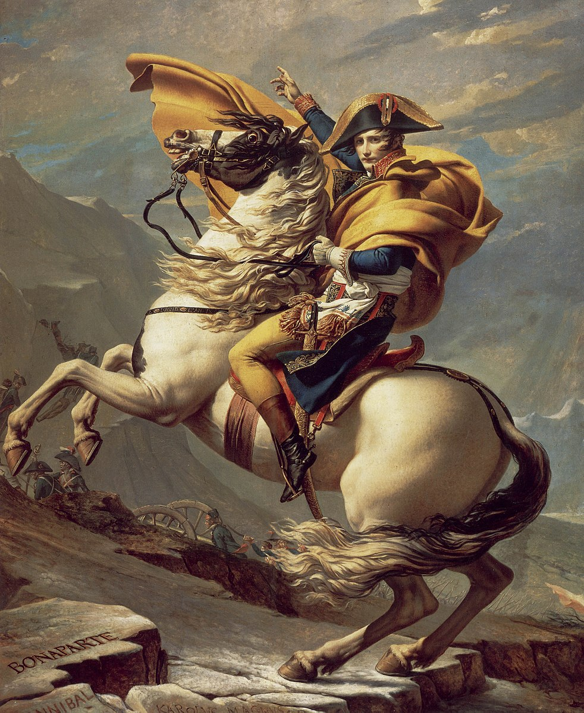

Napoleon’s nationalism and dream greatly shaped old France, and while this may sound admirable, there is ongoing debate about whether he was a hero or a villain. Napoleon’s legacy includes both good and controversial accomplishments; it is hard to decide if he was a villain or a hero. However, he was closer to being a good leader because of the numerous good achievements that outweighed his controversial achievements. 

The Battle of Waterloo, which ended his reign in 1815, marked the downfall of the French Empire. Due to his ambition and evil temptation, he faced the tragic consequence of defeat by British soldiers, which led to the French military's collapse and Napoleon's fall. Yet, he had numerous victories in his battles, such as the Battle of Austerlitz, which showed his military brilliance to his enemies and proved his skills and strategies to his military. 

Napoleon’s reputation should be reconsidered because of his heroism, his outstanding military brilliance, and his spreading liberty and equality over the continent. Even if there were sacrifices and deaths during battles, France managed to improve economically and politically. They won countless battles, which made him a great leader within France. Napoleon's military victories allowed France to expand its territorial control and influence across Europe, and it was able to spread their ideas, such as liberty, equality, and secularism. His nationalism played an important role in advancing France both politically and economically.

We cannot judge a person just by looking at their failures; for example, Abraham Lincoln is recorded as a hero in the United States even though he took charge of a war that caused 750,000 casualties, including civilians. Just as people remember Lincoln as a great historical leader because of his achievements, like ending slavery and preserving his Union, Napoleon’s legacy also has numerous good achievements beyond his battles. 

Napoleon had over 60 battles and only lost 7 of them. The most notable and significant battle that the French won was the Battle of Austerlitz. The countries that were involved in this battle were France, Russia, and Austria, which were allied with Russia and opposed Napoleon during the Napoleonic War period. The number of troops that were involved in this battle was about 158,000, and about 24,000 were wounded and killed. Before France had the Battle of Austerlitz, France had inequality, economic hardship, and property damage by Austrian and Russian forces. They still followed the Feudal system, which made Monarchs and nobles hold more power than peasants and common civilians. Additionally, they looted people’s property and burned villages and crops to stop the development of France. Napoleon thought that a person’s birth would not unfairly decide someone’s career. On the other side, Russia, Austria, and Britain wanted to stop the advancement of France under Napoleon, so they formed a coalition that started a battle that remains historical until today, the Battle of Austerlitz. The French achieved a victory in the battle, which removed the threats and inequality in France. When Austria was defeated, it surrendered by signing the Treaty of Pressburg, which ended their involvement and gave up land to France. He continued to improve France, but mainly on equality, liberty, and fraternity. Unlike Austria, Russia rapidly returned to its territory, which avoided any penalty from Napoleon. Napoleon’s nationalism did not end with numerous battles; it also involved his significant and amazing commitment to liberty and equality. 

The Napoleonic Code, the most notable achievement of Napoleon, reinforced equality and liberty in France. It was also referred to as the Code Napoleon and the French Civil Code, which is a set of laws established by Napoleon that regulated and unified French Laws. This code removed the feudal privileges that they had, which prevented and removed inequality in France. It involved property rights, which also prevented property damage. Overall, this significant achievement from Napoleon served justice and fairness to all people in France rather than inequality. Not only did it bring fairness to France, but it also influenced other countries with legal systems that protected individual rights. 

Without doubt, Napoleon did lose a lot of battles that led to massive injuries and deaths of French soldiers. However, because of the battles he won, France could rapidly expand their territory across Europe, advance the country with different resources from other countries, and several reforms were initiated by Napoleon.