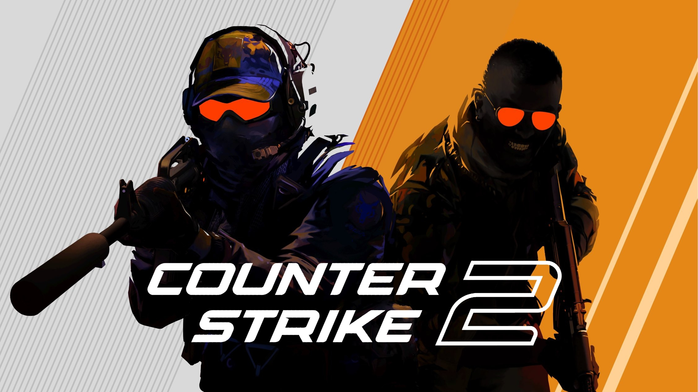

Counter-Strike is the most famous FPS (First-Person Shooter) game worldwide in 2026. Counter-Strike began from a Half-Life mod created by Minh “Gooseman” Le and Jess Ckuffe, focusing on tactical team-based gameplay. It was first released in 2000. It developed via 1.6, Source, Global Offensive (2012), and Counter-Strike 2 (2023), becoming a premier tactical FPS and a major esports title. Since it used the Source 2 engine, the game became more modern in graphics, maps, networking, and visual effects. 

The basic format of this game is 5 vs 5. One team plays as Terrorists, and the opposing team plays as Counter-Terrorists. It is not just killing 5 opposing enemies. Instead, it is an object-based game. The most famous mode is bomb defusal. Terrorists try to plant the bomb and protect it until it explodes. Counter-Terrorists try to defuse the bomb before this happens. At the start of each round, players receive money to buy tools such as weapons, armor, grenades, and defuse kits. Even though Counter-Strike is a shooting game, a player’s aim isn't the only thing in the gameplay. Their budget management is very important for optimizing artillery. Also, they should develop a plan or set up tactics well through communication, map control, positioning, and timing. 

In the game, there are various buyable weapons. The main weapon types are pistols, SMGs, rifles, sniper rifles, shotguns, heavy weapons, and utility. Pistols are especially important in the early rounds, including Glock-18, Desert Eagle, etc. If the team is out of budget, they can buy the pistols instead of rifles. SMGs are cheaper than rifles and more useful in close-range fights. Rifles are the main weapon in competitive Counter-Strike. Sniper Rifles are the most important guns, because they can kill enemies with a single shot in many situations. It is powerful, but it is also risky because it is very expensive. The shotgun is also a type of gun, but, since it has a short shooting range, it is rarely used by the players. Lastly, utility is extremely important due to its special effects: block vision, force enemies away from positions, help teammates enter a site, and delay enemy pushes. Grenades can create many variables to flip the game, showing that Counter-Strike is not just a shooting game, but involves tactics. 

As players get more used to this game, they create some roles for each player so that they can divide their work. Firstly, the entry is a person who goes into the site or initiates a fight. This role is very important. But also dangerous, because the entry player usually meets the enemy first. If the players are unlucky, there might be multiple enemies watching them. Even though the entry dies, it is not just a suicide because it can reveal the enemies’ positions at the same time. Secondly, an AWPer is a player who primarily uses the AWP, the most famous sniper rifle in Counter-Strike. The main thing AWPer does is watch the long angles. Sometimes, waiting for the enemy might lead to an important kill in the game. The AWPer’s role is not just getting a lucky shot; instead, it is controlling the long-distance space and making the enemy stuck in a limited space. Thirdly, Supporter helps team members to move more flexibly by throwing grenades, smoke, and flashbangs. This allows entries to go inside the site more freely, emphasizing that the supporter's tactics are very important. Lastly, lurker is the key variable that can flip the whole round. They watch the map for information about the enemy and try to kill the rotating enemy. This requires patience, timing, and some sense of listening to enemy sounds.

The most important tournaments are the Majors. Not only that, but there are also major tournament circuits such as ESL and BLAST, hosting big events throughout the year. Teams qualify for top events through strong results and ranking systems such as the Valve Regional Standings (VRS). Until now, there are famous tournaments left with close attention from the players.

Counter-Strike requires more communication skills than other FPS games. Because of its long history, objective-based gameplay, and variety of weapons, it created different situations for players to overcome. Even though aiming skill is important, the game emphasizes teamwork, communication, and timing for the tactics. With major international tournaments such as the Majors, ESL, and BLAST, Counter-Strike has maintained its fame, thanks to its huge fanbase. For these reasons, Counter-Strike remains one of the most successful FPS games in the world.
