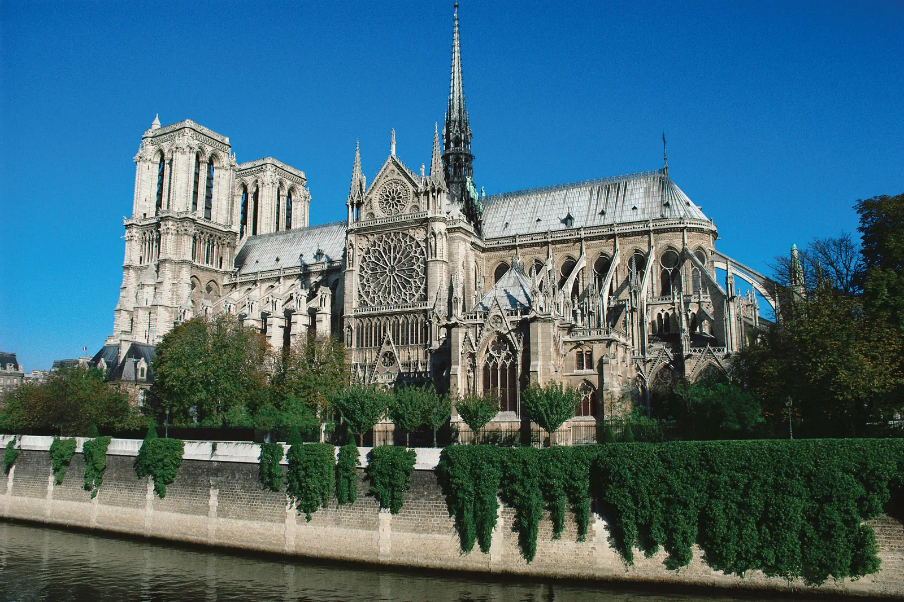

## Eiffel Tower

Eiffel Tower is very popular. Every year, many tourists visit Paris to see it. The height of the Eiffel Tower is 324 meters, which is the same as a 81 floor building. Before 1930, it was the tallest building in the world. In 1909, It was almost demolished because people in Paris thought that it was really ugly. There are 3 floors for visitors. For the first and second floor, visitors can use both the stairs and an elevator. For the highest third floor, they can only use the elevator. The Eiffel Tower is corroding because of wind and rain.

The tower is named after Gustave Eiffel, who is the architect that designed it. He also helped design parts of the Statue of Liberty. In the Paris Universal Exposition, which commemorates the centenary of the French Revolution, the Eiffel Tower was chosen to be built. 

After the construction of the Eiffel Tower began, citizens of Paris thought that it was rash action. People who lived near the Eiffel Tower sued it, because it harmed the residential environment. After the construction ended, many artists and intellectuals criticized it. They said it does not match Paris, the city of art, and it harms the fine view. At that time, most of the buildings were made with stone, while the Eiffel Tower was made with iron. However, these days, it is considered a beautiful building and a symbol of Paris. It was also registered as a UNESCO world heritage in 1991.

## Notre-Dame Cathedral

The Notre-Dame Cathedral is a Gothic cathedral. Notre Dame means “our lady” in French, which is referring to the Virgin Mary. These days, it is also used as a building of the Roman Catholic Church that is the archdiocese of Paris. The Notre-Dame Cathedral is one of the best and oldest Gothic churches.  During the French Revolution, parts of the church were destroyed due to anti-Christian protests. It was soon restored during the 19th century. However, a fire broke out on the roof in 2019. 

## Louvre Pyramid

The Louvre Pyramid is in the Napoleon Plaza. There are three pyramids in the Louvre Museum, but this one is the biggest one. It is regarded as the symbol of the Louvre Museum. 
In 1984, the Pyramid was designed by I. M. Pei. It was opened in 1989 for the public. The building consists of metal pillars and 603 pieces of rhombus-shaped glasses. The height is 21.6 meters. 
Many people criticized the Pyramid claiming that the appearance doesn’t fit the Renaissance buildings around it. Also, it is a pyramid, which is the symbol of death in some cultures. However, the mayor of Paris decided to build it so that it becomes a landmark of Paris. 

## Arc de Triomphe

Arc de Triomphe is like a grave. It was made to remember the deceased soldiers of the Napoleonic Wars. Under it, there are many tombs of unidentified soldiers. In 1806, it was designed by the architect Jean Chalgain. It is 50 meters high, 22 meters deep, and 50 square meters in area. At that time, before the Monument to the Revolution in Mexico City, it was the tallest arch in the world. The lamps under it never turn off. 

## Palais Garnier

The Palais Garnier is on the northern side of the 9th arrondissement of Paris and it can accommodate 2,200 people. There are 2160 seats for the audience and  40 spare chairs. It is known as the opera theater of Paris. The baroque style of the building was, at the time of its construction, considered a masterpiece. In 1875, the building was officially selected as the national musical academy (Académie Nationale de Musique - Théâtre de l'Opéra). This name was used until 1978. However, after 1978, It changed to the national opera theater of Paris (Théâtre National de l'Opéra de Paris). However, people know it as the Paris Opera. In front of it, there are statues of famous musicians like Beethoven and Mozart. These days, there are many performances by artists such as Jean Baptiste Sully ,Jean Philippe Rameau, Christoph Willibald Gluck. As of today, there are more than 600 operas and 300 ballets performed here. 

*Listen to the article as read by the author:*

`audio: https://www.dropbox.com/scl/fi/ardlz5cfwc3auklccw62a/alvin_0124.mp3?rlkey=jwi5r679ye9nyg9uh97gp7kzy&raw=1`