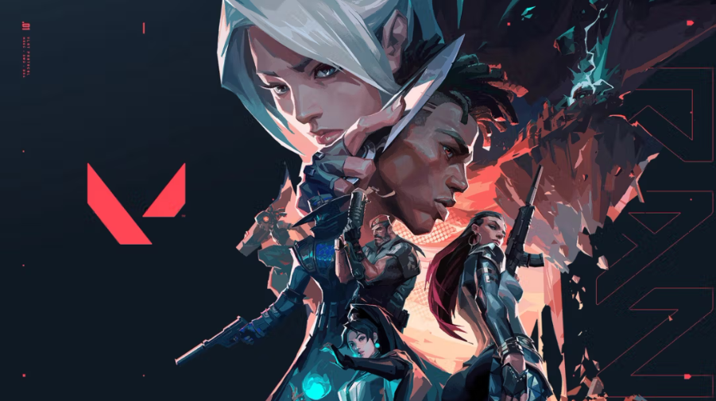

In 2025, FPS games were on fire. One of the most popular ones was Valorant, a 5 vs 5 shooting game. Compared to other famous FPS games, the rules and characteristics are simple, and there aren't overflowing exterior effects. Also, the company Riot Games, which made Valorant, was not primarily focused on FPS games. It was already famous for League of  Legends, a multiplayer online battle arena that is far from FPS games.

In 2020, Valorant was first released by the game company Riot Games. Riot Games was one of the successful game companies thanks to its popular game League of Legends. Despite being already succesful, they joined the FPS genre. The basic rule of the game itself wasn’t confusing for the new players, using abilities and following team tactics. There are 12 rounds for attack and another 12 rounds for defence. The team that gets 13 scores first wins. While attackers plant the spike, which is a bomb, into the site and explode it or kill all five defenders, defenders have to defuse the bomb or kill all five attackers.  However, the biggest problem was a different shooting mechanism. In many FPS games, players can still hit enemies while moving. By contrast, in Valorant, the accuracy of shooting decreased when players were moving. This design made players focus more on positioning and timing rather than movement.

Another feature of Valorant is its weapon system. Since players were mostly damaged by headshots, weapons that have high headshot damage were very popular. Among these, the Phantom and the Vandal are the most commonly used rifles in the game. Vandal is known for its non-changing damage at any distance, while Phantom is known for its shooting speed and invisible tracks. While the Phantom might seem a more desirable option, it becomes weaker as the distance from the enemy increases, leading to players failing to kill enemies with a single headshot.

Duelists are agents who first fight and kill for the team. They have abilities that help them to enter sites first and escape from dangerous places. Because of this, duelists are often treated to lead attacks and make spaces for their teammates. Initiators focus on gathering information to prepare to go into the site. Their abilities are designed to reveal enemy positions, spotting enemies out of their hiding spots. Sentinels specialize in defense, area control, and team protection. They use traps, utility, or healing abilities to manage areas of the map and prevent enemies’ flanks (going behind the main fighting point to attack the enemy from their back). Sentinels are especially important for holding sites and maintaining stability during both attack and defense. Controllers manage the battlefield by controlling their smokes. Their smokes block enemy sightlines and limit movement, helping teammates enter the site. Without controllers, entering or defending a site becomes much more difficult.

Because each agent in Valorant has a clearly defined role, teamwork becomes one of the most important parts of the game. Duelists, initiators, sentinels, and controllers contribute to the entire game, and the absence of one role is significant to the overall result of the game. For example, without initiators, teams have a lack of information and experience difficulties entering sites without catching the enemy's eyes. Without controllers, the gates of the sites are open, making both attackers and defenders much more difficult. This structure shows that winning in Valorant depends not on individual skill alone, but on how well players coordinate together with their roles.

Another important aspect of Valorant is its revenue structure. Although the game is free to play, Riot Games generates profit through selling weapon skins. These items do not provide any advantages. Yet, even though only the appearance and sound of the gun change, many players say that a specific type of skin provides benefits to the players. Though it is just a psychological influence, many people consider Valorant a type of pay-to-win game.

Valorant is more than a simple FPS game. Not only did its unique shooting mechanism attract more people, but by designing four major roles, it made each role important in the overall gameplay. Even its revenue structure shows Riot Games’ clever design, selling cosmetic items and understanding players’ psychological influence to generate profit without affecting the game environment itself. Though maintaining its balance and simple structure, Valorant is a successful game developed by a non-FPS gaming company, Riot Games.
