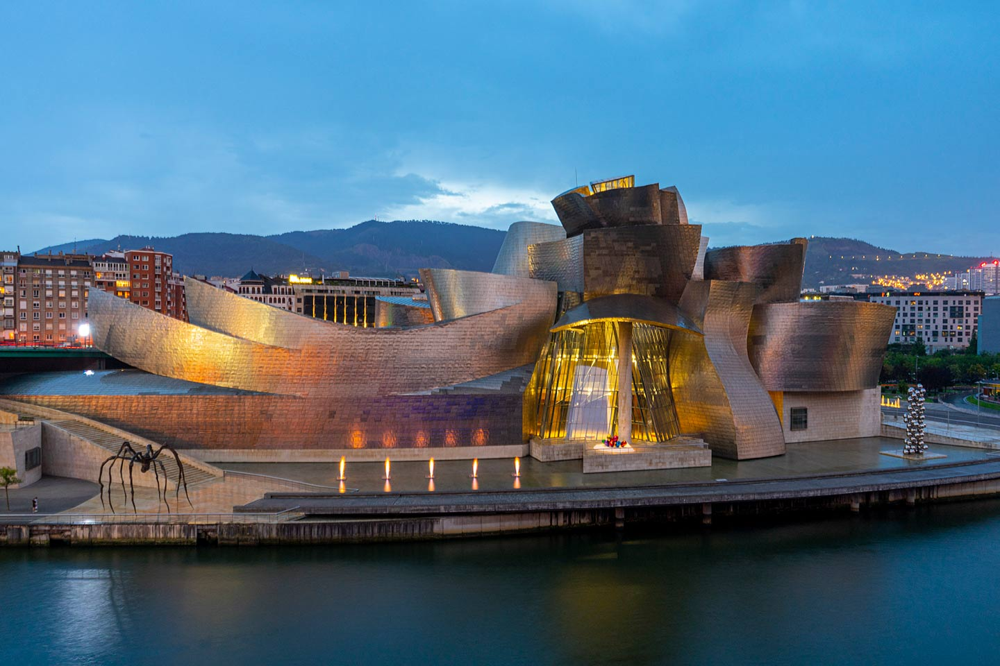

There are many kinds of architecture in the world. From ancient times, people usually gave meaning to buildings. Also, they used woods and rocks. However, modern architecture focuses on practicality and art. For example, there are many buildings that people can’t live in and are only for art. An example would be the Eiffel tower since it wasn’t for people to live, and it harmonized with other buildings. In this article, I'm going to tell you about modern architecture and many different kinds of buildings.

## Capital Gate

The Capital Gate is in Abu Dhabi, UAE. The height of this building is 160 m, and it has 35 floors. It can withstand its weight despite the inclined part; they put 490 piles under the basement and used a diagrid (repeated diagonal braces) structure. The 12,500 windows show its splendor. As you can see, it looks like the Leaning Tower of Pisa. Actually, this building was influenced by it. However, it is made of modern materials. Just like this, some buildings are based on old popular buildings. They redesign to make them look modern. 

## Guggenheim Museum Bilbao

The Guggenheim Museum Bilbao is in Bilbao, Spain. In the past, Bilbao was a capital of industry, but it collapsed into decay. So, people spent about 100 million dollars for the Guggenheim Museum Bilbao to overcome the city’s collapse. Its height is 50 meters, and it is covered with titanium panels. Other materials include limestone and glass, which all show different shapes and colors from different points of view. Also, since the panels are in front of the river, the color of the building changes. The king of Spain praised the museum as the best building in the 20th century that humans made. 

## National Centre For the Performing Arts

The National Centre for the Performing Arts is in Beijing, China. It started construction in 2001 and was completed in 2007. It was planned already in 1958, but there were many problems. The building cost about 2 million dollars to build. It is a titanium dome and has a nickname, which is an “egg.” It has 22,000 windows of 6,250 different forms. It looks like a crystal floating on water because there are no pillars. Also, it harmonizes with the background which is an artificial lake. Unlike in the past, people could build different types of shapes.

The modern buildings are not all of modern architecture. Over centuries, the techniques of architecture also changed. One of the most famous methods of construction is the MTP method (Media Transfer Protocol). The conventional method is self-assembly. Self-assembly buildings’ constructions are made in the factory and assembled on the site. The construction doesn’t take too long, but it was limited to perfectly square buildings. For the MTP method, people build only the frames first and then bring the constructions that are already made to assemble. The biggest advantage is the decreasing construction period, because they make modules in the factory. For the conventional method, every single construction should be built in order. They spend a lot of time there. However, the MTP method can complete a building at once. Also, it can ensure safety, because everything happens out of the building. People don’t have to climb the ladder for a long time to install the constructions and work such as installing. So, it prevents accidents and makes people safer. 

These days, there are many other methods of construction such as monolithic architecture and the use of steel framework. However, each method has pros and cons. For example, some methods reduce the time of construction, but it also reduces the quality of building. On the other hand, some methods increase the time of construction, but it makes the quality of building better. I think the MTP method modularized everything so that things are more time-efficient and less complicated. 