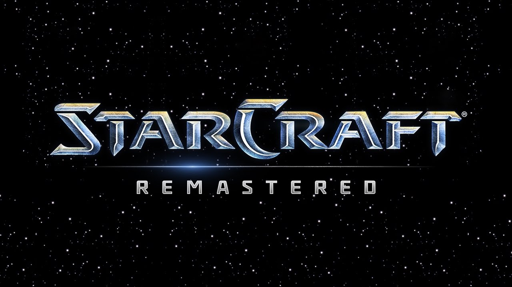

StarCraft is a real-time strategy (RTS) game series that has established itself as one of the most influential titles in competitive gaming. However, StarCraft is more than just a game—it requires deep planning, quick thinking, and strategy. The essential goal is to build up your economy, create a powerful army, and beat down your opponent. In the early 2000s, StarCraft became extremely popular in South Korea, with televised matches and professional leagues helping to launch the entire esports scene. 

At first, playing StarCraft might look like you’re just clicking around buildings, but the reality is different. The real challenge is to completely demolish the opponent’s ability to fight by destroying all their units and buildings. Since StarCraft is played in real time, you’re forced to think—collecting resources, producing new units, and managing battles, often all at once. It’s a constant balancing act between your economy and your military, and focusing too much on one side can quickly result in defeat. 

There are three playable species in StarCraft: Terran, Zerg, and Protoss. Often, Terran is very flexible. Terran workers build the buildings, and Terran buildings can be suspended in the air. It helps them move the important buildings to a safer place. Also, there is another huge advantage; they can repair their units and buildings. In fights, Terrans are strong when they have time to get ready and defend good positions. However,  if Terrans are attacked before being prepared, they can lose quickly. Zergs possess swiftness and the ability to multiply fast. Zergy can make the units fast, and it can grow the economy quickly. Lastly, Protoss has strong power and high technology units. Protoss units are expensive but very powerful. However, if they lose in the major battle, it is extremely hard to rebuild the army due to the high cost of the units. 

StarCraft was especially famous in South Korea. In the early 2000s, the advanced internet was spreading all over the world. The PC rooms were suddenly expanded with the help of low prices and high-quality games compared to household desktops. So, it had the perfect conditions to be famous. Also, the game itself was perfect to play in the PC room with friends. Since it required deep knowledge of the game, players needed to spend more time in the PC room, leading to the increaseof players. The StarCraft league was also broadcast on television and became more popular. Also, South Korea had many people who were good at games. Because of the dominance of PC rooms and the founding of the KeSPA(Korean e-Sports Association), a significant difference existed between the Korean players and foreign players. Later, the operators divided the server. It was to guarantee a stable ping for equality. But there was also another reason. The Koreans, compared to other players, were exceptionally good at the game. This means you shouldn’t play on the Korea server without being serious and prepared, because the competition is tough. 

As of 2026, it is a very old game. 27 years have passed since the game was first released. However, it is still famous among the old players. One of the main reasons is that the three species, Terran, Zerg, and Protoss, still create different tactics. Since the game-playing style is not just fixed to one tactic, various builds and managements can exist. So, in every round, different game plays were shown.  Also, StarCraft did not just remain in the old version. Over time, it introduced a remastered version of its game. The company upgraded graphics and units so that the old players and new players could play it easily. Because of its popularity, there are still many competitions. Even though many people who grew up with StarCraft may not play the game anymore, they can still enjoy the fun competitions.

StarCraft is not famous because it is old. It became one of the most important games that spread esports around the world. Not just playing with a single gaming style, it provides various ways to enjoy the game. Even after 27 years, StarCraft is still remembered and played because it demonstrates deep strategy, strong competition, and a long history that connects gaming with esports.
