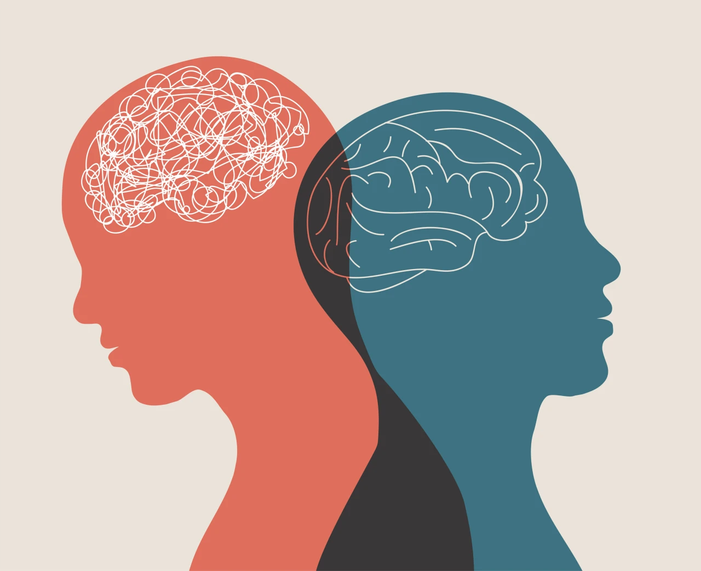

When people are under pressure, they usually freeze. Have you ever wondered why people freeze? Psychology helps us to answer the question. In a simple definition, psychology is the study of the mind and behavior. It leads us to think, feel, and act in different situations.

Philosophers’ ideas of thinking continued until the birth of psychology. In 1879, at Germany’s University of Leipzig, Wilhelm Wundt created an experimental apparatus. The machine measured the time lag between people hearing a ball hit a platform and them pressing a telegraph key. People responded in about one-tenth of a second when asked to press the key as soon as the sound occurred and in about two-tenths of a second when asked to press the key as soon as they were consciously aware of perceiving the sound. As a result, began what many consider psychology’s first experiment, launching the first psychological laboratory. From this experiment, psychology became organized into different branches. These include structuralism, functionalism, behaviorism, etc.

In 1892, Wundt’s student Edward Bradford Titchener joined the Cornell University faculty and introduced structuralism. Structuralism is an early school of psychology that used introspection to explore the structural elements of the human mind. As physicists and chemists discerned the structure of matter, Titchener aimed to discover the structural elements of the mind. He engaged people in self-reflective introspection, training them to report elements of their experience as they looked at a rose, listened to a metronome, smelled a scent, or tasted a substance. However, unlike these to find the structure of the mind from simple elements, philosopher-psychologist William Hames thought it more fruitful to consider the evolved functions of our thoughts and feelings. Smelling is what the nose does and thinking is what the brain does. However, he wondered why the nose and brain do these things. Under the influence of evolutionary theorist Charles Darwin, he was thinking about human olfaction, it was developed because it was adaptive. It contributed to our ancestor’s survival. As a functionalist, James encouraged explorations of emotions, memories, willpower, habits, and moment-to-moment streams of consciousness.

During the short story, psychology was wrestled with many issues that are still in dispute. The biggest and most persistent is the nature-nurture issue, which is the controversy over the relative contributions of biology and experience. Nature refers largely to our genetics. It includes the genes we are born with and other hereditary factors that can impact how our personality is formed and influence the way that we develop from childhood through adulthood. Nurture encompasses the environmental factors that impact who we are. This includes our early childhood experiences, the way we were raised, our social relationships, and the surrounding culture. Two centuries later, Decastes’ views gained support from a curious naturalist. Darwins’ 1859 on the origin of species explained this diversity of life by proposing the evolutionary process of natural selection, from among chance variations, nature selects the traits that best enable an organism to survive and reproduce in a particular environment.

The integrated viewpoint incorporates various levels of analysis and offers a more complete picture of any given behavior or mental process. Cells, molecules, and atoms suggest different levels of analysis, which offer complementary outlooks. Together, different levels of analysis form an integrated biopsychosocial approach, which considers the influences of biological, psychological, and social-cultural factors. Each level provides a valuable vantage point for looking at behavior. One perspective may stress the biological, psychological, or social-cultural level more than another, but different perspectives were described such as biological, evolutionary, psychodynamic, behavioral, cognitive, and social-cultural perspectives.

Some psychologists conduct basic research that builds psychology’s knowledge base such as biological, developmental, cognitive, educational, personality, and social psychologists. These psychologists may also conduct applied research that tackles practical problems such as industrial-organizational psychologists, who use psychology’s concepts and methods in the workplace to help organizations. Also, human factors psychologists focus on the interaction of people, machines, and physical environments. Counseling psychologists help people to cope with challenges and crises and to improve their personal and social functioning. Clinical psychologists assess and treat mental, emotional, and behavioral disorders. Both counseling and clinical psychologists manage and interpret tests counseling and therapy, and conduct basic and applied research. In contrast, psychiatrists, who also often provide psychotherapy, are medical doctors licensed to prescribe drugs.

Psychology helps us understand human thoughts, emotions, and behaviors through various perspectives. From the beginning of early psychology to modern psychology, psychology continues to evolve how we think, feel, and behave. It doesn’t only explain our behaviors but also helps us improve our lives and relationships.