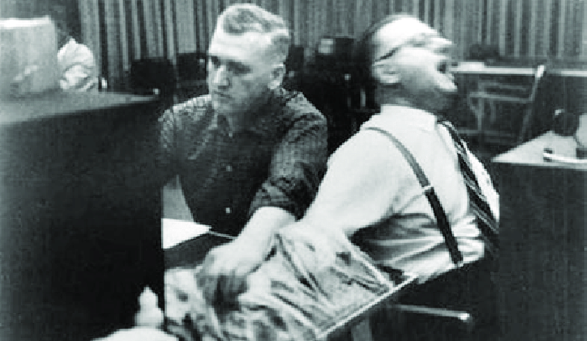

Obedience is quite common in front of the elders or others who have higher authority. Obedience is a person’s willingness to comply with instructions or orders from an authority figure. In 1974,  Stanley Milgram conducted the classic obedience studies. 

In the experiment, participants were told that they were taking part in a study about teaching and learning, and they played the role of a teacher. As a teacher, each participant's job was to give the learner an electric shock for every incorrect response. The teacher sits in front of the machine, which has a switch labeled with voltages. The teacher is giving electric shocks, beginning with 15 volts of a slight shock, to punish the learner for wrong answers. After each of the learner’s errors, they move up to the next higher voltage. Complying with the experimenter’s instructions, the teacher hears the learner grunt when he presses the switch in the sequence. After the teacher activates the switch, which has a power of 120 volts, the learner shouts that the shocks are painful. After 150 volts of strong shock, the learner cries and screams painfully. Even though the teacher doesn’t want to press the switch, the experimenter prods. During the experiment, the teachers perspired, trembled, laughed nervously, and bit their lips. In a recent virtual reality recreation of these experiments, participants responded much as did Milgram’s participants, including perspiration and a racing heart, when shocking a virtual woman on a screen in front of them

Milgram replicated his study with several interesting twists. He found that he could decrease participants’ compliance by bringing them into closer contact with the confederates. Participants who could see the learners gave fewer shocks than participants who could only hear the learners. The lowest shock rates of all were administered by participants who had to force the learner's hand onto the shock plate. However, even in that last condition, approximately 30 percent delivered all of the shocks. When the experimenter left in the middle of the experiment and was replaced by an assistant, obedience levels also decreased. Finally, when other confederates were present in the room and they objected to the shocks, the percentage of participants who quit in the middle of the experiment skyrocketed.

According to Milgram’s experiment, there are some situational factors that can explain high levels of obedience: the physical presence of an authority figure dramatically increased compliance, the victim was depersonalized or at a distance, even in another room, and diffusion of responsibility.

Psychologist Gina Perry suggests that much of what we think we know about Milgram’s famous experiments is only part of the story. While researching an article on the topic, she stumbled across hundreds of audiotapes found in Yale archives that documented numerous variations of Milgram’s shock experiment. While his experiment of his process reports methodical and uniform procedures, the audiotapes showed something different. During the experimental session, the experimenters often went off script and coerced the subjects into continuing the shocks. Milgram’s use of deception and stress triggered a debate over his research ethics. 

Milgram’s experiment has been severely criticized on ethical grounds, and such an experiment would surely not receive the approval of an institutional review board (IRB) today. When debriefed, many participants learned that the shocks had been real; they would have killed the learner. Understandably, some people were profoundly disturbed by this insight. In his defense, Milgram pointed out that, after the participants learned of the deception and actual research purposes, virtually none regretted taking part. When 40 of the teachers who had agonized most were later interviewed by a psychiatrist, none appeared to be suffering emotional lasting effects. 

In Milgram’s experiments, the participants were also torn between what they should respond to, such as the scream of the victim, of the orders of the experimenter. Their moral sense warned them not to harm another, yet it also prompted them to obey the experimenter and to be good research participants. Between kindness and obedience in collision, obedience usually wins in most situations.

Milgram’s obedience experiment revealed how obedience affects our behavior, such as under the pressure of authority, ordinary individuals are capable of inflicting harm on others. During the experiment, we can also know that situational factors – such as authority presence, depersonalization of the victim, and diffusion of responsibility – can affect our behaviors. In present-day society, where authority plays an important role in the system, this experiment argues the deep relationship between authority and personal morality in obedience.