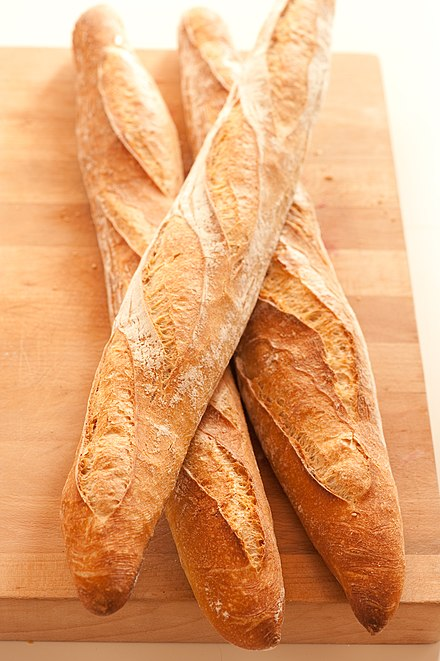

These days in Korea, bread is a food because of its convenience to eat and richness in nutrients. Many types of bread have been made for a very long time. 

Bread making started in the neolithic age. The first bread was made of grain flour and water. They were mixed and cooked on a hot stone. So, its shape was really different compared to bread these days as the early bread was flat. Flatbread was very important to early civilizations. The Sumerians ate flatbread made of barley, and in Egypt around the 12th century BC, it was possible to buy flatbread called ta on the street. In ancient Greece, bread was devoted as an offering to the god of death, and this bread, known as Psadista, was made using fine flour, oil, and wine. Yeasted bread dates back to prehistoric times. Yeast causes dough to rise naturally when left alone. The first yeasted bread was discovered in ancient Egypt. The ancient Egyptians made bread by using the emmer wheat, which made bread denser inside.

## Baguette
The baguette is an iconic bread. 320 baguettes sell every second in France and 10 billion baguettes every year. As you can see, baguette is not just an ordinary bread, it is part of French culture. In 1788 and 1789, France suffered severe food shortages due to poor harvests for two consecutive years. During that time, the price of bread soared to an unbearable level. While poor people could barely afford low quality bread made of grains that had not been peeled properly, the rich people still ate bread made with white flour and plenty of butter. This is the reason why bread became the center of conflict during the French Revolution. There was even a rumor that the queen told people to eat cake if they had no bread. In the novel Les Miserables, Jean Valjean was imprisoned 19 years for stealing just a single loaf of bread. These things lead to citizens' dissatisfaction. After the revolution, the government had to solve the bread problem first. So, on November 15, 1793, the National Convention, which dismantled the ancien regime, the government limited bread to a mix of three quarters of flour and one quarter of rye. 

The word “baguette” comes from the Latin word “baculum,” which means a long staff. However, the origin is unclear, because there are many stories of the baguette. Previously, in France, bread was made by using levain, which is a natural yeast. To make bread with natural yeast, people must go through the process of making new bread dough several times over 24 hours. Bakers in the 18th century had to take a nap next to the bread oven and had to wake up every three hours to change the natural yeast. Because of this hard work, in France, in order to protect bakers, a law was set in 1920 that bread could not be made from 10 PM to 4 AM.

Today, bread is sweet, tasty, and soft. However, the old breads were not. In France, there was even a law for bread, like a law for bakers to take time when making baguettes. Bread may just be a food to you, but in French history, it is a big part of their culture.