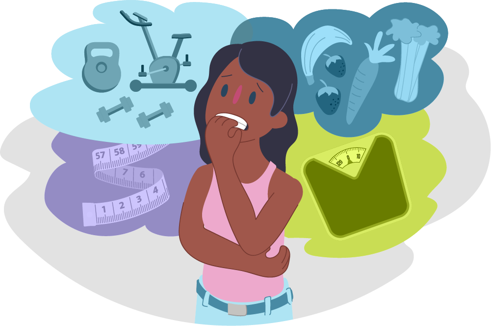

Food is the most important source for human beings. Humans can’t survive without food, but if there are some problems with the food, it can lead to health problems. Such as anorexia nervosa, it simply makes people not eat the food that is directly related to their survival. Psychologists say that there are many reasons for it, such as biological, psychological, and sociocultural factors.

For biological factors, genetically, eating disorders can be inherited from their parents. In case of identical twins, it shows that there is a higher possibility that both twins have inherited the eating disorder rather than one of them getting it. Not only genetics, the changes in chemicals in our body can cause eating disorders. Serotonin regulates various physical processes, including mood, sleep, appetite, and pain perception. However, since serotonin regulates our mood, if there is a problem with the level of serotonin, a lower level of serotonin results in a higher probability of anorexia nervosa or bulimia. 

Related to both psychological and sociocultural factors, the mindset and environmental conditions affect in development of eating disorders. If a person has low self-esteem and feels pressure in society, it can affect their relationship with food. For example, people who have a big problem with their body may try to lose weight even if they are already healthy. This can lead to a dangerous, more extreme obsession with dieting. 

Sociocultural factors include social media, the standard of beauty, and peer pressure. Social media often shows unrealistic body images that make people feel like they need to be like them, which fits the social standard. Especially among teenagers, teenagers follow trends and obsess over other people’s attention. 

The main symptoms of the eating disorders are anorexia nervosa, bulimia, and binge eating disorder. Anorexia nervosa can be a threatening eating disorder. It includes an unhealthy low body weight, intense fear of gaining weight, and a view of weight and shape that is not realistic, like a skinny body. Anorexia often involves using extreme efforts to control weight and shape, which often seriously contribute to health and daily life.

Bulimia, also called bulimia nervosa, is a sometimes-threatening eating disorder. Bulimia includes episodes of purging. Sometimes bulimia can also cause severely limiting eating for periods. This often leads to stronger urges to binge eat and purge. Bingeing involves eating food, sometimes an extremely large amount, in a short period. During bingeing, people feel like they have no control over their eating and that they can’t stop. After eating with guilt, shame, or an intense fear of weight gain, purging is done to get rid of calories. Purging can include vomiting, exercising too much. Some people change medicine doses, such as changing insulin amounts, to try to lose weight.

Binge eating disorder involves eating food in a short amount of time. When bingeing, it feels like there’s no control over eating. However, binge eating is not followed by purging. During a binge, people may eat food faster or consume more food than planned. Even when not hungry, eating may continue long past feeling uncomfortable. After a binge, people often feel a great deal of guilt, disgust, or shame. They may fear gaining weight. They may try to severely limit eating for periods.

Eating disorders are serious mental and physical health problems. It is not just food, but a combination of factors: point of view, body, and how people see themselves in society. These disorders are caused by many factors, such as biology, emotions, and culture. Anorexia, bulimia, and binge eating are the main types that can hurt both the body and life. People who struggle with eating disorders often hide their symptoms to hide symptoms. But this can make them overlook the truth. It is the reason why early detection of the symptoms and the problems is essential.

To prevent eating disorders, people should be more educated about what a healthy body image is. Further, it is mandatory to make people understand that everyone has different body types, and the weight or shape doesn’t decide the value of one. Also, social media should be used more carefully, especially for teenagers. Recovery from eating disorders takes a lot of time. Often, professional help from doctors or therapists is needed, but support from friends and family is also important. 

In conclusion, eating disorders are not easy to recover from, but with understanding and care, they can be treated. If somebody is struggling with food and their body image, it is important to listen and help them. Starting with a little bit of attention to the problem can change big things. 