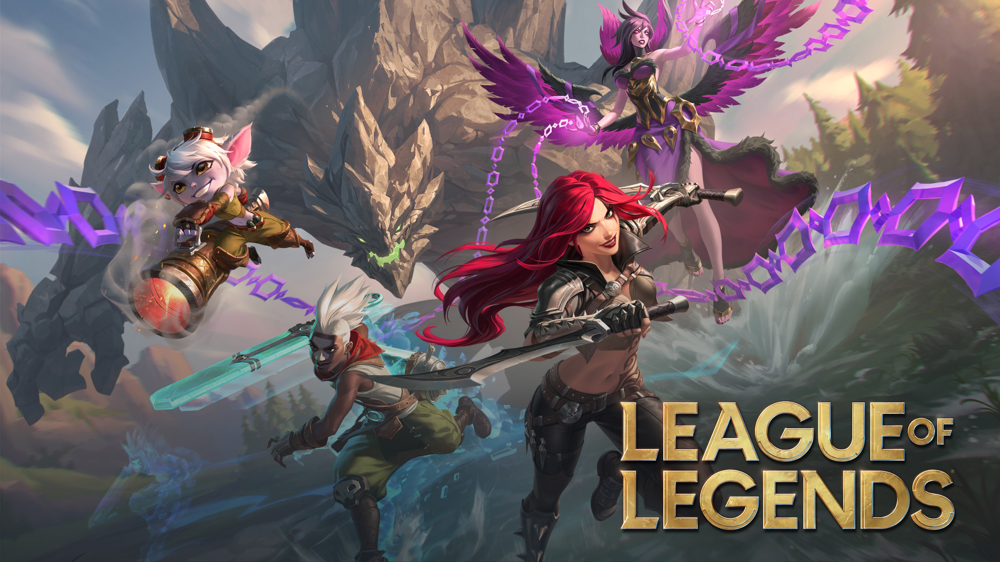
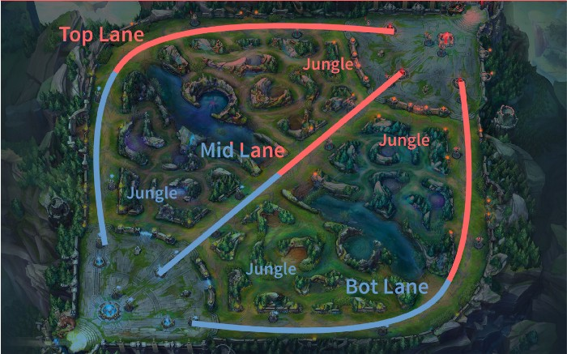
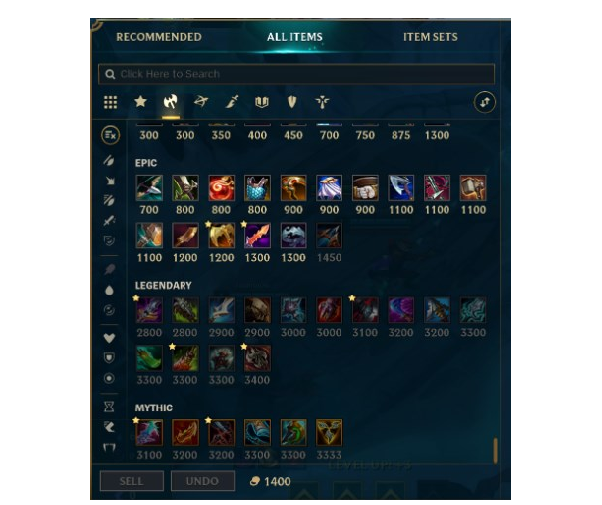

## League of Legends

When we think about online games, there are various games that come to our mind, such as Fortnite, Roblox, Minecraft, Counter strike. This reveals that most of the popular games are FPS(First-person shooter) games. While FPS games dominate the market,  League of Legends survives in the game market. 

League of Legends is a multiplayer online battle arena game developed by Riot Games. The basic rule is destroying each other’s core, the nexus. In its first release in 2009, the player was not given a specific lane. Consequently, most of the players played freely in the map, referred to as the Summoner’s Rift.	

From season 6 in 2016, 5 lanes - top, jungle, mid, bottom, and support - were officially fixed in the game. Furthermore, champions are divided into three main classes. Tanks are focused on absorbing damage,  controlling enemies, and do not deal high damage. They act as the front wall of the team. The Assassins class is specialized in high burst damage, mobility, and picking off vulnerable, high-priority targets to quickly secure kills. Ranged damage dealers deal damage from a distance and use long-range autoattacks as their primary weapons. In addition, there are 2 additional types of champions. First, AD (Attack Damage) stands for the physical damage a champion deals mainly through their basic attacks and, more rarely, skills. Secondly, AP (Ability Power) stands for the damage of a champion’s magical abilities or spells.

Additionally, players can buy items from the in-game shop using gold earned during a match. They can earn money from killing enemies, minions, jungle monsters, etc anditems bought with gold enhance various champion stats such as AD, AP, health, armor, and magical resistance. Thus, as the game carries on, players should buy the items according to the situation of the enemy and ally. Some items have their own unique abilities. One of the most well-known items is Zhonya’s hourglass, which has the ability to make the user invincible for two and a half seconds, but during these two and a half seconds, the user can’t move, attack, or use any abilities. 

The ultimate goal of the game is to destroy the opponent’s nexus. To achieve this goal, players have to reinforce their stats and destroy towers one by one. In the map, there are three lanes: top, mid, and bottom. For each lane, players fight with each other and earn gold from towers, minions, and kills. Additionally, Jungle position acquires money from jungle monsters. In detail, epic jungle monsters give special buffs to the team that kills the epic monster. Diverse, unique strategies started to develop as people played the game more and more. These tactics include jungle ganks and controlling the wave. Jungle ganking is interfering with the fight in a specific lane to make the structure a 1 versus 2 fight and collect the easy kills. Controlling the minion wave is an important detail that affects the overall game. The champion obtains gold when they kill the minion. However, when the champion pulls the wave back, the opponent can not easily acquire gold because of the tower. The tower’s damage is unbelievably strong at the beginning of the game, and it can push the minion waves. Still, some loss of gold is inevitable. However, after players push the wave, they can roam to the other lane to help and get the kills like in the jungle.

Since League of Legends is a big E-sports game in the world, the League of Legends World Championship began in 2011. As for 2025, there are 17 teams remaining in the league such as T1, TBD, Gen G. T1 – the most famous team in the world – has team members: Doran, Oner, Faker, Gumayusi, and Keria. Faker is treated like a god, living legend, and the unkillable demon king by the fans ofT1. Faker first joined T1 and participated in the league from 2013. His gameplay was unbelievably surprising. Overall, he built fame through his unparalleled competitive success, technical skill, and influential leadership in the game

Though League of Legends was in service for 16 years, its fame doesn’t seem to decrease. It is still popular. Since Riot Games constantly releases new champions, balance patches, and in-game events that users enjoy, it has managed to sustain its position. With 171 champions, 100 items, and tactics, there are numerous combinations to enjoy. In 2025, 120 ~ 135 million people actively play every month. However, the most critical reason why this game could survive until now with the other competitive games is basically because of the many ways to enjoy this game and the much more efforts of the executives of the Riot Games.
