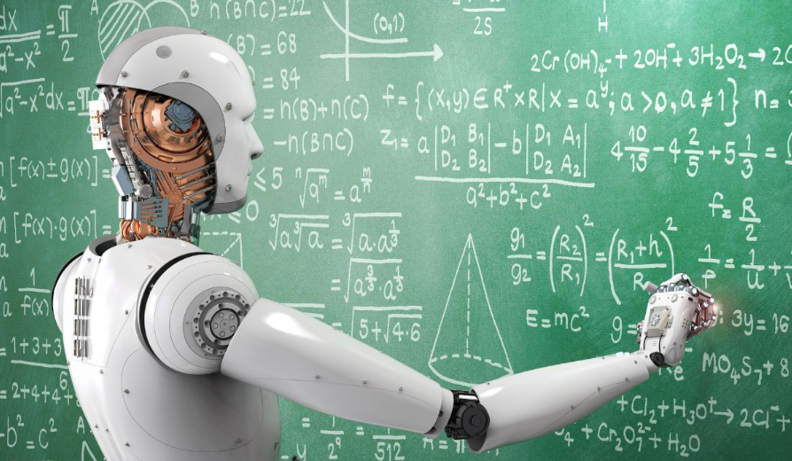

Artificial Intelligence, or AI, is taking up a large part of recent education. Students can now use AI to ask questions, summarize information, check grammar, generate ideas, and solve difficult problems. In the past, when students didn’t understand something, they usually had to search through a textbook, look online, or wait until they could ask their teachers. Now, students can type questions into an AI and get an explanation almost immediately. Because of this, AI is making learning more convenient, but it also creates problems, meaning that we should use AI very carefully. 

One fundamental advantage of learning about AI is its vast scope. Anyone — regardless of age or gender — can easily access AI tools like ChatGPT, Gemini, and Claude online. Furthermore, AI provides answers very quickly and offers high accuracy for simple problems. That does not mean, however, that its accuracy for difficult problems is low. This is because AI derives its answers by utilizing vast amounts of information — "big data." It generates responses after learning from the thoughts and problem-solving processes of many people, as well as the patterns within them.

At the same time, however, this creates certain issues. Indiscriminate use of AI often stems from a desire to complete assignments quickly rather than a genuine intent to learn. In essence, it is akin to constantly handing someone a fish instead of teaching them how to fish.

When students get an answer without working through the problem, they might be able to finish, but they miss the point of solving it in the first place. For example, a student might copy a math solution from AI and understand each step while reading it. Still, understanding someone else’s explanation is not the same as solving a problem on their own. When a similar question shows up on a test, the student might not know where to start. It means the homework is done, but the skill that assignment meant to build was gone. 

Another problem is that artificial intelligence is not always right. Many students trust artificial intelligence because its answers often sound right and well put together. However, artificial intelligence might give wrong information, especially when the question is hard or requires very specific knowledge. This can turn into an issue if students just accept the answer without questioning it. In this way, students shouldn’t only know how to use artificial intelligence but also how to question artificial intelligence. They need to match the answer with their book, class notes, or other trustworthy sources before thinking that’s completely right.

Artificial intelligence can also change the way students think about work. Because answers can be generated in seconds, students may get used to getting information. However, learning doesn’t always happen quickly. Rather, it takes a long time to understand the material fully. Also, students might make errors before they finally get what they are doing. If students always use AI whenever they get stuck, they might become less patient with the learning process. Instead of trying another method or thinking about the problem for a few more minutes, they may immediately ask AI to solve it for them. 

However, these issues don't mean that schools should prohibit the use of AI completely. Artificial intelligence is already becoming a part of our everyday lives, and it will probably become even more important in the future. Students may use AI not just in school but also in college and their jobs. So avoiding it completely would not really prepare students for the future. Instead, schools should teach students how to use it in a good way.

For example, there is a difference between asking artificial intelligence to finish an assignment and asking it to help with an assignment. A student could say, "Give me the answer to this question?” The student could also say, "Can you explain what I did wrong?" The second question lets the student understand the mistake and try again. Students can also use it to come up with ideas, check spelling or ask for a simpler explanation of a hard idea. In these cases, artificial intelligence is supporting the learning instead of taking over.

So, the best way to use intelligence in education is to think of it as a teacher rather than an answer generator. A teacher shouldn’t just give students all the answers. Instead, a teacher helps students understand the steps so that they can solve problems on their own later. Artificial intelligence can do this when it is used in a careful way. It can explain ideas, give examples, and help students find their errors. The students still need to think and make choices on their own.

In the end, artificial intelligence itself is not the problem. The critical point is how we decide to use it. Artificial intelligence can make education easier. It offers students learning chances that were hard to get before. At the same time, using artificial intelligence carelessly can reduce thinking and make students rely too much on quick answers. As it becomes a part of education, students should learn how to use it without letting it take over their thinking. The aim shouldn’t be to stop using artificial intelligence, but to make sure that it helps us learn rather than doing all the learning for us.
