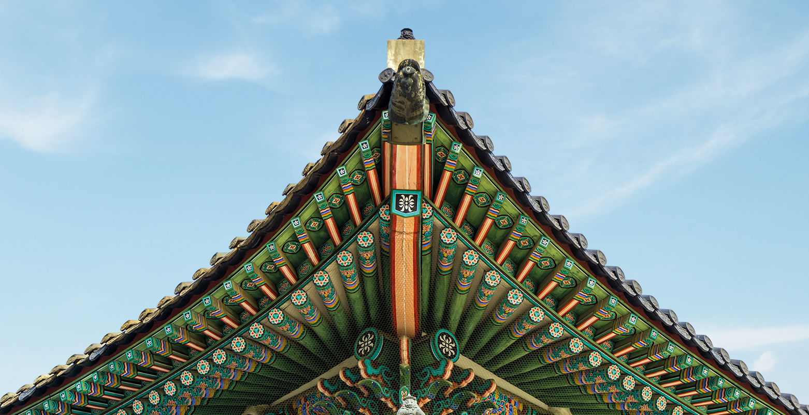

Korean traditional buildings are called “hanok.” Korean architecture's unique feature is that most of the lines have flexibility, which most remarkably appears in the roof. Tiled roof houses were usually for the rich people, or yangban, while the thatched roof houses were usually for the commoners. 

The palace of Korea has a lot of special and colorful designs. For example, dancheong has its own unique colorful pattern. Dancheong is a colorful decoration under the roof of a wooden building. There is also a function for dancheong: it helps the roof to not become rotten by rain, storm, etc. However, it should be repaired every 40~50 years. These days, it is so expensive, so people grease it. 

In Buddhist temples and palaces, there are also many kinds of special patterned decorations. The most popular pattern is the flower lattice pattern. The flower lattice patterns are usually made of wood. And the patterns of dancheongs are all connected.  

Korean thatched roof houses were mainly made of rice straws, wheat straws, and reeds. However, they should change their roofs often, because the roofs rot. Some houses have an ondol floor, which can warm the floor. Fire in the furnace makes smoke and that smoke passes under the floor. The warm smoke makes the ondol warm, so the floor of the room gets warm. I think other countries’ heating systems are worse than ondol because stoves, for example, make smoke in the house, but ondol doesn't.

The traditional Korean window is called a changho, which means “windows and doors.” Changho is good during the summer, because it ventilates very well. However, it makes the house cold during the winter. I think a normal wooden door is much better than a changho, because it gets very cold in the winter. So changing the door is much better at least in the winter. 

Udegi is a type of house made by people living in Ulleung-do. It has a double wall, because it snows a lot there. The outside wall's material is the same as that of a normal tiled roof, but the inside wall is different. The walls are made of many logs and mud. The space between two walls can be used as a passage or storage. I guess people in Ulleung-do couldn't build many udegi, because the size of their land is so small that they couldn't gather much material. I think using mud is not a bad idea. I also think they can make houses closer to each other so that people can be warm and share their foods. 

In Jeju Island, the wind blows so harshly that a normal thatched roof blows away. So, people used ropes to fix the roof and made them low.
Also, there are a lot of basalts on the island, so people made stone walls by stacking the basalts. There weren't thieves, so people in Jeju didn't use doors. They used such a massage, which is Olle. Olle, made of logs, looks like a door, but it isn't. They are used for communication. Three logs mean I come home very late. Two logs mean I come home late. One log means I will come home soon. Lastly, No log means I'm home.

One of the most famous Korean Buddhist architecture is Seokguram. On the side of the wall, there are statues of many Buddhas. Seokguram is very old, so most of the statues were destroyed. However, during the Japanese colonial era, they founded it, so they restored it.

