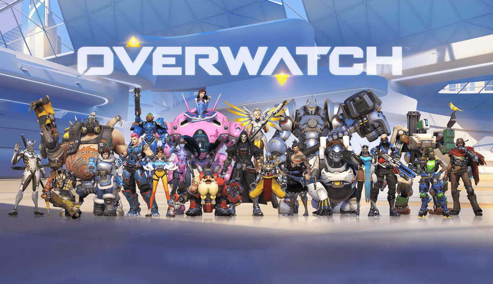
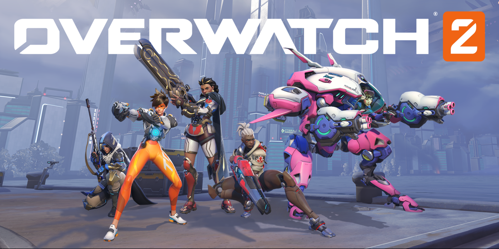

Overwatch is a team-based first-person shooter (FPS) game developed by Blizzard Entertainment. There were numerous competitors in the market when it was first released. Still, it could survive in the competitive game market thanks to its high quality and good storyline. Eventually, it became one of the most popular multiplayer games.

Overwatch was first released in 2016. Before its release, the character's trailer and the cinematics impressed people. Due to its promotion, there was a large portion of people who made an advance reservation. Soon after its release, it received great attention and became one of the most popular games in 2016. Contrastingly, when it first came out, people didn’t expect paid games to grow that much. 

The game was a 6 vs 6 FPS team game. There were 3 roles: tanker, dealer, and healer. The tanker, whose primary job is to absorb damage and control the frontline, had a large health pool. The dealer was a Damage hero, a role responsible for dealing damage to enemies, often referred to as DPS. The healer was a hero whose primary role was to restore the health of teammates. Additionally, there was one more role at the beginning of Overwatch, the defender. Its role was to guard flashpoints and objectives by holding down an area, often with high damage but low mobility. Unfortunately, the defender soon disappeared.

In the beginning, the play styles of the players were varied, but also disorganized and chaotic. Similar to what many other games had, Overwatch also had a time for the players to adapt to it. In season 1, different team compositions started to appear. The first composition consisted of 2 tankers, 2 dealers, and 2 healers. Then, after 3 months, season 1 concluded and season 2 started. Compared to season 1, season 2 showed a more stable game-playing style, but some heroes displayed overbalanced performances. Season 3 was like a roller coaster going down. As the game became more popular, cheaters appeared. The players did not care about the cheaters before, because, anyway, the game was still enjoyable. However, the executives couldn’t catch and ban the cheaters effectively, and this led to the first decline of the game. 

In 2017, Overwatch faced big problems. There were many serious problems, such as cheating, balance, strongly fixed composition, etc Everyone played Overwatch because there wasn't a game that could replace it. However, another competitive game, Battleground, was released in 2017. Since an alternative came out, a significant portion of people moved to Battleground.
This was just the beginning of the decline of Overwatch. After that, while there were efforts of the executives about a balance patch, the negligence of the cheating decayed the quality of the game, and conflict between players led to a decline in the players of  Overwatch. In 2019, Blizzard officially announced plans to make a PvE story mode and Overwatch 2. However, PVE mode was delayed because of the covid 19.

After the decline of Overwatch 1, Blizzard decided to create a sequel to revive the game. In October 2022, Overwatch 2 was officially released without the PvE mode. The developers aimed to make the game faster, simpler, and more accessible. One of the biggest changes was the team system changing from 6v6 to 5v5. This change reduced one tank position, making the gameplay more careful for tanks. Some people enjoyed the fast tempo, but others thought Overwatch 2 broke the balance, and the big difference in teamwork lost the original Overwatch’s sensation.

Furthermore, Overwatch 2 became free to play, which made a lot of users flow in. However, this decision came with a new issue with the monetization system. Instead of it becoming free to play, Overwatch 2 started to sell the heroes’ skins. Many people criticized the price of the skins as being too expensive. Of all the announcements, the one that shocked Overwatch fans the most was the official cancellation of the Overwatch PVE story mode. This was understandable, as Overwatch had neglected the original game for four years, focusing on developing a PVE mode. Players could understand the developers' intentions, as they had already mentioned the release of a PVE mode, but after the official cancellation announcement, Blizzard faced a barrage of criticism.

In 2025, Overwatch is currently focusing on the PvP mode and paying attention to the players. The game is largely normalized, and the quality of hero skins has also improved significantly. Ultimately, Overwatch's success is about how they failed and how they improved based on that. Although Overwatch's performance wasn't that great, it's clear that they're putting in effort in Overwatch 2 to improve it.
