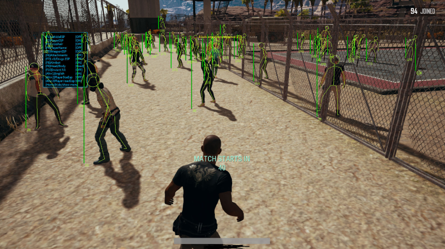

FPS games were very popular in 2017. The game that lit the fire was Battlegrounds. More than 200 million concurrent users played Battleground. Thanks to its great graphics and mechanics, it became the most popular game in 2018.

The beginning of PUBG – the game company of battlegrounds – was very amazing. Brendan Greene, also known as PlayerUnknown, wasn’t originally a professional game creator. He was originally a photographer and web designer. Starting from ARMA 2, a military simulation game, the battle royal genre became popular with DayZ Battle Royale. Since many people pay attention to this genre, he also made PlayerUnknown’s Battle Royale in ARMA 3. Later, the Korean game company Bluehole – now Krafton – scouted him to lead the development of a full battle royal game. PUBG was developed using Unreal Engine 4 and was completely released in March 2017. Its success continued with PUBG Mobile, spreading the fame of the battle royal genre.

The basic rule of the game is mainly divided into five categories. First, all players load into a waiting area before the match starts. Second, every match begins inside a single transport plane. The flight path is random and changes each game. Third, players begin with any weapon, including assault rifles, snipers, shotguns, SMGs, and pistols. Not only the weapons, but players should also loot armors, healing items, throw (grenades), and add attachments to the weapon, such as scopes, grips, and magazines. Fourth, after the match begins, a safe zone appears at a random location. Areas outside become the blue zone, which causes continuous damage. In each phase, the safe area shrinks and increases blue zone damage. Players must constantly rotate to the next circle to survive. Fifth, players should kill the rest of the other players and be the last survivor with the phrase “Winner Winner Chicken Dinner”.

PUBG is known for realistic control, small specific details, and weapon handling. These details make players more immersive and skill-based compared to other battle royal genre games. The fights using realistic weapons create more tension for the players, because they can easily die. Also, changing the geography of the map supports players in feeling new to the game. Because of the geographical changes, choosing positions, managing resources, and using clever tactics are important for the players.

Through this randomness and tactics, it looked very enjoyable for the players. However, when it was first released, PUBG had performance issues such as lag, frame drop, and the game was not available for people who had lower-end PCs. Also, random looting items and safe zone positioning sometimes gave unfair disadvantages for the players. Furthermore, because of its hyper-realistic effects, it was quite hard to fully understand the game, such as the map, recoil, and control. More than the other problems, since it was an FPS game, it couldn’t be free from the cheaters. Because aiming, sound, controlling recoils, and recoil were very important parts in the game, cheating brought extreme advantages over the normal users. Then, numerous types of cheats began to dominate battlegrounds, such as wallhack, no recoil, speed hack, and ESP. But the worst cheat was aimbot; if there was 1 aimbot cheater in the game, it meant disaster. As Battlegrounds grew in popularity, the number of cheaters also increased exponentially. The sheer number of cheaters meant it was difficult to avoid encountering hacks in a single game.

Before PUBG, the e-sports gaming world relied on traditional FPS titles with limited maps and predictable systems. However, the addition of a battleground that hosted 100 players differentiated it from the other games. The closing of the safe zone added more tension, which increased the gaming market’s new perspective on battle royal games. The availability of streaming platforms like Twitch and YouTube increased popularity and contributed to a lot of exposure and attention from people. PUBG became familiar to the world through the broadcasts of popular streamers, and the competitive growth of the game increased the pressure for players to make professional teams to join the leagues and tournaments. Through this battlegrounds now have a lot of teams and global matches. 

With its innovative battle-royale format and massive-scale competition, PUBG changed both the gaming world and the e-sports environment. Despite facing issues like technical problems and extensive cheating in the early stages, the game kept developing and growing. The game's uniqueness makes it parallel with FPS games.
