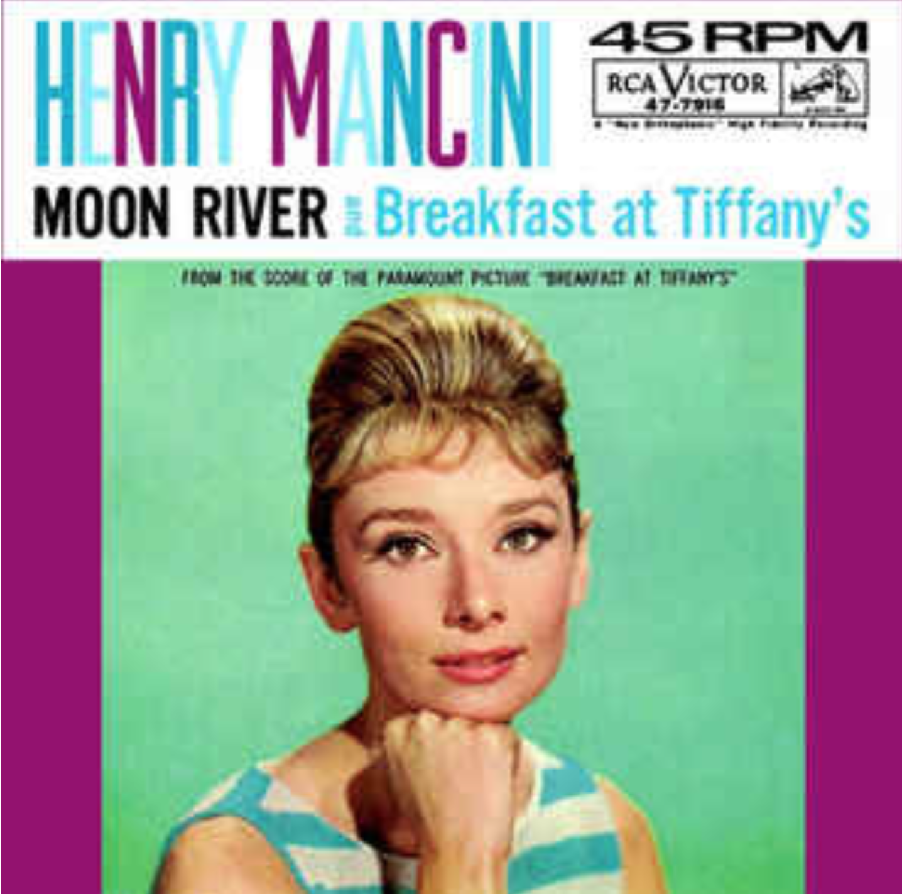

This song was written in 1961 by Audrey Hepburn. This song is very famous from the movie “Breakfast at Tiffany’s.” This song is popular in many ways because Audrey Hepburn sang this in the movie “Breakfast at Tiffany’s” laying at the window and playing the guitar. Andy Williams, a famous singer, also sang with his own voice. He sang this song , which made the song more popular. Then who wrote this song? Henry Mancini wrote this song. He is also a composer, arranger and a conductor. e got four academy awards, one Golden Globes.  They won the 1962 Grammy Awards(record of a year and song of the year).We can know that he is very musically talented. People are still not sure who first sang this song, but many people think of Andy Williams when they hear the title “Moon River.”What’s the secret inside the title's meaning? This song has a lot of secrets. The title wasn’t “Moon River” at first. It was “Blue River.” They changed it because of Elvis Presley, a singer and  actor. Elvis Presley named one of his songs “Blue River” already. We know that this song was very popular in the 20th century because it won the Academy Award for best original motion picture. This song is still  popular these days, and the genre of this song is jazz. But this song’s meaning is heartbreaking. It is about the loss of a love relationship. Do you know that this song's lyrics changed the situation of  Audrey Hepburn? Henry Mancini said “I confessed that thinking about Audrey Hepburn's big eyes made me write a more sentimental song than usual. So that Audrey Hepburn can sing comfortably, I wrote the song to fit Audrey Hepburn's vocal range.” “Moon River” was almost removed from the movie, because after the first screening the director suggested that Audrey Hepburn's singing scene should be removed. But Audrey Hepburn was determined to stop the scene from being removed, so they kept this scene. The scene became very famous. If this scene was removed then we would not have known this song! Many people on wedding days turn on this music. In “Moon River” there is a line “Moon river and me.” I think this line is the main verse of this song. In the verses of “My Huckleberry Friend,”  Andy Williams thought about his childhood, so he also wrote about it on “Moon River.” Andy Williams  included “Moon River” in a variety  of shows in his theater, which started from 1962 and finished in 1967. His song “Moon River” was in the Billboard Hot 100 chart. 