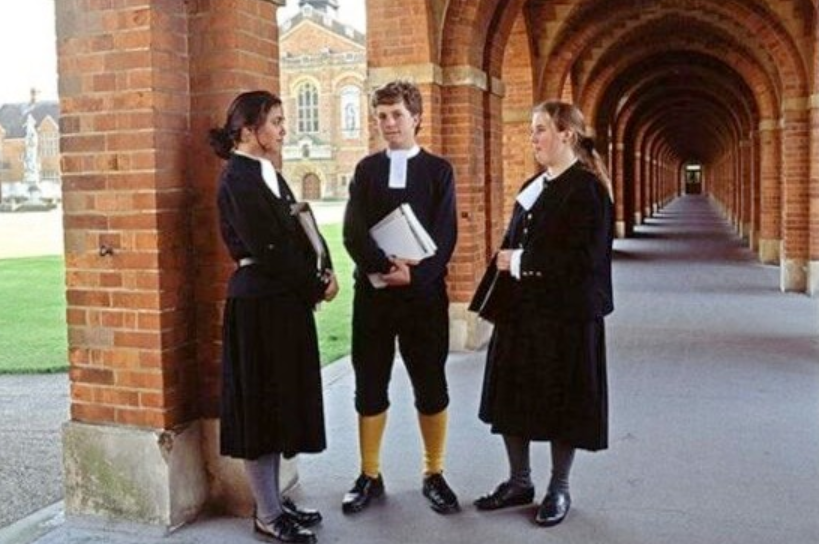

 
School uniforms have been a part of formal education for hundreds of years and remain common in many countries today. A school uniform is a set of standardized clothing worn by students, usually designed to represent a specific school. School uniforms began in Europe, especially in England, during the 16th century, when schools looked for  ways to clearly identify students and maintain discipline. As education systems developed and spread across different regions, the purpose and design of school uniforms gradually changed. Over time, uniforms were influenced by social values, cultural differences, and practical needs. The history of school uniforms, from their origins to their role in modern education, has been examined.

The earliest use of school uniforms can be traced back to England in the 16th century. One of the first recorded examples was the uniform that students wore at Christ’s Hospital, a charitable school founded in 1552. Students wore long blue coats, which became known as “bluecoats”, so people could recognize that they are from the school. During this period, uniforms were mainly introduced to promote discipline and order within educational institutions. They also helped people to distinguish students from non-students in public spaces. As schools became more organized and public, uniforms gradually spread to other institutions across England and later to different parts of Europe.

During the 19th century, school uniforms became more widespread as public education systems expanded. In Britain, uniforms were increasingly adopted by both public and private schools which was a way to promote discipline and equality among students. At the same time, ideas about school uniforms spread to other parts of the world through colonial influence and educational reforms. In many countries in Asia, Africa, and Oceania, uniforms were introduced as part of Western-style schooling systems. During the 12th century, school uniforms continued to change in response to social and economic developments. Designs became more practical and affordable, with greater attention to comfort and durability. From the mid 12th century, school uniforms had become a common feature of formal education in many regions around the world. 

School uniforms developed differently depending on national history, culture, and educational systems. In the United Kingdom, traditional uniforms often include blazers, ties. and formal shoes, reflecting the long history of British schooling and emphasis on formality. In Japan, school uniforms were introduced in the late 19th century as part of modernization efforts during the Meiji period. Japanese uniforms were influenced by Western military and naval styles, resulting in designs such as the gakuran for boys and sailor-style uniforms for girls. In South Korea, school uniforms became common during the 12th century, particularly after the expansion of secondary education. Korean uniforms were influenced by both Japanese models and later Western styles. Across these countries, school uniforms served similar purposes, including student identification and the promotion of order, while their designs reflected local cultural influences.

In modern educational systems, school uniforms have become so widespread that many people use them, though their designs and purposes have evolved. Nowadays, many schools focus on creating uniforms that are comfortable, practical, and also suitable for student’s daily lives. As a result, materials have changed toward lighter fabric and simple designs. In some countries, uniforms are designed to be worn in different seasons, with separate options for summer and winter. School uniforms today also have practical purposes, such as helping staff easily identify students and keeping order within school environments. While styles may vary across regions, uniforms remain a common feature in both public and private schools, showing the continued importance of standardization in education.

School uniforms have a long history that reflects changes in education, society, and culture over time. School uniforms were introduced in 16th century England to identify students and maintain discipline within schools. As education systems expanded during the 19th and 20th centuries, school uniforms spread to many parts of the world, often influenced by Western educational systems. Different countries changed uniforms to fit their own culture and traditions , resulting in a wide variety of styles and designs. In modern education, school uniforms are still used for practical purposes, such as keeping order and identifying  students. Although their appearance has evolved to improve comfort and practicality, the main function of school uniforms remains unchanged. Examining the history of school uniforms helps illustrate how education develops in response to broader social and historical factors. Overall, school uniforms continue to reflect historical traditions within education.
