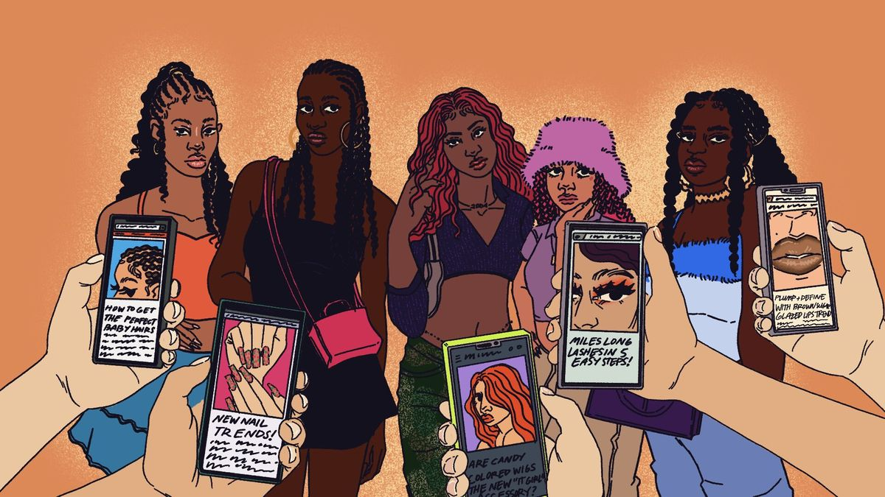

 
In the past, fashion trends mostly came from designers, magazines, and fashion shows. People usually followed what celebrities wore or what was shown on fashion show runways. Nowadays, social media has changed the way fashion trends are formed. Apps such as Instagram and TikTok make it easy for trends to spread quickly and reach many people at once. Because users see the same outfits and styles over and over on their Instagram feeds, certain looks become popular very rapidly. Social media has also changed who influenced fashions. Influencers and even regular users can start trends, which makes fashion feel more relatable to young people. However, this can also create pressure to keep up with trends that change constantly. Thus, social media plays a major role in shaping modern fashion trends. 

One important way social media influences fashion trends is through how trends are created. In the past, new styles usually came from designers or major fashion brands. Today, many trends begin online through influencers or viral posts. On social media platforms like Instagram and TikTok, an outfit can become popular because many people start copying it. 

Algorithms also play a significant role in this process. Social media often shows users content that is already popular, so the same styles appear repeatedly on their feeds. When people see similar outfits over and over again, they begin to recognize them as a trend. This repeated exposure helps transform simple clothing styles into widespread fashion trends. Because of this shift, fashion trends are no longer controlled only by industry professionals. Instead, online popularity and social media users now have a strong influence on what becomes fashionable. 

Another important effect of social media on fashion trends is how fast those trends spread. In the past, fashion trends followed seasonal cycles, which means they changed slowly. Now, social media allows trends to move much faster. A style can become popular within days if it appears in viral videos or posts. Because of social media platforms have a global reach, the same trend can be seen and copied by people all over the world at once. This speed also means that trends disappear quickly. As new content constantly appears on users’ feeds, older trends are quickly replaced by new ones. Fast fashion brands often respond to these trends immediately by producing similar styles at low prices. This encourages people to buy clothes more often in order to keep up. As a result, social media has turned fashion into something that is constantly changing and short-lived. 

Social media fashion trends also have a strong effect on consumers, especially young people. Because users are constantly exposed to new styles online, many feel pressure to keep up with what is popular. Seeing influencers and friends wear trendy outfits makes people feel like they need to buy similar clothes as well. This often leads to overconsumption and frequent shopping. In addition, the fast pace of trends can make people’s own style less important. Instead of choosing clothes based on comfort or individuality, people may focus more on what is currently trending online. However, social media also has some positive effects. It allows users to explore themselves in new ways and gives them access to fashion, which also influences how people think about what they should wear. 

In conclusion, social media has significantly changed the way fashion trends are created, shared, and followed. In the past, fashion was mainly influenced by designers, fashion shows, and magazines, which meant trends moved slowly and followed clear seasonal patterns. Nowadays, social media platforms such as Instagram and TikTok allow trends to appear and spread almost instantly. Influencers, algorithms, and online popularity play major roles in deciding what becomes fashionable, giving social media a powerful influence over modern fashion culture. However, this rapid trend cycle also brings negative effects, as exposure to new styles can create pressure to keep up, leading to frequent shopping and overconsumption. Many individuals may focus more on following trends than on developing their own personal style. At the same time, social media also has positive aspects, such as making fashion more accessible and allowing people to explore a wider range of styles and identities. Therefore, while social media has transformed fashion in many ways, its influence shows how digital platforms now shape not only wearing trends but also consumer behavior and self-expression. It is no longer just a place to share fashion, but a powerful force that continues to shape people’s choices and personal style. 
