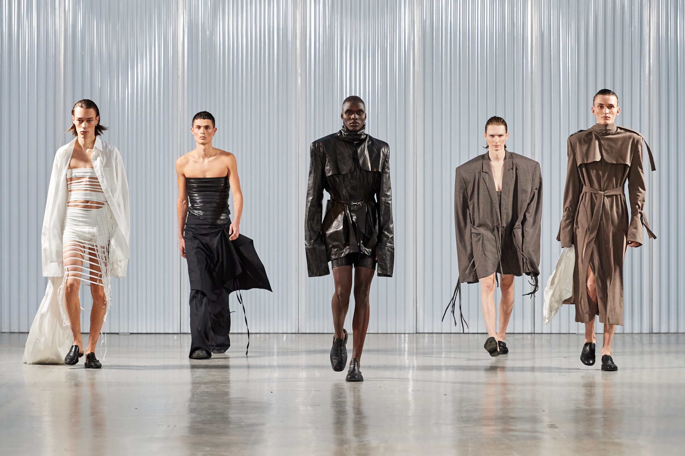

 

Fashion is more than just clothes that people wear every day. It is a way of people to express their identity, personality and beliefs. What someone chooses to wear can send messages or signals about who they are and how they want to be seen by others. For a long time, fashion was strongly connected to traditional gender roles. Society expected men and women to dress in very different ways, and these expectations were seen as normal. Men were usually expected to wear simple, practical, and less colorful clothes, while women were expected to wear more decorative, bright, and detailed clothing. These differences were not only about style but also about how society viewed men and women and their roles. 
	
However, these strict rules have started to change over time. Nowadays, many people no longer follow traditional ideas about what men and women should wear. Instead, they choose clothes based on their own taste and comfort. Fashion is becoming more open and flexible, allowing people to experiment with different styles. This change shows that society is also shifting its views on gender. More people believe that clothing should not be limited by gender, but should be a form of their own personal expression. As a result, fashion today reflects a shift toward greater freedom and individuality rather than strict social rules.  

In the past, fashion rules were very strict and clearly divided by gender. What people wear was not really their own choice, it was strongly influenced by social expectations. Men were expected to dress in a simple, formal and practical way, often wearing suits, dark colors, and clothes which show seriousness and strength. In contrast, women were expected to wear more decorative and detailed outfits, such as dresses and skirts, along with accessories that emphasized their beauty and elegance. These differences were not only about style, but also about how society viewed the roles of men and women. According to the Victoria and Albert Museum, clothing in earlier periods often reflected social structure and gender roles, showing clear differences between what men and women were expected to wear. 

This means that fashion was used as a way to reinforce traditional ideas about gender rather than allowing personal choice. Because of these stereotypes, people did not feel free to wear whatever they wanted. If someone dressed differently from what society expected, they could be judged or criticized by others. For example, it was considered rare for women to wear pants in public places. However, designers such as Coco Chanel began to challenge these norms by introducing more comfortable and practical clothing for women. Over time, these small changes slowly started to break down strict gender rules in fashion. Thus, in the past, these rules limited personal expression and made fashion less flexible for each individual. 

Today, these strict fashion rules are not as strong as they used to be. More people are starting to question the idea that certain clothes belong only to men or women. Instead of following old rules, many people now choose what they wear based on their own style and comfort. Because of this, fashion feels more free than in the past. Nowadays, it is common to see people mixing different styles, and the boundary between men’ and women’s clothing style becomes less clear. 

You can easily see this change in everyday life. For example, Harry Styles has worn outfits such as dresses that were once  seen as only for women but now are more widely accepted. In the same way, BTS also wear a variety of styles, including colorful clothing and accessories that do not fit traditional gender expectations. According to Business of Fashion, younger people nowadays are more open-minded to try various styles and do not feel hesitant or limited by gender when choosing clothes. Because of these changes, people feel freer to express themselves through fashion. Instead of thinking about what they are supposed to wear, they focus more on what they want to wear. 

There are few reasons why fashion has become more open and flexible today. The first reason is that people’s views on gender have changed. Many people no longer believe that men and women have to follow strict rules, so they also feel less pressure about their clothing choices. The second reason is that social media has also played an important role. SNS platforms such as Instagram and TikTok allow more people to see many different styles from around the world. When people see others wearing what they like without considering gender, it becomes easier for them to do the same. The last reason is that younger generations tend to care more about being themselves. They focus less on rules and more on personal style. Because of these changes, fashion has gradually become a way for people to express themselves. 

Thus, fashion has changed a lot from the past. It used to follow strict gender rules and stereotypes, but today it is becoming more open and flexible. People are now more focused on expressing themselves rather than following what society expects. Even though some traditional ideas still remain, fashion is clearly moving toward freedom. As society continues to change, it is likely that fashion will become even more inclusive and allow people to express their identity in their own way. 
