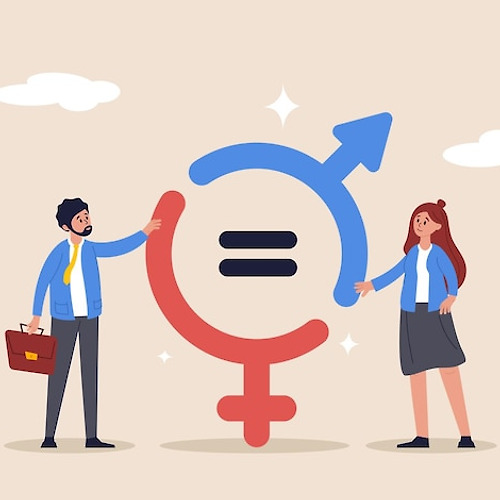

Gender equality means that individuals, regardless of gender, have equal rights, responsibilities, and opportunities in all areas of life. These days, many countries care more about gender equality, and things have improved compared to the past. But even now, there are cases where people are treated unfairly just because of their gender. For example, women often get paid less than men for doing the same job, and there aren’t as many women in high positions. In some countries, women still do not have access to get proper education or the chance to follow their dreams. These examples show that we still don’t have full gender equality. If we want a fairer world, we need to see these problems and try to make them better. 

Gender equality is important because it creates a fair and balanced society where everyone has the same chances, no matter if they are male, female, or identify in another way. When people are treated equally, they can follow their dreams, develop their talents, and live with confidence. Gender should not decide what someone can or cannot do. Also, gender equality helps create a world where everyone is treated fairly. When men and women have the same chances, they can choose what they want to do and follow their dreams. There is no need to say something is men’s (or women’s). People should be free to be themselves. In schools, workplaces, and even at home or anywhere, gender equality makes things better. When everyone is respected, it’s easier to work together and feel better. Countries that have strong gender equality often have happier people and better lives. Another important point is that gender equality benefits not only women, but men too. Traditional gender roles often say that men must always be strong and never show weakness. This can be very stressful and unfair for men. It’s okay to show feelings, be kind, and do things that were once called “for women”. In a truly equal society, everyone has the freedom to express themselves and live without fear of judgment. In short, gender equality makes society more fair, safe, and successful. It gives everyone freedom to live fully, without limits based on gender. That’s why it’s not just a women’s issue, it is something that helps all of us.

Also in society, there are lots of gender stereotypes. The definition of gender stereotypes is generalized and often inaccurate beliefs about the characteristics, behaviours, and roles that are associated with men and women. Nowadays, many people are challenging these ideas, but the impact of gender stereotypes is still very much alive. Gender stereotypes significantly restrict individual freedom by assigning fixed roles and behavior based on gender, often from an early age. These societal expectations not only shape how people view others, but also how they see themselves. For instance, men are frequently discouraged from expressing vulnerability or emotion, as such traits are seen as signs of weakness. Similarly, women are often expected to be passive, polite and agreeable qualities traditionally seen as “feminine”. These stereotypes begin in childhood through gendered toys, media representation, and even adult expectations. A woman who is interested in science or sports can be discouraged, while a man who likes dolls or dance might be mocked. Over time, these limitations affect personal identity, career choices, and even relationships. Therefore, breaking down gender stereotypes is essential for creating a society where individuals are free to explore their full potential without fear of judgement.

Then, how can we make a change? Making gender equality a reality takes action in schools, media, and daily life. Education is one of the best ways to start. School should teach students to respect and be fair to everyone, and show the different ways people can live and express themselves. When young people learn to question unfair ideas, they grow up with more open minds. In everyday life, small actions matter too. Saying something when someone makes a gender-biased comment like “men shouldn’t cry” can help change the way people think. Using fair and respectful language also makes a difference. Big changes take time, but if each person tries to be more fair and aware, we can move toward a more equal society together.

Gender equality is not just an idea. It’s something that affects people’s everyday lives. Even though there has been progress, there are still many challenges caused by stereotypes and gender unfair things. To understand these problems and work together to change them, we can build a society where everyone is treated with respect. A more equal world gives everyone a better chance to succeed and be themselves. If we all do our part, real change is possible.