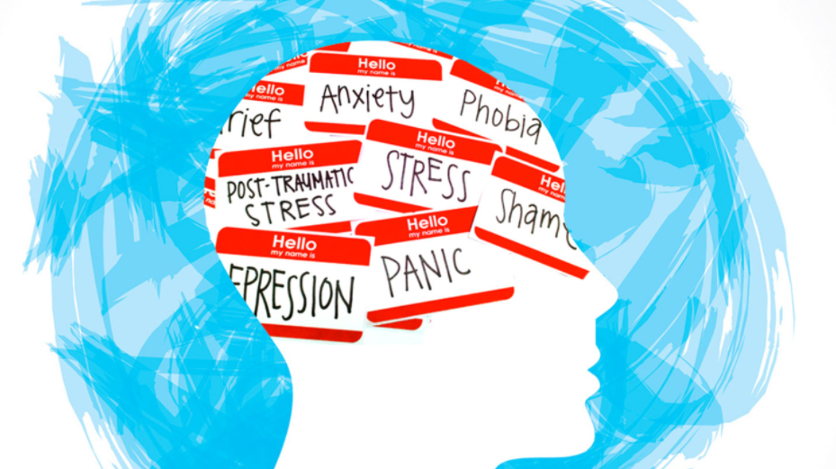

These days, teenagers are suffering from many problems such as stress, depression and anxiety which affect academic achievement and their daily life. In terms of  study, relationships between friends or family and social media are the biggest distraction. In these situations, the role of society and schools in helping young people grow healthy is becoming more important. In this journal, we will examine the causes of youth mental health problems and suggest various solutions to address them.

Mental health issues of teenagers are caused for various reasons. In the youth period, the changes they are going over makes them prone to stress. On top of that, they have to study hard, take many tests, and join other school activities. These things worsen their stress. Many students stay up late to study and feel nervous when they think they are not doing as well as others. Over time, these feelings can grow and turn into real anxiety or sadness.
Sometimes, adults say “We expect this from you” or “Do your best!", but this can give severe pressure. Teenagers may feel like they cannot talk about their feelings, so they hide them and pretend they are okay, when they are getting tired and are constantly anxious about that If this is repeated, their long-term mental health will be damaged. Today, many teenagers live in a world full of competitions. They study hard to get into good universities and to find good jobs. From a young age, they are told to get good grades and be better than others. All these cause them to  compare themselves with their friends. When they feel like they are not doing well, they can feel very stressed and sad. Adults often say things like “you must try hard to succeed.” Although it may be helpful occasionally, it can pressure the teenagers a lot. They start to fear failure. They feel like they must be perfect all the time, which makes them anxious with even small mistakes. Some students even give up their sleep to study more, or stop hanging out with their friends because they think of them as rivals. Also, teenagers sometimes focus only on test scores or short term success instead of thinking about things that make them feel happy. They do not have time to think about their mental health. If this stress continues for a long time, it can lead to problems like anxiety or depression. Today, many teenagers spend a lot of time on social media such as Instagram and Youtube. This can alsoaffect their mental health. First, people often post only the good parts of their lives online. Teenagers see this and start comparing themself. They may feel bad or think their life is not good enough. This can lower their self-esteem. Second, cyberbullying also can be a big problem. When teenagers get mean comments or messages online, it can hurt their feelings and make them distressed. Third, social media often makes people care too much about looks or being popular. Teens may try to look perfect in the media and forget who they really are. This can make it hard to feel good about themselves.

To solve mental health problems in teenagers, many groups need to work together. Schools can offer counseling programs and teach students about mental health. This helps students understand their feelings and talk about them. Reducing test pressure is also important. At home, their family members should pay more attention and spend more time talking with their children. Society and the government can support teenagers by starting mental health campaigns and giving free counseling services. Teenagers should also try to express their feelings, take enough rest, and talk with friends when they feel stressed.

In conclusion, mental health is very important for everyone, especially teenagers. Many teenagers face stress, anxiety, and pressure in their daily lives. These problems can grow worse if they are ignored. That is why schools, families, and society must help them. Teenagers should not try to solve everything alone. They need support, care, and understanding from people around them. If we all work together, we can make more safe and healthier places for teenagers. Mental health is not something to be ashamed of, but it is something we must talk about and care for every day. By creating open conversations and supporting each other, we can help everyone feel understood and less alone.