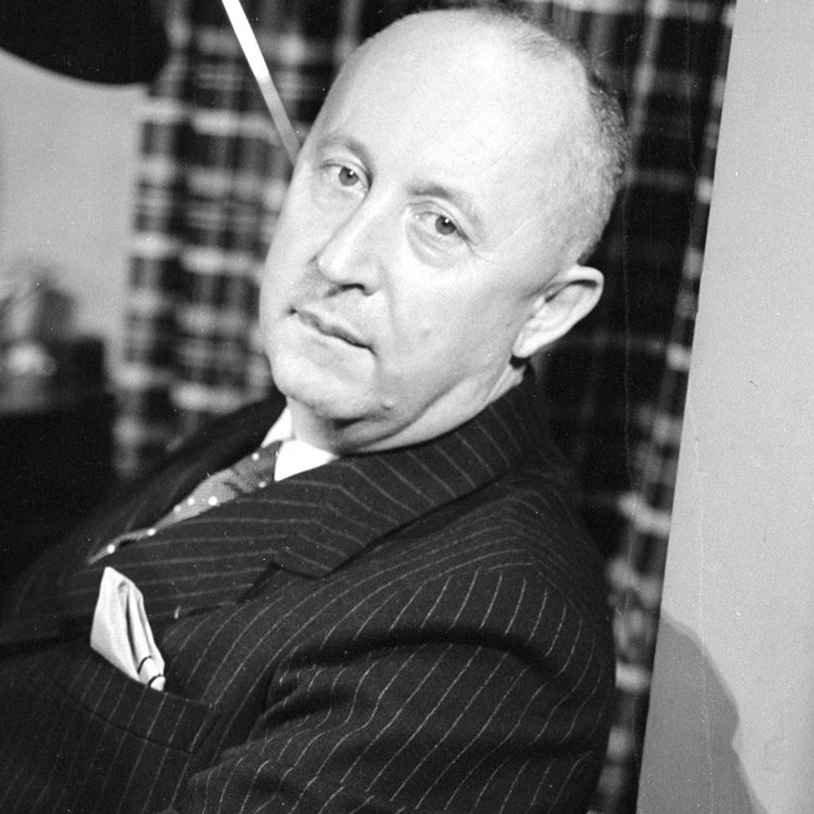
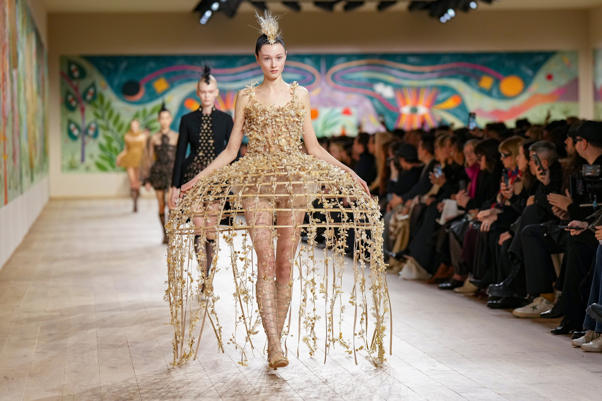

Christian Dior (1905-1957) was a famous fashion designer in France. He started his own fashion house in 1946, and inspired women's elegance and hope after World War II. At that time, Europe was recovering from World War II, and people wanted hope and beauty in their lives. Dior helped women feel confident through his design and became an important figure in the fashion industry. During this time, the atmosphere of the war led French society to encourage women to wear mostly simple and practical clothing. However, Dior broke this trend by presenting decorative and luxurious designs, reminding women of their  right to love themselves and express elegance. His fashion was not only clothing but also a symbol of social status and quality of life. 

# Dior
 

## The New Look
In 1947, Dior showed his first collection called the “New Look.” The features of the new look had a small waist, a full skirt, and a soft, elegant shape. It was quite different from the simple and practical clothes that most women wore during World War II. It made them feel more beautiful and confident. The New Look became very popular in Europe and the United States, and it influenced many other designers, changing the direction of fashion world wide. The New Look was more than design; it reflected the post-war recovery and the changing roles of women in society. By emphasizing the waist and full skirts highlighted femininity while visually expressing hope for social status and economic stability. The collection was widely covered by fashion magazines and newspapers, and many women sought to emulate the style.

## Expansion and Influence
Dior did not make only clothes; He also designed perfumes, shoes, handbags, and accessories. His first perfume, Miss Dior,  named after his sister Catherine, reinforced the brand’s elegant image. The Dior House also trained young designers, helping them to achieve success later. In this way, Dior was not only a designer but also a mentor to the next generation. The influence of the Dior House extended beyond fashion, as its designs appeared in films, photographs, and advertisements, becoming cultural icons. As a lifestyle brand that included perfumes and accessories, Dior also changed people’s everyday fashion experiences. 

.jpg)

## After Dior's Death
After Christian Dior had a sudden death from a third heart attack in 1957, Yves Saint Laurent, only 21 years old, became the chief designer and led Dior. He kept Dior’s elegance while introducing new and modern ideas. Later, designers such as Marc Bohan, Gianfranco Ferré, John Galliano, and Raf Simons took charge, each adding their own style while maintaining the brand’s luxury and elegance. During this time, the Dior House became a central figure in the fashion industry. Each designer reflected their own philosophy and the spirit of the times in their collections. In this way, Dior continuously evolved while preserving the brand’s identity.

## Modern Dior
Today, Dior is one of the most famous luxury fashion brands in the world. In 2016, Maria Grazia Chiuri became the first woman chief designer, showing feminist messages in her collections. For example, she presented t-shirts bearing the phrase ‘We Should All Be Feminists.’ Dior continues to create dresses, suits, handbags, shoes, and perfumes, influencing fashion and culture worldwide. Modern Dior demonstrates that fashion can convey social and cultural meaning beyond clothing. Fashion shows are used as artistic stages, and Dior’s collections inspire fans around the world.

Dior’s history is not only about making clothes but is deeply connected to style, culture, and society. From the New Look in 1947 to the modern collections today, Dior has expressed society and culture through fashion. More than just a brand, Dior is an icon of elegance, creativity, and culture through fashion. Its history shows how fashion can reflect the times, influence people’s lives, and shape social attitudes. With its historical, cultural, and artistic significance, Dior will continue to hold an important position in the global fashion industry. Moreover, Dior continues to influence new generations of designers, inspiring them to explore innovative ideas while respecting tradition. Fashion shows, campaigns, and collaborations with artists and cultural institutions demonstrate how Dior shapes trends and ideas beyond clothing. Through its blending of creativity, heritage, and social consciousness, the brand remains a symbol of enduring innovation and global cultural impact, proving that fashion can be both an art form and a reflection of society. Its commitment to sustainability, inclusivity, and cultural dialogue further strengthens Dior’s role as a leader in the modern fashion world.

