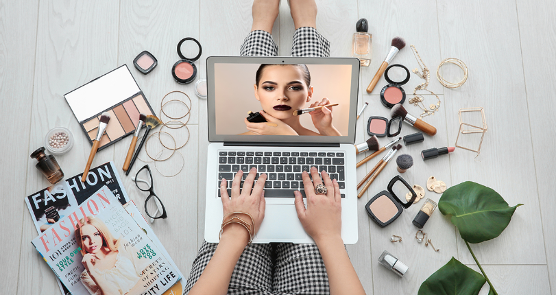

 
Social media has transformed how we search and shop for beauty products. People used to buy cosmetics through advertisements, magazines, stores, or the advice of friends. Today, beauty brands have more direct access to consumer platforms like TikTok and Instagram. Influencers, short videos, product reviews, and beauty trends can spark people’s interest in a product even if they have never seen it in a store. One study found that the trustworthiness and expertise of such an influencer may impact consumers’ intention to purchase products (Rizomyliotis et al., 2024). The fact that a single short video or recommendation from an influencer can popularize a product shows how social media can influence consumers and the products they buy, and thus the prominence of it in marketing cosmetics. This journal will explore how beauty brands use social media to attract consumers and encourage them to buy their products. 

One of the most common ways beauty brands use social media is through influencer marketing. Instead of only using traditional advertisements, brands work with influencers who can show products to their followers. For example, an influencer may use a skincare product in their own YouTube or TikTok video. This can make the product feel more real and easier to understand. Rizomyliotis et al. (2024) found that influencer trust and expertise can further motivate the customers to buy the product by providing more rationales. Thus, if the advertiser is trustworthy, consumers may be more interested in the product. This is why beauty brands often choose influencers who are famous.

Reviews are another important part of beauty marketing. Before buying a skincare or makeup product, many people look at reviews to see what other customers think about it. Reviews can give you a good idea of what a product looks like, feels like, or performs like in the real world. This is especially useful for beauty products because consumers cannot always know how a product will work for them just by looking at an advertisement. In addition, reviews can also make a brand seem more trustworthy because the information comes from other consumers, not only from the company. 

Packaging also plays an important part in beauty marketing. When people see a beauty product for the first time, its packaging can affect their first impression. Colors, shapes, fonts, and the overall design can make the product stand out. Brand identity is also important because it helps consumers recognize and remember a brand. For example, using a similar style and design across different products can make a brand easier to recognize. Because beauty products are often shared on social media, attractive packaging can also make people more interested in taking pictures or videos of the product and sharing them online.

Furthermore, beauty brands use limited-edition products to make consumers feel that a product is special or difficult to get. For example, a brand may release a collaboration product for only a short time or make only a limited number of products. This can create a sense of urgency because consumers may worry that the product will be sold out if they do not buy quickly. Limited-edition products can also make consumers feel that they have something different from other people. For beauty brands, this strategy can be especially effective when a limited product is promoted through social media. 

Another strategy often used in beauty marketing is before-and-after content. Beauty brands can show the difference in the participant’s appearance before and after using the product. This makes the possible effect of a product easy to see. This type of content is common on social media because people can understand the message quickly by looking at a picture or short video. However, brands also need to be careful because edited photos or unrealistic results can give consumers a wrong idea about the product. If consumers feel that a brand is exaggerating its results or being dishonest, the brand can lose their trust.

Social media is now an important part of beauty marketing. Factors such as influencers’ advertisements, reviews, packaging, limited-edition products, and before-and-after content can make consumers more interested in beauty products. These strategies help brands to get attention and connect with consumers. Social media has therefore changed beauty marketing from simply showing products to creating conversations, trends, and consumer experiences around them. As social media continues to grow, its influence on how consumers discover and choose beauty products will likely become even stronger.
